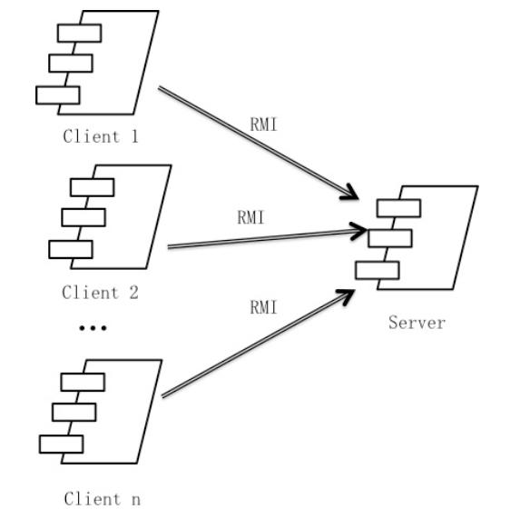
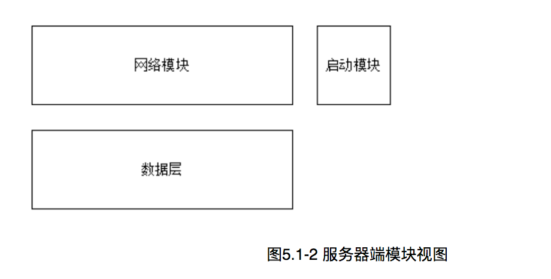

#
**企业进存销系统**  
 
 
 
#
 **SSASS(Stocking Selling and                               	Storing System)**
 
 
 
#
体系结构设计文档Storing System)
 
 
 
 
 
###**学院：南京大学软件学院** 
###**成员：潘羽 谢寅鹏 熊以恒 肖云帆** 
###**完成日期：2017年10月18日** 

##目录

##更新历史

#1.引言

##&nbsp;&nbsp;&nbsp;&nbsp;1.1编制目的
&nbsp;&nbsp;&nbsp;&nbsp;本报表详细完成对企业进销存系统的概要设计，达到指导详细设计和开发的目的，同时实现和测试人员及用户的沟通。
  &nbsp;&nbsp;&nbsp;&nbsp; 本报告面向开发人员、测试人员及最终用户而编写，是了解系统的导航。
 
 
 
##&nbsp;&nbsp;&nbsp;&nbsp;1.2词汇表
<table>
	<tr>
		<th>词汇名称</th>
		<th>词汇含义</th>
		<th>备注</th>
	</tr>
	<tr>
		<th>ui</th>
		<th>表示某展示层</th>
		<th>&nbsp;&nbsp;&nbsp;&nbsp;&nbsp;&nbsp;&nbsp;&nbsp;&nbsp;&nbsp;&nbsp;&nbsp;&nbsp;&nbsp;&nbsp;&nbsp;</th>
	</tr>
	<tr>
		<th>bl</th>
		<th>表示某逻辑层</th>
		<th>&nbsp;&nbsp;&nbsp;&nbsp;&nbsp;&nbsp;&nbsp;&nbsp;&nbsp;&nbsp;&nbsp;&nbsp;&nbsp;&nbsp;&nbsp;&nbsp;</th>
	</tr>
	<tr>
		<th>data</th>
		<th>表示某数据层</th>
		<th>&nbsp;&nbsp;&nbsp;&nbsp;&nbsp;&nbsp;&nbsp;&nbsp;&nbsp;&nbsp;&nbsp;&nbsp;&nbsp;&nbsp;&nbsp;&nbsp;</th>
	</tr>
	<tr>
		<th>RMI</th>
		<th>表示远程方法调用</th>
		<th>&nbsp;&nbsp;&nbsp;&nbsp;&nbsp;&nbsp;&nbsp;&nbsp;&nbsp;&nbsp;&nbsp;&nbsp;&nbsp;&nbsp;&nbsp;&nbsp;</th>
	</tr>
</table>
 
 
##&nbsp;&nbsp;&nbsp;&nbsp;1.3参考资料
<ol>
	<li>IEEE std 1471-2000</li>
<li>丁二玉，刘钦.计算与软件工程（卷二）[M]机械工业出版2012：134—182
</li>
</ol>

 
 
 
#2.产品概述
&nbsp;&nbsp;&nbsp;&nbsp;参考企业进销存系统系统用例文档和企业进销存系统软件需求规格说明文档中对产品的概括描述。企业进销存系统主要是应用于减少挤压库存，增加销售额，提高财务人员工作效率，为经理的决策做支持，主要功能见用例图如下。

_用例图.png)

 
 
 
#3.逻辑视角
&nbsp;&nbsp;&nbsp;&nbsp;企业进销存系统中，选择了分层体系结构风格，将系统分为3层(展示层、业务逻辑层、数据层)能够很好地示意整个高层抽象。展示层包含GUI页面的实现，业务逻辑层包含业务逻辑处理的实现，数据层负责数据的持久化和访问。分层体系结构的逻辑视角和逻辑设计方案如图1和图2所示。
 
 
 

 &nbsp;&nbsp;&nbsp;&nbsp;图一 参照体系结构风格的包图表达逻辑视角
 
 
 

 &nbsp;&nbsp;&nbsp;&nbsp;图二 软件体系结构逻辑设计方案
 
 
 

#4.组合视角
 &nbsp;&nbsp;&nbsp;&nbsp;[软工2 166]与抽象的逻辑设计相比，实现物理设计要考虑更多的实现细节，这些细节有：
<ol>
	<li>presentation层与logic层被置于客户端，data层被置于服务器端，那么logic层的开发包不可能依赖于data层的开发包。使用RMI技术，将data层开发包分解为置于客户端的dataservice接口包和置于服务器端的data层开发包。这样一来，logic层开发包依赖于dataservice包，dataservice包和data层的开发包都依赖于RMI类库包。</li>
	<li>所有的data层开发包都需要进行数据持久化（例如读写数据库、读写文件等），所以它们会有一些重复代码，可以将重复代码独立为新的开发包，然后所有的data层开发包都依赖于databaseutility。datavaseutility会依赖于JDBC类库包。
</li>
	<li>所有的presentation层开发包都需要使用图形类型建立界面，都要依赖于图形界面类库包。
</li>
	<li>此外，presentation层实现时，由mainui包负责整个页面之间的跳转逻辑。其他各包负责各自页面自身的功能。
</li>
	<li>在分层风格的典型设计中，不希望高层直接依赖于低层，而是为低层建立接口包，实现依赖倒置原则，所以应该调整为：各presentation层开发包（调用）依赖于logic层接口包businesslogicservice包，logic层开发包也依赖于（实现了）logic层接口包businesslogicservice包。
</li>
	<li>在分层风格的典型设计中，presentation层与logic层之间、logic层与data层之间可能会传递复杂数据对象，那么相邻两层都需要使用数据对象声明，所以需要将数据对象声明独立为开发包（VO包和PO包）。
</li>
<li></li>
<li>在logic层中，初始化和业务逻辑层上下文的工作被分配到utility包中。
经过细节改进，最终建立的互联网酒店预订系统开发包设计如表4.1-1，其局部包图如图4.1-1和4.1-2所示：
</li>
</ol>

#4.1开发包图
<table>
	<tr>
		<th>开发(物理)包</th>
		<th>依赖的其他开发包</th>
	</tr>
	<tr>
		<th align="left">mainui</th>
		<th align="left">classifyui, goodsui, commodityui, memberui, stockui, returnui, bankui, saleui, collectionui, paymentui, manageui, accountui, promotionui, checkui</th>
	</tr>	
	<tr>
		<th align="left">classfyui</th>
		<th align="left">classifyservice, goodsbl, 界面类库包, vo </th>
	<tr>
	 <tr>
		<th align="left">classfyblservice</th>
		<th></th>
	<tr>
	<tr>
		<th align="left">classifybl</th>
		<th align="left">classifyservice, classifydataservice, po, commoditybl, goodsbl</th>
	<tr>
	 <tr>
		<th align="left">classifydataservice</th>
		<th align="left">Java RMI, po</th>
	<tr>
	 <tr>
		<th align="left">classifydata</th>
		<th align="left">databaseutility, po, classifydataservice </th>
	<tr>
	 <tr>
		<th align="left">goodsui</th>
		<th align="left">goodsservice, 界面类库包, vo</th>
	<tr>
	  <tr>
		<th align="left">goodsblservice</th>
		<th align="left"></th>
	<tr> <tr>
		<th align="left">goodsbl</th>
		<th align="left">goodsblservice, goodsdataservice, po, commoditybl</th>
	</tr> <tr>
		<th align="left">goodsdataservice</th>
		<th align="left">Java RMI, po</th>
	</tr> <tr>
		<th align="left">goodsdata</th>
		<th align="left">Java RMI, po, databaseutility</th>
	</tr> <tr>
		<th align="left">commodityui</th>
		<th align="left">commodityservice, 界面类库包, vo</th>
	</tr> <tr>
		<th align="left">commodityblservice</th>
		<th align="left"></th>
	</tr> <tr>
		<th align="left">commoditybl</th>
		<th align="left">commodityservice, commoditydataservice, po, salebl</th>
	</tr> <tr>
		<th align="left">commoditydataservice</th>
		<th align="left">Java RMI, po</th>
	</tr> <tr>
		<th align="left">commoditydata</th>
		<th align="left">Java RMI, po, databaseutility</th>
	</tr> 
	 <tr>
		<th align="left">memberui</th>
		<th align="left">memberservice, 界面类库包, vo</th>
	</tr> <tr>
		<th align="left">memberblservice</th>
		<th align="left"></th>
	</tr> <tr>
		<th align="left">memberbl</th>
		<th align="left">memberservice, memberdataservice, po, salebl, commoditybl</th>
	</tr> <tr>
		<th align="left">memberdataservice</th>
		<th align="left">Java RMI, po</th>
	</tr> <tr>
		<th align="left">memberdata</th>
		<th align="left">Java RMI, po, databaseutility</th>
	</tr> 
	 <tr>
		<th align="left">stockui</th>
		<th align="left">stockservice, 界面类库包, vo</th>
	</tr> <tr>
		<th align="left">stockblservice</th>
		<th align="left"></th>
	</tr> <tr>
		<th align="left">stockbl</th>
		<th align="left">stockservice, stockdataservice, po, commoditybl</th>
	</tr> <tr>
		<th align="left">stockdataservice</th>
		<th align="left">Java RMI, po</th>
	</tr> <tr>
		<th align="left">stockdata</th>
		<th align="left">Java RMI, po, databaseutility</th>
	</tr> 

 
  <tr>
		<th align="left">returnui</th>
		<th align="left">returnservice, 界面类库包, vo</th>
	</tr> <tr>
		<th align="left">returnblservice</th>
		<th align="left"></th>
	</tr> <tr>
		<th align="left">returnbl</th>
		<th align="left">returnservice, returndataservice, po, commoditybl</th>
	</tr> <tr>
		<th align="left">returndataservice</th>
		<th align="left">Java RMI, po</th>
	</tr> <tr>
		<th align="left">returndata</th>
		<th align="left">Java RMI, po, databaseutility</th>
	</tr> 

 <tr>
		<th align="left">bankui</th>
		<th align="left">bankservice, 界面类库包, vo</th>
	</tr> <tr>
		<th align="left">bankblservice</th>
		<th align="left"></th>
	</tr> <tr>
		<th align="left">bankbl</th>
		<th align="left">bankservice, bankdataservice, po</th>
	</tr> <tr>
		<th align="left">bankdataservice</th>
		<th align="left">Java RMI, po</th>
	</tr> <tr>
		<th align="left">bankdata</th>
		<th align="left">Java RMI, po, databaseutility</th>
	</tr> 

 <tr>
		<th align="left">saleui</th>
		<th align="left">saleservice, 界面类库包, vo</th>
	</tr> <tr>
		<th align="left">saleblservice</th>
		<th align="left"></th>
	</tr> <tr>
		<th align="left">salebl</th>
		<th align="left">saleservice, saledataservice, po, promotionbl, userbl</th>
	</tr> <tr>
		<th align="left">saledataservice</th>
		<th align="left">Java RMI, po</th>
	</tr> <tr>
		<th align="left">saledata</th>
		<th align="left">Java RMI, po, databaseutility</th>
	</tr> 

 <tr>
		<th align="left">collectionui</th>
		<th align="left">collectionservice, 界面类库包, vo</th>
	</tr> <tr>
		<th align="left">collectionblservice</th>
		<th align="left"></th>
	</tr> <tr>
		<th align="left">collectionbl</th>
		<th align="left">collectionservice, collectiondataservice, po, </th>
	</tr> <tr>
		<th align="left">collectiondataservice</th>
		<th align="left">Java RMI, po</th>
	</tr> <tr>
		<th align="left">collectiondata</th>
		<th align="left">Java RMI, po, databaseutility</th>
	</tr> 

 <tr>
		<th align="left">paymentui</th>
		<th align="left">paymentservice, 界面类库包, vo</th>
	</tr> <tr>
		<th align="left">paymentservice</th>
		<th align="left"></th>
	</tr> <tr>
		<th align="left">paymentbl</th>
		<th align="left">paymentservice, paymentdataservice, po, checkbl</th>
	</tr> <tr>
		<th align="left">paymentdataservice</th>
		<th align="left">Java RMI, po</th>
	</tr> <tr>
		<th align="left">paymentdata</th>
		<th align="left">Java RMI, po, databaseutility</th>
	</tr> 

 <tr>
		<th align="left">manageui</th>
		<th align="left">manageservice, 界面类库包, vo</th>
	</tr> <tr>
		<th align="left">manageservice</th>
		<th align="left"></th>
	</tr> <tr>
		<th align="left">managebl</th>
		<th align="left">manageservice, managedataservice, po</th>
	</tr> <tr>
		<th align="left">managedataservice</th>
		<th align="left">Java RMI, po</th>
	</tr> <tr>
		<th align="left">managedata</th>
		<th align="left">Java RMI, po, databaseutility</th>
	</tr> 

 <tr>
		<th align="left">Accountui</th>
		<th align="left">Accountservice, 界面类库包, vo</th>
	</tr> <tr>
		<th align="left">Accountservice</th>
		<th align="left"></th>
	</tr> <tr>
		<th align="left">Accountbl</th>
		<th align="left">Accountservice, Accountdataservice, po</th>
	</tr> <tr>
		<th align="left">Accountdataservice</th>
		<th align="left">Java RMI, po</th>
	</tr> <tr>
		<th align="left">Accountdata</th>
		<th align="left">Java RMI, po, databaseutility</th>
	</tr> 

 <tr>
		<th align="left">promotionui</th>
		<th align="left">promotionservice, 界面类库包, vo</th>
	</tr> <tr>
		<th align="left">promotionservice</th>
		<th align="left"></th>
	</tr> <tr>
		<th align="left">promotionbl</th>
		<th align="left">promotionservice, promotiondataservice, po</th>
	</tr> <tr>
		<th align="left">promotiondataservice</th>
		<th align="left">Java RMI, po</th>
	</tr> <tr>
		<th align="left">promotiondata</th>
		<th align="left">Java RMI, po, databaseutility</th>
	</tr> 

 <tr>
		<th align="left">checkui</th>
		<th align="left">checkservice, 界面类库包, vo</th>
	</tr> <tr>
		<th align="left">checkservice</th>
		<th align="left"></th>
	</tr> <tr>
		<th align="left">checkbl</th>
		<th align="left">checkservice, checkdataservice, po</th>
	</tr> <tr>
		<th align="left">checkdataservice</th>
		<th align="left">Java RMI, po</th>
	</tr> <tr>
		<th align="left">checkdata</th>
		<th align="left">Java RMI, po, databaseutility</th>
	</tr> 

<tr>
		<th align="left">userui</th>
		<th align="left">userservice, 界面类库包, vo</th>
	</tr> <tr>
		<th align="left">userservice</th>
		<th align="left"></th>
	</tr> <tr>
		<th align="left">userbl</th>
		<th align="left">userservice, userdataservice, po</th>
	</tr> <tr>
		<th align="left">userdataservice</th>
		<th align="left">Java RMI, po</th>
	</tr> <tr>
		<th align="left">userdata</th>
		<th align="left">Java RMI, po</th>
	</tr> 
<tr>
	<th align="left">vo</th>
	<th align="left"></th>
</tr>
<tr>
	<th align="left">po</th>
	<th align="left"></th>
</tr>
<tr>
	<th align="left">utilitybl</th>
	<th align="left"></th>
</tr>

<tr>
	<th align="left">界面类库包</th>
	<th align="left"></th>
</tr>

<tr>
	<th align="left">Java RMI</th>
	<th align="left"></th>
</tr>
<tr>
	<th align="left">Databaseutility </th>
	<th align="left">JDBC</th>
</tr>
</table>

**补图**

##4.2运行时进程
在企业进销存系统中，会有多个客户端进程和一个服务器端进程，其进程图如图4.2所示。结合部署图，客户端进程实在客户端机器上运行，服务器端进程是在服务器端机器上运行。 
                
 图4.2 进程图
 
                 
                 
                 
&nbsp;&nbsp;&nbsp;&nbsp; 互联网酒店预订系统中客户端构件是放在客户端机器上，服务器端构件是放在服务器端机器上。在客户端节点上，还要部署RMIStub构件。由于JavaRMI构件属于JDK6.0的一部分。所以，在系统JDK环境未设置好的情况下，需要将系统打包成exe文件。部署图如图4.3所示。 
 
 

 
 
 
 
 
 
#5.接口视角
##5.1 模块的职责

**表5.1-1 客户端各层的职责**

<table>
	<tr>
		<th>层</th>
		<th>职责</th>
	</tr>
<tr>
		<th>启动模块</th>
		<th>负责初始化网络通信机制，启动用户界面。</th>
	</tr>
<tr>
		<th>用户界面层</th>
		<th>基于窗口的进销存系统客户端用户界面。</th>
	</tr>
<tr>
		<th>业务逻辑层</th>
		<th>对于用户界面的输入响应和业务处理逻辑。</th>
	</tr>
<tr>
		<th>客户端网络模块</th>
		<th>利用Java RMI机制查找RMI服务</th>
	</tr>
</table>

 
 
**表5.1-2 服务器端各层的职责**

<table>
	<tr>
		<th>层</th>
		<th>职责</th>
	</tr>
<tr>
		<th>启动模块</th>
		<th>负责初始化网络通信机制，启动用户界面。</th>
	</tr>
<tr>
		<th>数据层</th>
		<th>负责数据的持久化及数据访问接口。</th>
	</tr>
<tr>
		<th>服务器端网络模块</th>
		<th>利用Java RMI机制开启RMI服务，注册RMI服务</th>
	</tr>
</table>
&nbsp;&nbsp;&nbsp;&nbsp;每一层只是使用下方直接接触的层。层与层之间仅仅是通过接口的调用来完成的。层之间调用的接口如表5.1-3所示。
