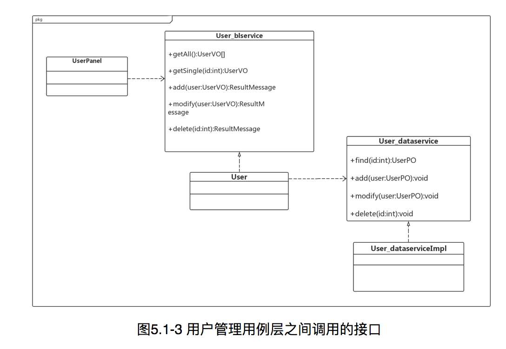

#
**企业进存销系统**  
 
 
 
#
 **SSASS(Stocking Selling and                               	Storing System)**
 
 
 
#
体系结构设计文档Storing System)
 
 
 
 
 
###**学院：南京大学软件学院** 
###**成员：潘羽 谢寅鹏 熊以恒 肖云帆** 
###**完成日期：2017年10月18日** 

##目录

##更新历史

#1.引言

##&nbsp;&nbsp;&nbsp;&nbsp;1.1编制目的
&nbsp;&nbsp;&nbsp;&nbsp;本报表详细完成对企业进销存系统的概要设计，达到指导详细设计和开发的目的，同时实现和测试人员及用户的沟通。
  &nbsp;&nbsp;&nbsp;&nbsp; 本报告面向开发人员、测试人员及最终用户而编写，是了解系统的导航。
 
 
 
##&nbsp;&nbsp;&nbsp;&nbsp;1.2词汇表
<table>
	<tr>
		<th>词汇名称</th>
		<th>词汇含义</th>
		<th>备注</th>
	</tr>
	<tr>
		<th>ui</th>
		<th>表示某展示层</th>
		<th>&nbsp;&nbsp;&nbsp;&nbsp;&nbsp;&nbsp;&nbsp;&nbsp;&nbsp;&nbsp;&nbsp;&nbsp;&nbsp;&nbsp;&nbsp;&nbsp;</th>
	</tr>
	<tr>
		<th>bl</th>
		<th>表示某逻辑层</th>
		<th>&nbsp;&nbsp;&nbsp;&nbsp;&nbsp;&nbsp;&nbsp;&nbsp;&nbsp;&nbsp;&nbsp;&nbsp;&nbsp;&nbsp;&nbsp;&nbsp;</th>
	</tr>
	<tr>
		<th>data</th>
		<th>表示某数据层</th>
		<th>&nbsp;&nbsp;&nbsp;&nbsp;&nbsp;&nbsp;&nbsp;&nbsp;&nbsp;&nbsp;&nbsp;&nbsp;&nbsp;&nbsp;&nbsp;&nbsp;</th>
	</tr>
	<tr>
		<th>RMI</th>
		<th>表示远程方法调用</th>
		<th>&nbsp;&nbsp;&nbsp;&nbsp;&nbsp;&nbsp;&nbsp;&nbsp;&nbsp;&nbsp;&nbsp;&nbsp;&nbsp;&nbsp;&nbsp;&nbsp;</th>
	</tr>
</table>

##&nbsp;&nbsp;&nbsp;&nbsp;1.3参考资料
<ol>
	<li>IEEE std 1471-2000</li>
<li>丁二玉，刘钦.计算与软件工程（卷二）[M]机械工业出版2012：134—182
</li>
</ol>

 
 
 
#2.产品概述
&nbsp;&nbsp;&nbsp;&nbsp;参考企业进销存系统系统用例文档和企业进销存系统软件需求规格说明文档中对产品的概括描述。企业进销存系统主要是应用于减少挤压库存，增加销售额，提高财务人员工作效率，为经理的决策做支持，主要功能见用例图如下。

_用例图.png)

 
 
 
#3.逻辑视角
&nbsp;&nbsp;&nbsp;&nbsp;企业进销存系统中，选择了分层体系结构风格，将系统分为3层(展示层、业务逻辑层、数据层)能够很好地示意整个高层抽象。展示层包含GUI页面的实现，业务逻辑层包含业务逻辑处理的实现，数据层负责数据的持久化和访问。分层体系结构的逻辑视角和逻辑设计方案如图1和图2所示。
 
 
 

 &nbsp;&nbsp;&nbsp;&nbsp;图一 参照体系结构风格的包图表达逻辑视角
 
 
 

 &nbsp;&nbsp;&nbsp;&nbsp;图二 软件体系结构逻辑设计方案
 
 
 

#4.组合视角
 &nbsp;&nbsp;&nbsp;&nbsp;[软工2 166]与抽象的逻辑设计相比，实现物理设计要考虑更多的实现细节，这些细节有：
<ol>
	<li>presentation层与logic层被置于客户端，data层被置于服务器端，那么logic层的开发包不可能依赖于data层的开发包。使用RMI技术，将data层开发包分解为置于客户端的dataservice接口包和置于服务器端的data层开发包。这样一来，logic层开发包依赖于dataservice包，dataservice包和data层的开发包都依赖于RMI类库包。</li>
	<li>所有的data层开发包都需要进行数据持久化（例如读写数据库、读写文件等），所以它们会有一些重复代码，可以将重复代码独立为新的开发包，然后所有的data层开发包都依赖于databaseutility。datavaseutility会依赖于JDBC类库包。
</li>
	<li>所有的presentation层开发包都需要使用图形类型建立界面，都要依赖于图形界面类库包。
</li>
	<li>此外，presentation层实现时，由mainui包负责整个页面之间的跳转逻辑。其他各包负责各自页面自身的功能。
</li>
	<li>在分层风格的典型设计中，不希望高层直接依赖于低层，而是为低层建立接口包，实现依赖倒置原则，所以应该调整为：各presentation层开发包（调用）依赖于logic层接口包businesslogicservice包，logic层开发包也依赖于（实现了）logic层接口包businesslogicservice包。
</li>
	<li>在分层风格的典型设计中，presentation层与logic层之间、logic层与data层之间可能会传递复杂数据对象，那么相邻两层都需要使用数据对象声明，所以需要将数据对象声明独立为开发包（VO包和PO包）。
</li>
<li></li>
<li>在logic层中，初始化和业务逻辑层上下文的工作被分配到utility包中。
经过细节改进，最终建立的互联网酒店预订系统开发包设计如表4.1-1，其局部包图如图4.1-1和4.1-2所示：
</li>
</ol>

#4.1开发包图
<table>
	<tr>
		<th>开发(物理)包</th>
		<th>依赖的其他开发包</th>
	</tr>
	<tr>
		<th align="left">mainui</th>
		<th align="left">classifyui, goodsui, commodityui, memberui, stockui, returnui, bankui, saleui, collectionui, paymentui, manageui, accountui, promotionui, checkui</th>
	</tr>	
	<tr>
		<th align="left">classfyui</th>
		<th align="left">classifyblservice, goodsbl, 界面类库包, vo </th>
	<tr>
	 <tr>
		<th align="left">classfyblservice</th>
		<th></th>
	<tr>
	<tr>
		<th align="left">classifybl</th>
		<th align="left">classifyblservice, classifydataservice, po, commoditybl, goodsbl</th>
	<tr>
	 <tr>
		<th align="left">classifydataservice</th>
		<th align="left">Java RMI, po</th>
	<tr>
	 <tr>
		<th align="left">classifydata</th>
		<th align="left">databaseutility, po, classifydataservice </th>
	<tr>
	 <tr>
		<th align="left">goodsui</th>
		<th align="left">goodsblservice, 界面类库包, vo</th>
	<tr>
	  <tr>
		<th align="left">goodsblservice</th>
		<th align="left"></th>
	<tr> <tr>
		<th align="left">goodsbl</th>
		<th align="left">goodsblservice, goodsdataservice, po, commoditybl</th>
	</tr> <tr>
		<th align="left">goodsdataservice</th>
		<th align="left">Java RMI, po</th>
	</tr> <tr>
		<th align="left">goodsdata</th>
		<th align="left">Java RMI, po, databaseutility</th>
	</tr> <tr>
		<th align="left">commodityui</th>
		<th align="left">commodityblservice, 界面类库包, vo</th>
	</tr> <tr>
		<th align="left">commodityblservice</th>
		<th align="left"></th>
	</tr> <tr>
		<th align="left">commoditybl</th>
		<th align="left">commodityblservice, commoditydataservice, po, salebl</th>
	</tr> <tr>
		<th align="left">commoditydataservice</th>
		<th align="left">Java RMI, po</th>
	</tr> <tr>
		<th align="left">commoditydata</th>
		<th align="left">Java RMI, po, databaseutility</th>
	</tr> 
	 <tr>
		<th align="left">memberui</th>
		<th align="left">memberblservice, 界面类库包, vo</th>
	</tr> <tr>
		<th align="left">memberblservice</th>
		<th align="left"></th>
	</tr> <tr>
		<th align="left">memberbl</th>
		<th align="left">memberblservice, memberdataservice, po, salebl, commoditybl</th>
	</tr> <tr>
		<th align="left">memberdataservice</th>
		<th align="left">Java RMI, po</th>
	</tr> <tr>
		<th align="left">memberdata</th>
		<th align="left">Java RMI, po, databaseutility</th>
	</tr> 
	 <tr>
		<th align="left">stockui</th>
		<th align="left">stockblservice, 界面类库包, vo</th>
	</tr> <tr>
		<th align="left">stockblservice</th>
		<th align="left"></th>
	</tr> <tr>
		<th align="left">stockbl</th>
		<th align="left">stockblservice, stockdataservice, po, commoditybl</th>
	</tr> <tr>
		<th align="left">stockdataservice</th>
		<th align="left">Java RMI, po</th>
	</tr> <tr>
		<th align="left">stockdata</th>
		<th align="left">Java RMI, po, databaseutility</th>
	</tr> 

 
  <tr>
		<th align="left">returnui</th>
		<th align="left">returnblservice, 界面类库包, vo</th>
	</tr> <tr>
		<th align="left">returnblservice</th>
		<th align="left"></th>
	</tr> <tr>
		<th align="left">returnbl</th>
		<th align="left">returnblservice, returndataservice, po, commoditybl</th>
	</tr> <tr>
		<th align="left">returndataservice</th>
		<th align="left">Java RMI, po</th>
	</tr> <tr>
		<th align="left">returndata</th>
		<th align="left">Java RMI, po, databaseutility</th>
	</tr> 

 <tr>
		<th align="left">bankui</th>
		<th align="left">bankblservice, 界面类库包, vo</th>
	</tr> <tr>
		<th align="left">bankblservice</th>
		<th align="left"></th>
	</tr> <tr>
		<th align="left">bankbl</th>
		<th align="left">bankblservice, bankdataservice, po</th>
	</tr> <tr>
		<th align="left">bankdataservice</th>
		<th align="left">Java RMI, po</th>
	</tr> <tr>
		<th align="left">bankdata</th>
		<th align="left">Java RMI, po, databaseutility</th>
	</tr> 

 <tr>
		<th align="left">saleui</th>
		<th align="left">saleblservice, 界面类库包, vo</th>
	</tr> <tr>
		<th align="left">saleblservice</th>
		<th align="left"></th>
	</tr> <tr>
		<th align="left">salebl</th>
		<th align="left">saleblservice, saledataservice, po, promotionbl, userbl</th>
	</tr> <tr>
		<th align="left">saledataservice</th>
		<th align="left">Java RMI, po</th>
	</tr> <tr>
		<th align="left">saledata</th>
		<th align="left">Java RMI, po, databaseutility</th>
	</tr> 

 <tr>
		<th align="left">collectionui</th>
		<th align="left">collectionblservice, 界面类库包, vo</th>
	</tr> <tr>
		<th align="left">collectionblservice</th>
		<th align="left"></th>
	</tr> <tr>
		<th align="left">collectionbl</th>
		<th align="left">collectionblservice, collectiondataservice, po, </th>
	</tr> <tr>
		<th align="left">collectiondataservice</th>
		<th align="left">Java RMI, po</th>
	</tr> <tr>
		<th align="left">collectiondata</th>
		<th align="left">Java RMI, po, databaseutility</th>
	</tr> 

 <tr>
		<th align="left">paymentui</th>
		<th align="left">paymentblservice, 界面类库包, vo</th>
	</tr> <tr>
		<th align="left">paymentblservice</th>
		<th align="left"></th>
	</tr> <tr>
		<th align="left">paymentbl</th>
		<th align="left">paymentblservice, paymentdataservice, po, checkbl</th>
	</tr> <tr>
		<th align="left">paymentdataservice</th>
		<th align="left">Java RMI, po</th>
	</tr> <tr>
		<th align="left">paymentdata</th>
		<th align="left">Java RMI, po, databaseutility</th>
	</tr> 

 <tr>
		<th align="left">manageui</th>
		<th align="left">manageblservice, 界面类库包, vo</th>
	</tr> <tr>
		<th align="left">manageblservice</th>
		<th align="left"></th>
	</tr> <tr>bk
		<th align="left">managebl</th>
		<th align="left">manageblservice, managedataservice, po</th>
	</tr> <tr>
		<th align="left">managedataservice</th>
		<th align="left">Java RMI, po</th>
	</tr> <tr>
		<th align="left">managedata</th>
		<th align="left">Java RMI, po, databaseutility</th>
	</tr> 

 <tr>
		<th align="left">accountui</th>
		<th align="left">accountblservice, 界面类库包, vo</th>
	</tr> <tr>
		<th align="left">accountblservice</th>
		<th align="left"></th>
	</tr> <tr>
		<th align="left">accountbl</th>
		<th align="left">accountblservice, accountdataservice, po</th>
	</tr> <tr>
		<th align="left">accountdataservice</th>
		<th align="left">Java RMI, po</th>
	</tr> <tr>
		<th align="left">accountdata</th>
		<th align="left">Java RMI, po, databaseutility</th>
	</tr> 

 <tr>
		<th align="left">promotionui</th>
		<th align="left">promotionblservice, 界面类库包, vo</th>
	</tr> <tr>
		<th align="left">promotionblservice</th>
		<th align="left"></th>
	</tr> <tr>
		<th align="left">promotionbl</th>
		<th align="left">promotionblservice, promotiondataservice, po</th>
	</tr> <tr>
		<th align="left">promotiondataservice</th>
		<th align="left">Java RMI, po</th>
	</tr> <tr>
		<th align="left">promotiondata</th>
		<th align="left">Java RMI, po, databaseutility</th>
	</tr> 

 <tr>
		<th align="left">checkui</th>
		<th align="left">checkblservice, 界面类库包, vo</th>
	</tr> <tr>
		<th align="left">checkblservice</th>
		<th align="left"></th>
	</tr> <tr>
		<th align="left">checkbl</th>
		<th align="left">checkblservice, checkdataservice, po</th>
	</tr> <tr>
		<th align="left">checkdataservice</th>
		<th align="left">Java RMI, po</th>
	</tr> <tr>
		<th align="left">checkdata</th>
		<th align="left">Java RMI, po, databaseutility</th>
	</tr> 

<tr>
		<th align="left">userui</th>
		<th align="left">userblservice, 界面类库包, vo</th>
	</tr> <tr>
		<th align="left">userblservice</th>
		<th align="left"></th>
	</tr> <tr>
		<th align="left">userbl</th>
		<th align="left">userblservice, userdataservice, po</th>
	</tr> <tr>
		<th align="left">userdataservice</th>
		<th align="left">Java RMI, po</th>
	</tr> <tr>
		<th align="left">userdata</th>
		<th align="left">Java RMI, po</th>
	</tr> 
<tr>
	<th align="left">vo</th>
	<th align="left"></th>
</tr>
<tr>
	<th align="left">po</th>
	<th align="left"></th>
</tr>
<tr>
	<th align="left">utilitybl</th>
	<th align="left"></th>
</tr>

<tr>
	<th align="left">界面类库包</th>
	<th align="left"></th>
</tr>

<tr>
	<th align="left">Java RMI</th>
	<th align="left"></th>
</tr>
<tr>
	<th align="left">Databaseutility </th>
	<th align="left">JDBC</th>
</tr>

</table>

**补图**

##4.2运行时进程
在企业进销存系统中，会有多个客户端进程和一个服务器端进程，其进程图如图4.2所示。结合部署图，客户端进程实在客户端机器上运行，服务器端进程是在服务器端机器上运行。 
                
 图4.2 进程图
 
                 
                 
                 
&nbsp;&nbsp;&nbsp;&nbsp; 互联网酒店预订系统中客户端构件是放在客户端机器上，服务器端构件是放在服务器端机器上。在客户端节点上，还要部署RMIStub构件。由于JavaRMI构件属于JDK6.0的一部分。所以，在系统JDK环境未设置好的情况下，需要将系统打包成exe文件。部署图如图4.3所示。 
 
 

 
 
 
 
 
 
#5.接口视角
##5.1 模块的职责

**表5.1-1 客户端各层的职责**

<table>
	<tr>
		<th>层</th>
		<th>职责</th>
	</tr>
<tr>
		<th>启动模块</th>
		<th>负责初始化网络通信机制，启动用户界面。</th>
	</tr>
<tr>
		<th>用户界面层</th>
		<th>基于窗口的进销存系统客户端用户界面。</th>
	</tr>
<tr>
		<th>业务逻辑层</th>
		<th>对于用户界面的输入响应和业务处理逻辑。</th>
	</tr>
<tr>
		<th>客户端网络模块</th>
		<th>利用Java RMI机制查找RMI服务</th>
	</tr>
</table>

 
<brqqq>
**表5.1-2 服务器端各层的职责**

<table>
	<tr>
		<th>层</th>
		<th>职责</th>
	</tr>
<tr>
		<th>启动模块</th>
		<th>负责初始化网络通信机制，启动用户界面。</th>
	</tr>
<tr>
		<th>数据层</th>
		<th>负责数据的持久化及数据访问接口。</th>
	</tr>
<tr>
		<th>服务器端网络模块</th>
		<th>利用Java RMI机制开启RMI服务，注册RMI服务</th>
	</tr>
</table>
&nbsp;&nbsp;&nbsp;&nbsp;每一层只是使用下方直接接触的层。层与层之间仅仅是通过接口的调用来完成的。层之间调用的接口如表5.1-3所示。
<table>
	<tr>
		<th>接口</th>
		<th>服务调用方</th>
		<th>服务提供方</th>
	</tr>
	<tr>
		<th align="left">classfyblservice 
		goodsblService 
		commodityblService 
		memberblService 
		stockblService 
		returnblService 
		bankblService 
		saleblService 
		collectionblService 
		paymentblService 
		manageblservice 
		accountblservice 
		promotionblservice 
		checkblservice 
		userblservice</th>
		<th>客户端展示层</th>
		<th>客户端业务逻辑层</th>
	</tr>
<tr>
		<th align="left">goodsDataService 
		commodityDataService 
		memberDataService 
		stockDataService 
		returnDataService 
		bankDataService 
		saleDataService 
		collectionDataService 
		paymentDataService 
		manageDataservice 
		accountDataservice 
		promotionDataservice 
		checkDataservice 
		userDataservice</th>
		<th>客户端业务逻辑层</th>
		<th>服务器端数据层</th>
	</tr>

</table>
&nbsp;&nbsp;&nbsp;&nbsp;借用用户管理用例来说明层之间的调用，如图5.1-3所示。每一层之间都是由上层依赖了一个接口（需接口），而下层实现这个接口（供接口）。userblService提供了User界面所需要的所有业务逻辑功能UserDataService提供了对数据库的增、删、改、查等操作。这样的实现就大大降低了层与层之间的耦合。
 
 
 

##5.2用户界面层的分解

##5.3业务逻辑层的分解
&nbsp;&nbsp;&nbsp;&nbsp;业务逻辑层包括多个针对界面的业务逻辑处理对象。例如，User对象负责处理登陆界面的业务逻辑；User对象负责处理管理用户的业务逻辑。业务逻辑层的设计如图5.3-1所示。

**补图**

###5.3.1业务逻辑层模块的职责
业务逻辑层模块的职责如表5.3.1-1所示
<table>
	<tr>
		<th>模块</th>
		<th>职责</th>
	</tr>
	<tr>
		<th align="left">classifybl</th>
		<th align="left">负责与商品分类相关的服务</th>
	</tr>
	<tr>
		<th align="left">goodsbl</th>
		<th align="left">负责与商品相关的服务</th>
	</tr>
	<tr>
		<th align="left">commoditybl</th>
		<th align="left">负责与库存相关的服务</th>
	</tr>
		<tr>
		<th align="left">memberbl</th>
		<th align="left">负责与会员相关的服务</th>
	</tr>
		<tr>
		<th align="left">stockbl</th>
		<th align="left">负责与进货相关的服务</th>
	</tr>
		<tr>
		<th align="left">returnbl</th>
		<th align="left">负责与退货相关的服务</th>
	</tr>
		<tr>
		<th align="left">bankbl</th>
		<th align="left">负责与银行账户相关的服务</th>
	</tr>
		<tr>
		<th align="left">salebl</th>
		<th align="left">负责与销售相关的服务</th>
	</tr>
		<tr>
		<th align="left">collectionbl</th>
		<th align="left">负责与收款相关的服务</th>
	</tr>
	<tr>
		<th align="left">paymentbl</th>
		<th align="left">负责与付款相关的服务</th>
	</tr>
	<tr>
		<th align="left">managebl</th>
		<th align="left">负责与查看经营相关的服务</th>
	</tr>
	<tr>
		<th align="left">accountbl</th>
		<th align="left">负责与账单相关的服务</th>
	</tr>
	<tr>
		<th align="left">promotionbl</th>
		<th align="left">负责与促销策略相关的服务</th>
	</tr>
	<tr>
		<th align="left">checkbl</th>
		<th align="left">负责与审批订单相关的服务</th>
	</tr>
	<tr>
		<th align="left">userbl</th>
		<th align="left">负责处理与用户信息管理相关的服务</th>
	</tr>
</table>
###5.3.1业务逻辑层模块的接口规范
表5.3.2-1 classifybl模块的接口规范
<table>
	<tr>
		<th colspan="3">提供的服务（供接口）</th>
	</tr>
	<tr>
		<th rowspan="3">classifybl.goodsClassfiy</th>
		<th>语法</th>
		<th>public Treeset goodsClassify();</th>
		</tr>
		<tr>
			<th>前置条件</th>
			<th>查看商品分类，已知商品名称</th>
		</tr>
		<tr>
			<th>后置条件</th>
			<th>根据商品名称返回商品分类列表</th>		</tr>	
<tr>
		<th rowspan="3">classifybl.addClassify</th>
		<th>语法</th>
		<th>public boolean addClassify(ClassifyblVo clas);</th>
		</tr>
		<tr>
			<th>前置条件</th>
			<th>库存管理人员增加商品分类</th>
		</tr>
		<tr>
			<th>后置条件</th>
			<th>增加存储的商品分类</th>
</tr>	
<tr>
		<th rowspan="3">classifybl.deleteClassify</th>
		<th>语法</th>
		<th>public boolean deleteClassify(ClassifyblVo clas);</th>
		</tr>
		<tr>
			<th>前置条件</th>
			<th>库存管理人员删除商品分类</th>
		</tr>
		<tr>
			<th>后置条件</th>
			<th>删除存储的商品分类</th>
</tr>	
<tr>
		<th rowspan="3">classifybl.modifyClassify</th>
		<th>语法</th>
		<th>public boolean modifyClassify(ClassifyblVo clas);</th>
		</tr>
		<tr>
			<th>前置条件</th>
			<th>库存管理人员修改商品分类</th>
		</tr>
		<tr>
			<th>后置条件</th>
			<th>改变存储的商品分类</th>
</tr>	

<tr><th colspan="4">需要的服务（需接口)</th></tr>
<tr><th>服务名</th><th colspan="2">服务</th>
<tr><th>ClassfiyData.add(ClassifyPo clas);</th>
<th colspan="2">增加一个商品分类</th> </tr>
<tr><th>ClassfiyData.find(String className);</th>
<th colspan="2">查找一个商品分类，已知商品名称</th> </tr>
<tr><th>ClassfiyData.delete(ClassifyPo clas);
<th colspan="2">删除一个商品分类</th> </th></tr>
<tr><th>ClassfiyData.modify(ClassifyPo clas);</th>
<th colspan="2">修改一个商品分类</th> </tr>
</table>

表5.3.2-2 goodsbl模块的接口规范
<table>
	<tr>
		<th colspan="3">提供的服务（供接口）</th>
	</tr>
	<tr>
		<th rowspan="3">goodsbl.add</th>
		<th>语法</th>
		<th>public boolean addGoods(GoodsVo goods);</th>
		</tr>
		<tr>
			<th>前置条件</th>
			<th>库存管理人员增加库存商品</th>
		</tr>
		<tr>
			<th>后置条件</th>
			<th>增加存储的商品</th>	
		</tr>	
<tr>
		<th rowspan="3">goodsbl.deleteGoods</th>
		<th>语法</th>
		<th>public boolean deleteGoods(GoodsVo clas);</th>
		</tr>
		<tr>
			<th>前置条件</th>
			<th>库存管理人员删除商品</th>
		</tr>
		<tr>
			<th>后置条件</th>
			<th>删除存储的商品</th>
</tr>	
<tr>
		<th rowspan="3">goodsbl.modifyClassify</th>
		<th>语法</th>
		<th>public boolean modifyGoods(GoodsVo clas);</th>
		</tr>
		<tr>
			<th>前置条件</th>
			<th>库存管理人员修改商品</th>
		</tr>
		<tr>
			<th>后置条件</th>
			<th>改变存储的商品信息</th>
</tr>	
<tr>
		<th rowspan="3">goodsbl.findGoods</th>
		<th>语法</th>
		<th>public ArrayList&lt;GoodsVo&gt;findGoods(String number, String name, String type);</th>
		</tr>
		<tr>
			<th>前置条件</th>
			<th>库存管理人员通过关键字查找商品修改商品</th>
		</tr>
		<tr>
			<th>后置条件</th>
			<th>显示商品信息列表</th>
</tr>	
<tr>
		<th rowspan="3">goodsbl.getGoods</th>
		<th>语法</th>
		<th>public ArrayList&lt;GoodsVO> getGoods(String goodsNode);</th>
		</tr>
		<tr>
			<th>前置条件</th>
			<th>库存管理人员点击商品分类节点</th>
		</tr>
		<tr>
			<th>后置条件</th>
			<th>返回商品信息</th>
</tr>	

<tr><th colspan="4">需要的服务（需接口)</th></tr>
<tr><th>服务名</th><th colspan="2">服务</th>
<tr><th>GoodsData.add(GoodsPo goods);</th>
<th colspan="2">增加一个商品</th> </tr>
<tr><th>GoodsData.find(String goodsName);</th>
<th colspan="2">查找一个商品</th> </tr>
<tr><th>GoodsData.delete(GoodsPo goods);
<th colspan="2">删除一个商品</th> </th></tr>
<tr><th>GoodsData.modify(GoodsPo goods);</th>
<th colspan="2">修改一个商品</th> </tr>
</table>

**表5.3.2-3 commoditybl模块的接口规范**
<table>
	<tr>
		<th colspan="3">提供的服务（供接口）</th>
	</tr>
	<tr>
		<th rowspan="3">commodity.isInTime</th>
		<th>语法</th>
		<th>public boolean isInTime(String time);</th>
		</tr>
		<tr>
			<th>前置条件</th>
			<th>库存管理人员在预设时间查看库存</th>
		</tr>
		<tr>
			<th>后置条件</th>
			<th>根据时间允许查看库存</th>	
		</tr>	
<tr>
		<th rowspan="3">commoditybl.getComInfo</th>
		<th>语法</th>
		<th>public  ArrayList&lt;commodityVO> getComInfo(String date);</th>
		</tr>
		<tr>
			<th>前置条件</th>
			<th>库存管理人员查看库存</th>
		</tr>
		<tr>
			<th>后置条件</th>
			<th>返回库存属性列表</th>
</tr>	
<tr>
		<th rowspan="3">commoditybl.checkCom</th>
		<th>语法</th>
		<th>public  ArrayList&lt;commodityVO> getComInfo(String date)</th>
		</tr>
		<tr>
			<th>前置条件</th>
			<th>库存管理人员盘点库存</th>
		</tr>
		<tr>
			<th>后置条件</th>
			<th>返回库存商品列表</th>
</tr>	
<tr>
<tr>
		<th rowspan="3">commoditybl.choosePresent</th>
		<th>语法</th>
		<th>public ArrayList&lt;commodityVO> createPresentList(String date);</th>
		</tr>
		<tr>
			<th>前置条件</th>
			<th>库存管理人员选择商品赠送</th>
		</tr>
		<tr>
			<th>后置条件</th>
			<th>显示赠送商品列表</th>
</tr>	
<tr>
		<th rowspan="3">commoditybl.submitPresentOrder</th>
		<th>语法</th>
		<th>public  boolean submitPresentOrder(String date, ArrayList&lt;commodityVO> presentLst)</th>
		</tr>
		<tr>
			<th>前置条件</th>
			<th>库存管理人员提交商品赠送单</th>
		</tr>
		<tr>
			<th>后置条件</th>
			<th>保存赠送单信息</th>
</tr>	
<tr>
		<th rowspan="3">commoditybl.removeCom</th>
		<th>语法</th>
		<th>public  boolean removeCom(String date, ArrayList&lt;commodityVO> presentLst)</th>
		</tr>
		<tr>
			<th>前置条件</th>
			<th>库存管理人员已经选择商品赠送</th>
		</tr>
		<tr>
			<th>后置条件</th>
			<th>库存减去赠送商品并保存</th>
</tr>	
<tr>
		<th rowspan="3">commoditybl.submitBreakageRecepit</th>
		<th>语法</th>
		<th>public  boolean submitBreakageRecepit(String date, ArrayList&lt;commodityVO> brkLst)</th>
		</tr>
		<tr>
			<th>前置条件</th>
			<th>库存报损</th>
		</tr>
		<tr>
			<th>后置条件</th>
			<th>提交库存报损单</th>
</tr>	
<tr>
		<th rowspan="3">commoditybl.submitOverflowRecepit</th>
		<th>语法</th>
		<th>public  boolean submitOverflowRecepit(String date, ArrayList&lt;commodityVO> overflowLst)</th>
		</tr>
		<tr>
			<th>前置条件</th>
			<th>库存报溢</th>
		</tr>
		<tr>
			<th>后置条件</th>
			<th>提交库存报溢单</th>
</tr>	
<tr>
		<th rowspan="3">commoditybl.submitWarningRecepit</th>
		<th>语法</th>
		<th>public  boolean submitWarningRecepit(String date, ArrayList&lt;commodityVO> overflowLst)</th>
		</tr>
		<tr>
			<th>前置条件</th>
			<th>库存报警</th>
		</tr>
		<tr>
			<th>后置条件</th>
			<th>提交库存报警单</th>
</tr>	

<tr><th colspan="4">需要的服务（需接口)</th></tr>
<tr><th>服务名</th><th colspan="2">服务</th>
<tr><th> CommodityData.isInTime(String time);</th>
<th colspan="2">检查库存在预设时间内</th> </tr>
<tr><th>CommodityData.getComInfo(String date);</th>
<th colspan="2">查询库存</th> </tr>
<tr><th>CommodityData.checkCom(String date);
<th colspan="2">盘点库存</th> </th></tr>
<tr><th>CommodityData.removeCom(String date, ArrayList&It;CommodityPO> lst)</th>
<th colspan="2">删除赠送商品</th> </tr>
<tr><th>CommodityData.submitBreakageRecepit	(String date, ArrayList&It;CommodityPO> lst)</th>
<th colspan="2">提交报损单</th> </tr>
<tr><th>CommodityData.submitOverflowRecepit	(String date, ArrayList&It;CommodityPO> lst)</th>
<th colspan="2">提交报溢单</th> </tr>
<tr><th>CommodityData.submitWarningRecepit(String date, ArrayList&It;CommodityPO> lst)</th>
<th colspan="2">提交报警单</th> </tr>

</table>

###5.4.2数据层模块的接口规范
**表5.4.2-1 数据层classifydata模块的接口规范**

<table>
	
<tr>
		<th rowspan="3">ClassifyData.add</th>
		<th>语法</th>
		<th>public boolean add(ClassifyPo clas);</th>
		</tr>
		<tr>
			<th>前置条件</th>
			<th>数据库不存在同样ID的分类</th>
		</tr>
		<tr>
			<th>后置条件</th>
			<th>在数据库中增加一条记录，并且把序列化文件保存到本地</th>
</tr>	
<tr>
		<th rowspan="3">ClassifyData.exceptionFind </th>
		<th>语法</th>
		<th>public ArrayList<ClassifyPO> exceptionFind ();</th>
		</tr>
		<tr>
			<th>前置条件</th>
			<th>无</th>
		</tr>
		<tr>
			<th>后置条件</th>
			<th>无</th>
</tr>	
<tr>
		<th rowspan="3">ClassifyData.delete</th>
		<th>语法</th>
		<th>public boolean delete(ClassifyblPo clas);</th>
		</tr>
		<tr>
			<th>前置条件</th>
			<th>数据库存在此ID的分类</th>
		</tr>
		<tr>
			<th>后置条件</th>
			<th>在数据库中删除存储的商品分类，并且把序列化文件保存到本地</th>
</tr>	
<tr>
		<th rowspan="3">ClassifyData.modify</th>
		<th>语法</th>
		<th>public boolean modify(ClassifyblPo clas);</th>
		</tr>
		<tr>
			<th>前置条件</th>
			<th>数据库存在此ID的分类</th>
		</tr>
		<tr>
			<th>后置条件</th>
			<th>在数据库中修改记录，并且把序列化文件保存到本地</th>
</tr>	
<tr>
		<th rowspan="3">ClassifyData.find</th>
		<th>语法</th>
		<th>public ArrayList<ClassifyPO> find(String clas)</th>
		</tr>
		<tr>
			<th>前置条件</th>
			<th>数据库存在相同用户名的商品分类</th>
		</tr>
		<tr>
			<th>后置条件</th>
			<th>根据用户名返回商品分类列表</th>
</tr>	
</table>

表5.3.2-2 GoodsData模块的接口规范
<table>
	<tr>
		<th colspan="3">提供的服务（供接口）</th>
	</tr>
	<tr>
		<th rowspan="3">GoodsData.add</th>
		<th>语法</th>
		<th>public boolean add(GoodsPo goods);</th>
		</tr>
		<tr>
			<th>前置条件</th>
			<th>数据库不存在同样ID的商品</th>
		</tr>
		<tr>
			<th>后置条件</th>
			<th>在数据库中增加一条记录，并且把序列化文件保存到本地</th>
		</tr>	
		<tr>
		<th rowspan="3">GoodsData.exceptionFind </th>
		<th>语法</th>
		<th>public ArrayList<GoodsPO> exceptionFind ();</th>
		</tr>
		<tr>
			<th>前置条件</th>
			<th>无</th>
		</tr>
		<tr>
			<th>后置条件</th>
			<th>无</th>
</tr>	

<tr>
		<th rowspan="3">GoodsData.delete</th>
		<th>语法</th>
		<th>public boolean delete(GoodsPo clas);</th>
		</tr><tr>
			<th>前置条件</th>
			<th>数据库存在此ID的商品</th>
		</tr>
		<tr>
			<th>后置条件</th>
			<th>在数据库中删除商品，并且把序列化文件保存到本地</th>
</tr>	
<tr>
		<th rowspan="3">GoodsData.modify</th>
		<th>语法</th>
		<th>public boolean modify(GoodsPo clas);</th>
		</tr>
		<tr>
			<th>前置条件</th>
			<th>数据库存在此ID的商品</th>
		</tr>
		<tr>
			<th>后置条件</th>
			<th>在数据库中修改商品，并且把序列化文件保存到本地</th>
</tr>	
<tr>
		<th rowspan="3">GoodsData.find</th>
		<th>语法</th>
		<th>public ArrayList&lt;GoodsPo&gt;find(String number, String name, String type);</th>
		</tr>
		<tr>
			<th>前置条件</th>
			<th>数据库存在此关键字的商品</th>
		</tr>
		<tr>
			<th>后置条件</th>
			<th>显示商品信息列表</th>
</tr>	
<tr>
		<th rowspan="3">goodsbl.getGoods</th>
		<th>语法</th>
		<th>public ArrayList&lt;GoodsPO> getGoods(String goodsNode);</th>
		</tr>
		<tr>
			<th>前置条件</th>
			<th>库存管理人员点击商品分类节点</th>
		</tr>
		<tr>
			<th>后置条件</th>
			<th>返回商品信息</th>
 </tr>
</table>

**表5.3.2-3 CommodityData模块的接口规范**
<table>
	<tr>
		<th colspan="3">提供的服务（供接口）</th>
	</tr>
	<tr>
		<th rowspan="3">CommodityData.isInTime</th>
		<th>语法</th>
		<th>public boolean isInTime(String time);</th>
		</tr>
		<tr>
			<th>前置条件</th>
			<th>数据库中存在预设时间</th>
		</tr>
		<tr>
			<th>后置条件</th>
			<th>根据时间允许查看库存</th>	
		</tr>	
		<tr>
		<th rowspan="3">CommodityData.exceptionInTime</th>
		<th>语法</th>
		<th>public ArrayList<ClassifyPO> exceptionInTime();</th>
		</tr>
		<tr>
			<th>前置条件</th>
			<th>无</th>
		</tr>
		<tr>
			<th>后置条件</th>
			<th>无</th>	
		</tr>	
<tr>
		<th rowspan="3">CommodityData.getComInfo</th>
		<th>语法</th>
		<th>public  ArrayList&lt;commodityPO> getComInfo(String date);</th>
		</tr>
		<tr>
			<th>前置条件</th>
			<th>存在此日期的库存信息</th>
		</tr>
		<tr>
			<th>后置条件</th>
			<th>返回库存属性列表</th>
</tr>	
<tr>
		<th rowspan="3">CommodityData.checkCom</th>
		<th>语法</th>
		<th>public  ArrayList&lt;commodityPO> getComInfo(String date)</th>
		</tr>
		<tr>
			<th>前置条件</th>
			<th>存在此日期的库存商品信息</th>
		</tr>
		<tr>
			<th>后置条件</th>
			<th>返回库存商品列表</th>
</tr>	
<tr>
<tr>
		<th rowspan="3">CommodityData.createPresentList</th>
		<th>语法</th>
		<th>public ArrayList&lt;commodityPO> createPresentList(String date);</th>
		</tr>
		<tr>
			<th>前置条件</th>
			<th>数据库存在被赠送商品</th>
		</tr>
		<tr>
			<th>后置条件</th>
			<th>数据库保存赠送单，并且把序列化文件保存到本地</th>
</tr>	
<tr>
		<th rowspan="3">CommodityData.submitPresentList</th>
		<th>语法</th>
		<th>public  boolean submitPresentOrder(String date, ArrayList&lt;commodityPO> presentLst);</th>
		</tr>
		<tr>
			<th>前置条件</th>
			<th数据库提交赠送单</th>
		</tr>
		<tr>
			<th>后置条件</th>
			<th>数据库保存提交赠送单记录，并且把序列化文件保存到本地</th>
</tr>	
<tr>
		<th rowspan="3">CommodityData.removeCom</th>
		<th>语法</th>
		<th>public  boolean removeCom(String date, ArrayList&lt;commodityPO> presentLst);</th>
		</tr>
		<tr>
			<th>前置条件</th>
			<th>数据库存在被赠送商品</th>
		</tr>
		<tr>
			<th>后置条件</th>
			<th>数据库保存减少记录，并且把序列化文件保存到本地</th>
</tr>	
<tr>
		<th rowspan="3">CommodityData.submitBreakageRecepit</th>
		<th>语法</th>
		<th>public  boolean submitBreakageRecepit(String date, ArrayList&lt;commodityPO> brkLst)</th>
		</tr>
		<tr>
			<th>前置条件</th>
			<th>数据库存在商品量且比实际少</th>
		</tr>
		<tr>
			<th>后置条件</th>
			<th>数据库保存库存报损单，并且把序列化文件保存到本地</th>
</tr>	
<tr>
		<th rowspan="3">CommodityData.submitOverflowRecepit</th>
		<th>语法</th>
		<th>public  boolean submitOverflowRecepit(String date, ArrayList&lt;commodityVO> overflowLst)</th>
		</tr>
		<tr>
			<th>前置条件</th>
			<th>数据库存在商品量且比实际多</th>
		</tr>
		<tr>
			<th>后置条件</th>
			<th>数据库保存库存报溢单，并且把序列化文件保存到本地</th>
</tr>	
<tr>
		<th rowspan="3">CommodityData.submitWarningRecepit</th>
		<th>语法</th>
		<th>public  boolean submitWarningRecepit(String date, ArrayList&lt;commodityPO> overflowLst)</th>
		</tr>
		<tr>
			<th>前置条件</th>
			<th>数据库预设警戒数量并且库存数量低于警戒数量</th>
		</tr>
		<tr>
			<th>后置条件</th>
			<th>数据库保存库存报警单，并且把序列化文件保存到本地，</th>
</tr>	

</table>

