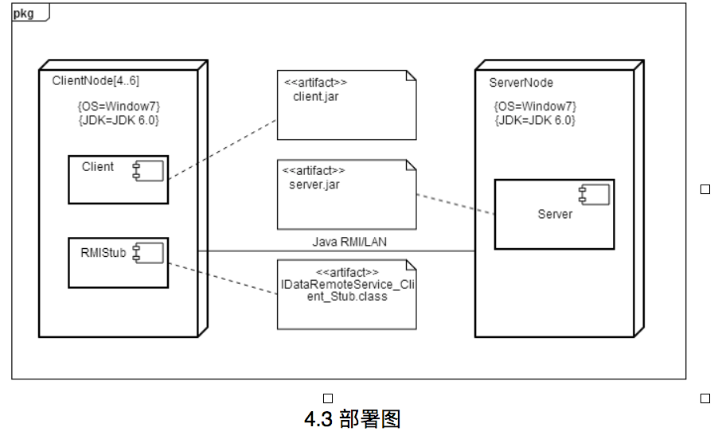
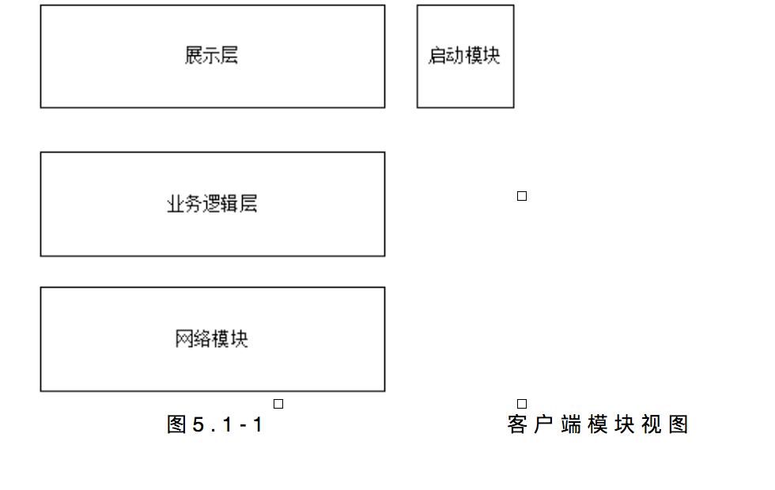
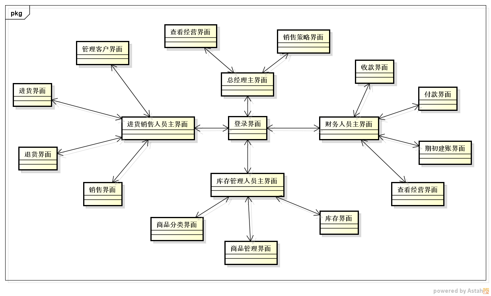
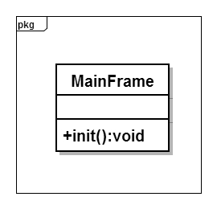
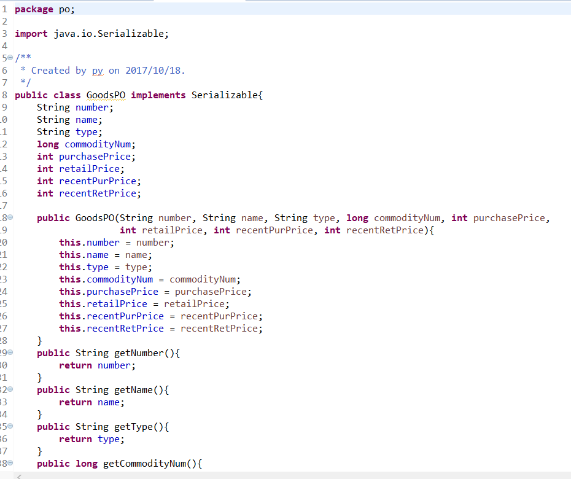
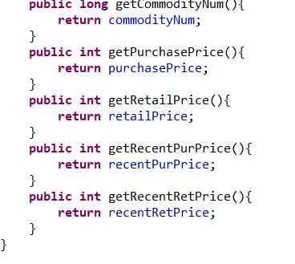

#
**企业进存销系统**  
 
 
 
#
 **SSASS(Stocking Selling and                               	Storing System)**
 
 
 
#
体系结构设计文档Storing System)
 
 
 
 
 
###**学院：南京大学软件学院** 
###**成员：潘羽 谢寅鹏 熊以恒 肖云帆** 
###**完成日期：2017年10月18日** 

##目录

##更新历史

#1.引言

##&nbsp;&nbsp;&nbsp;&nbsp;1.1编制目的
&nbsp;&nbsp;&nbsp;&nbsp;本报表详细完成对企业进销存系统的概要设计，达到指导详细设计和开发的目的，同时实现和测试人员及用户的沟通。
  &nbsp;&nbsp;&nbsp;&nbsp; 本报告面向开发人员、测试人员及最终用户而编写，是了解系统的导航。
 
 
 
##&nbsp;&nbsp;&nbsp;&nbsp;1.2词汇表
<table>
	<tr>
		<th>词汇名称</th>
		<th>词汇含义</th>
		<th>备注</th>
	</tr>
	<tr>
		<th>ui</th>
		<th>表示某展示层</th>
		<th>&nbsp;&nbsp;&nbsp;&nbsp;&nbsp;&nbsp;&nbsp;&nbsp;&nbsp;&nbsp;&nbsp;&nbsp;&nbsp;&nbsp;&nbsp;&nbsp;</th>
	</tr>
	<tr>
		<th>bl</th>
		<th>表示某逻辑层</th>
		<th>&nbsp;&nbsp;&nbsp;&nbsp;&nbsp;&nbsp;&nbsp;&nbsp;&nbsp;&nbsp;&nbsp;&nbsp;&nbsp;&nbsp;&nbsp;&nbsp;</th>
	</tr>
	<tr>
		<th>data</th>
		<th>表示某数据层</th>
		<th>&nbsp;&nbsp;&nbsp;&nbsp;&nbsp;&nbsp;&nbsp;&nbsp;&nbsp;&nbsp;&nbsp;&nbsp;&nbsp;&nbsp;&nbsp;&nbsp;</th>
	</tr>
	<tr>
		<th>RMI</th>
		<th>表示远程方法调用</th>
		<th>&nbsp;&nbsp;&nbsp;&nbsp;&nbsp;&nbsp;&nbsp;&nbsp;&nbsp;&nbsp;&nbsp;&nbsp;&nbsp;&nbsp;&nbsp;&nbsp;</th>
	</tr>
</table>

##&nbsp;&nbsp;&nbsp;&nbsp;1.3参考资料
<ol>
	<li>IEEE std 1471-2000</li>
<li>丁二玉，刘钦.计算与软件工程（卷二）[M]机械工业出版2012：134—182
</li>
</ol>

 
 
 
#2.产品概述
&nbsp;&nbsp;&nbsp;&nbsp;参考企业进销存系统系统用例文档和企业进销存系统软件需求规格说明文档中对产品的概括描述。企业进销存系统主要是应用于减少挤压库存，增加销售额，提高财务人员工作效率，为经理的决策做支持，主要功能见用例图如下。

_用例图.png)

 
 
 
#3.逻辑视角
&nbsp;&nbsp;&nbsp;&nbsp;企业进销存系统中，选择了分层体系结构风格，将系统分为3层(展示层、业务逻辑层、数据层)能够很好地示意整个高层抽象。展示层包含GUI页面的实现，业务逻辑层包含业务逻辑处理的实现，数据层负责数据的持久化和访问。分层体系结构的逻辑视角和逻辑设计方案如图1和图2所示。
 
 
 

 &nbsp;&nbsp;&nbsp;&nbsp;图一 参照体系结构风格的包图表达逻辑视角
 
 
 

 &nbsp;&nbsp;&nbsp;&nbsp;图二 软件体系结构逻辑设计方案
 
 
 

#4.组合视角
 &nbsp;&nbsp;&nbsp;&nbsp;[软工2 166]与抽象的逻辑设计相比，实现物理设计要考虑更多的实现细节，这些细节有：
<ol>
	<li>presentation层与logic层被置于客户端，data层被置于服务器端，那么logic层的开发包不可能依赖于data层的开发包。使用RMI技术，将data层开发包分解为置于客户端的dataservice接口包和置于服务器端的data层开发包。这样一来，logic层开发包依赖于dataservice包，dataservice包和data层的开发包都依赖于RMI类库包。</li>
	<li>所有的data层开发包都需要进行数据持久化（例如读写数据库、读写文件等），所以它们会有一些重复代码，可以将重复代码独立为新的开发包，然后所有的data层开发包都依赖于databaseutility。datavaseutility会依赖于JDBC类库包。
</li>
	<li>所有的presentation层开发包都需要使用图形类型建立界面，都要依赖于图形界面类库包。
</li>
	<li>此外，presentation层实现时，由mainui包负责整个页面之间的跳转逻辑。其他各包负责各自页面自身的功能。
</li>
	<li>在分层风格的典型设计中，不希望高层直接依赖于低层，而是为低层建立接口包，实现依赖倒置原则，所以应该调整为：各presentation层开发包（调用）依赖于logic层接口包businesslogicservice包，logic层开发包也依赖于（实现了）logic层接口包businesslogicservice包。
</li>
	<li>在分层风格的典型设计中，presentation层与logic层之间、logic层与data层之间可能会传递复杂数据对象，那么相邻两层都需要使用数据对象声明，所以需要将数据对象声明独立为开发包（VO包和PO包）。
</li>
<li>在logic层中，初始化和业务逻辑层上下文的工作被分配到utility包中。
经过细节改进，最终建立的互联网酒店预订系统开发包设计如表4.1-1，其局部包图如图4.1-1和4.1-2所示：
</li>
</ol>

#4.1开发包图
<table>
	<tr>
		<th>开发(物理)包</th>
		<th>依赖的其他开发包</th>
	</tr>
	<tr>
		<th align="left">mainui</th>
		<th align="left">classifyui, goodsui, commodityui, memberui, stockui, returnui, bankui, saleui, collectionui, paymentui, manageui, accountui, promotionui, checkui</th>
	</tr>	
	<tr>
		<th align="left">classfyui</th>
		<th align="left">classifyblservice, goodsbl, 界面类库包, vo </th>
	<tr>
	 <tr>
		<th align="left">classfyblservice</th>
		<th></th>
	<tr>
	<tr>
		<th align="left">classifybl</th>
		<th align="left">classifyblservice, classifydataservice, po, commoditybl, goodsbl</th>
	<tr>
	 <tr>
		<th align="left">classifydataservice</th>
		<th align="left">Java RMI, po</th>
	<tr>
	 <tr>
		<th align="left">classifydata</th>
		<th align="left">databaseutility, po, classifydataservice </th>
	<tr>
	 <tr>
		<th align="left">goodsui</th>
		<th align="left">goodsblservice, 界面类库包, vo</th>
	<tr>
	  <tr>
		<th align="left">goodsblservice</th>
		<th align="left"></th>
	<tr> <tr>
		<th align="left">goodsbl</th>
		<th align="left">goodsblservice, goodsdataservice, po, commoditybl</th>
	</tr> <tr>
		<th align="left">goodsdataservice</th>
		<th align="left">Java RMI, po</th>
	</tr> <tr>
		<th align="left">goodsdata</th>
		<th align="left">Java RMI, po, databaseutility</th>
	</tr> <tr>
		<th align="left">commodityui</th>
		<th align="left">commodityblservice, 界面类库包, vo</th>
	</tr> <tr>
		<th align="left">commodityblservice</th>
		<th align="left"></th>
	</tr> <tr>
		<th align="left">commoditybl</th>
		<th align="left">commodityblservice, commoditydataservice, po, salebl</th>
	</tr> <tr>
		<th align="left">commoditydataservice</th>
		<th align="left">Java RMI, po</th>
	</tr> <tr>
		<th align="left">commoditydata</th>
		<th align="left">Java RMI, po, databaseutility</th>
	</tr> 
	 <tr>
		<th align="left">memberui</th>
		<th align="left">memberblservice, 界面类库包, vo</th>
	</tr> <tr>
		<th align="left">memberblservice</th>
		<th align="left"></th>
	</tr> <tr>
		<th align="left">memberbl</th>
		<th align="left">memberblservice, memberdataservice, po, salebl, commoditybl</th>
	</tr> <tr>
		<th align="left">memberdataservice</th>
		<th align="left">Java RMI, po</th>
	</tr> <tr>
		<th align="left">memberdata</th>
		<th align="left">Java RMI, po, databaseutility</th>
	</tr> 
	 <tr>
		<th align="left">stockui</th>
		<th align="left">stockblservice, 界面类库包, vo</th>
	</tr> <tr>
		<th align="left">stockblservice</th>
		<th align="left"></th>
	</tr> <tr>
		<th align="left">stockbl</th>
		<th align="left">stockblservice, stockdataservice, po, commoditybl</th>
	</tr> <tr>
		<th align="left">stockdataservice</th>
		<th align="left">Java RMI, po</th>
	</tr> <tr>
		<th align="left">stockdata</th>
		<th align="left">Java RMI, po, databaseutility</th>
	</tr> 

 
  <tr>
		<th align="left">returnui</th>
		<th align="left">returnblservice, 界面类库包, vo</th>
	</tr> <tr>
		<th align="left">returnblservice</th>
		<th align="left"></th>
	</tr> <tr>
		<th align="left">returnbl</th>
		<th align="left">returnblservice, returndataservice, po, commoditybl</th>
	</tr> <tr>
		<th align="left">returndataservice</th>
		<th align="left">Java RMI, po</th>
	</tr> <tr>
		<th align="left">returndata</th>
		<th align="left">Java RMI, po, databaseutility</th>
	</tr> 

 <tr>
		<th align="left">bankui</th>
		<th align="left">bankblservice, 界面类库包, vo</th>
	</tr> <tr>
		<th align="left">bankblservice</th>
		<th align="left"></th>
	</tr> <tr>
		<th align="left">bankbl</th>
		<th align="left">bankblservice, bankdataservice, po</th>
	</tr> <tr>
		<th align="left">bankdataservice</th>
		<th align="left">Java RMI, po</th>
	</tr> <tr>
		<th align="left">bankdata</th>
		<th align="left">Java RMI, po, databaseutility</th>
	</tr> 

 <tr>
		<th align="left">saleui</th>
		<th align="left">saleblservice, 界面类库包, vo</th>
	</tr> <tr>
		<th align="left">saleblservice</th>
		<th align="left"></th>
	</tr> <tr>
		<th align="left">salebl</th>
		<th align="left">saleblservice, saledataservice, po, promotionbl, userbl</th>
	</tr> <tr>
		<th align="left">saledataservice</th>
		<th align="left">Java RMI, po</th>
	</tr> <tr>
		<th align="left">saledata</th>
		<th align="left">Java RMI, po, databaseutility</th>
	</tr> 

 <tr>
		<th align="left">collectionui</th>
		<th align="left">collectionblservice, 界面类库包, vo</th>
	</tr> <tr>
		<th align="left">collectionblservice</th>
		<th align="left"></th>
	</tr> <tr>
		<th align="left">collectionbl</th>
		<th align="left">collectionblservice, collectiondataservice, po, </th>
	</tr> <tr>
		<th align="left">collectiondataservice</th>
		<th align="left">Java RMI, po</th>
	</tr> <tr>
		<th align="left">collectiondata</th>
		<th align="left">Java RMI, po, databaseutility</th>
	</tr> 

 <tr>
		<th align="left">paymentui</th>
		<th align="left">paymentblservice, 界面类库包, vo</th>
	</tr> <tr>
		<th align="left">paymentblservice</th>
		<th align="left"></th>
	</tr> <tr>
		<th align="left">paymentbl</th>
		<th align="left">paymentblservice, paymentdataservice, po, checkbl</th>
	</tr> <tr>
		<th align="left">paymentdataservice</th>
		<th align="left">Java RMI, po</th>
	</tr> <tr>
		<th align="left">paymentdata</th>
		<th align="left">Java RMI, po, databaseutility</th>
	</tr> 

 <tr>
		<th align="left">manageui</th>
		<th align="left">manageblservice, 界面类库包, vo</th>
	</tr> <tr>
		<th align="left">manageblservice</th>
		<th align="left"></th>
	</tr> <tr>bk
		<th align="left">managebl</th>
		<th align="left">manageblservice, managedataservice, po</th>
	</tr> <tr>
		<th align="left">managedataservice</th>
		<th align="left">Java RMI, po</th>
	</tr> <tr>
		<th align="left">managedata</th>
		<th align="left">Java RMI, po, databaseutility</th>
	</tr> 

 <tr>
		<th align="left">accountui</th>
		<th align="left">accountblservice, 界面类库包, vo</th>
	</tr> <tr>
		<th align="left">accountblservice</th>
		<th align="left"></th>
	</tr> <tr>
		<th align="left">accountbl</th>
		<th align="left">accountblservice, accountdataservice, po</th>
	</tr> <tr>
		<th align="left">accountdataservice</th>
		<th align="left">Java RMI, po</th>
	</tr> <tr>
		<th align="left">accountdata</th>
		<th align="left">Java RMI, po, databaseutility</th>
	</tr> 

 <tr>
		<th align="left">promotionui</th>
		<th align="left">promotionblservice, 界面类库包, vo</th>
	</tr> <tr>
		<th align="left">promotionblservice</th>
		<th align="left"></th>
	</tr> <tr>
		<th align="left">promotionbl</th>
		<th align="left">promotionblservice, promotiondataservice, po</th>
	</tr> <tr>
		<th align="left">promotiondataservice</th>
		<th align="left">Java RMI, po</th>
	</tr> <tr>
		<th align="left">promotiondata</th>
		<th align="left">Java RMI, po, databaseutility</th>
	</tr> 

 <tr>
		<th align="left">checkui</th>
		<th align="left">checkblservice, 界面类库包, vo</th>
	</tr> <tr>
		<th align="left">checkblservice</th>
		<th align="left"></th>
	</tr> <tr>
		<th align="left">checkbl</th>
		<th align="left">checkblservice, checkdataservice, po</th>
	</tr> <tr>
		<th align="left">checkdataservice</th>
		<th align="left">Java RMI, po</th>
	</tr> <tr>
		<th align="left">checkdata</th>
		<th align="left">Java RMI, po, databaseutility</th>
	</tr> 

<tr>
		<th align="left">userui</th>
		<th align="left">userblservice, 界面类库包, vo</th>
	</tr> <tr>
		<th align="left">userblservice</th>
		<th align="left"></th>
	</tr> <tr>
		<th align="left">userbl</th>
		<th align="left">userblservice, userdataservice, po</th>
	</tr> <tr>
		<th align="left">userdataservice</th>
		<th align="left">Java RMI, po</th>
	</tr> <tr>
		<th align="left">userdata</th>
		<th align="left">Java RMI, po</th>
	</tr> 
<tr>
	<th align="left">vo</th>
	<th align="left"></th>
</tr>
<tr>
	<th align="left">po</th>
	<th align="left"></th>
</tr>
<tr>
	<th align="left">utilitybl</th>
	<th align="left"></th>
</tr>

<tr>
	<th align="left">界面类库包</th>
	<th align="left"></th>
</tr>

<tr>
	<th align="left">Java RMI</th>
	<th align="left"></th>
</tr>
<tr>
	<th align="left">Databaseutility </th>
	<th align="left">JDBC</th>
</tr>

</table>

**补图**

##4.2运行时进程
在企业进销存系统中，会有多个客户端进程和一个服务器端进程，其进程图如图4.2所示。结合部署图，客户端进程实在客户端机器上运行，服务器端进程是在服务器端机器上运行。 
                
 图4.2 进程图
 
                 
                 
                 
&nbsp;&nbsp;&nbsp;&nbsp; 企业进存销系统中客户端构件是放在客户端机器上，服务器端构件是放在服务器端机器上。在客户端节点上，还要部署RMIStub构件。由于JavaRMI构件属于JDK6.0的一部分。所以，在系统JDK环境未设置好的情况下，需要将系统打包成exe文件。部署图如图4.3所示。 
 
 

 
 
 
 
 
 
#5.接口视角
##5.1 模块的职责

**表5.1-1 客户端各层的职责**

<table>
	<tr>
		<th>层</th>
		<th>职责</th>
	</tr>
<tr>
		<th>启动模块</th>
		<th>负责初始化网络通信机制，启动用户界面。</th>
	</tr>
<tr>
		<th>用户界面层</th>
		<th>基于窗口的进销存系统客户端用户界面。</th>
	</tr>
<tr>
		<th>业务逻辑层</th>
		<th>对于用户界面的输入响应和业务处理逻辑。</th>
	</tr>
<tr>
		<th>客户端网络模块</th>
		<th>利用Java RMI机制查找RMI服务</th>
	</tr>
</table>

 
<brqqq>
**表5.1-2 服务器端各层的职责**

<table>
	<tr>
		<th>层</th>
		<th>职责</th>
	</tr>
<tr>
		<th>启动模块</th>
		<th>负责初始化网络通信机制，启动用户界面。</th>
	</tr>
<tr>
		<th>数据层</th>
		<th>负责数据的持久化及数据访问接口。</th>
	</tr>
<tr>
		<th>服务器端网络模块</th>
		<th>利用Java RMI机制开启RMI服务，注册RMI服务</th>
	</tr>
</table>
&nbsp;&nbsp;&nbsp;&nbsp;每一层只是使用下方直接接触的层。层与层之间仅仅是通过接口的调用来完成的。层之间调用的接口如表5.1-3所示。
<table>
	<tr>
		<th>接口</th>
		<th>服务调用方</th>
		<th>服务提供方</th>
	</tr>
	<tr>
		<th align="left">classfyblservice 
		goodsblService 
		commodityblService 
		memberblService 
		stockblService 
		returnblService 
		bankblService 
		saleblService 
		collectblService 
		payblService 
		manageblservice 
		accountblservice 
		promotionblservice 
		checkblservice 
		userblservice</th>
		<th>客户端展示层</th>
		<th>客户端业务逻辑层</th>
	</tr>
<tr>
		<th align="left">goodsDataService 
		commodityDataService 
		memberDataService 
		stockDataService 
		returnDataService 
		bankDataService 
		saleDataService 
		collectDataService 
		payDataService 
		manageDataservice 
		accountDataservice 
		promotionDataservice 
		checkDataservice 
		userDataservice</th>
		<th>客户端业务逻辑层</th>
		<th>服务器端数据层</th>
	</tr>

</table>
&nbsp;&nbsp;&nbsp;&nbsp;借用用户管理用例来说明层之间的调用，如图5.1-3所示。每一层之间都是由上层依赖了一个接口（需接口），而下层实现这个接口（供接口）。userblService提供了User界面所需要的所有业务逻辑功能UserDataService提供了对数据库的增、删、改、查等操作。这样的实现就大大降低了层与层之间的耦合。

##5.2用户界面层的分解 
根据需求，系统存在19个用户界面：登录界面、 总经理主界面，销售策略界面、查看经营界面、财务人员主界面、收款界面、付款界面、初期建账界面、查看经营界面、库存管理人员界面、库存界面、商品管理界面、商品分类界面、进货销售人员主界面、销售界面、退货界面、进货界面、管理客户界面。
  界面跳转如图5.2.1所示。
 

#

服务器端和客户端的用户界面设计接口是一致的，只是具体的页面不一样。用户界面类如图5.2.2所示。

 
###5.2.1用户界面层的分解 
如表5.2.1-1所示为用户界面层模块的职责。 
表5.2.1-1 用户界面层模块的职责 
<table>

<tr><th>MainFrame</th>
<th colspan="2">界面Frame，负责界面的显示和界面的跳转。</th> </tr>
</table>

###5.2.2用户界面层模块的接口规范 
如表5.2.2所示为用户界面层模块的接口规范。 
表5.2.2 用户界面层模块的接口规范 
<table>
	<tr>
		<th colspan="3">提供的服务（供接口）</th>
	</tr>
	<tr>
		<th rowspan="3">mainui</th>
		<th>语法</th>
		<th>Init(args:String[])</th>
		</tr>
		<tr>
			<th>前置条件</th>
			<th>无</th>
		</tr>
		<tr>
			<th>后置条件</th>
			<th>显示Frame</th>	
		</tr>	
<tr>
		<th rowspan="3">orderui</th>
		<th>语法</th>
		<th>Init(args:String[])</th>
		</tr>
		<tr>
			<th>前置条件</th>
			<th>无</th>
		</tr>
		<tr>
			<th>后置条件</th>
			<th>显示OrderPanel</th>
</tr>	
<tr>
		<th rowspan="3">userui</th>
		<th>语法</th>
		<th>Init(args:String[])</th>
		</tr>
		<tr>
			<th>前置条件</th>
			<th>无</th>
		</tr>
		<tr>
			<th>后置条件</th>
			<th>显示UserPanel</th>
</tr>	
<tr>
		<th rowspan="3">promotionui</th>
		<th>语法</th>
		<th>Init(args:String[])</th>
		</tr>
		<tr>
			<th>前置条件</th>
			<th>无</th>
		</tr>
		<tr>
			<th>后置条件</th>
			<th>显示PromotionPanel</th>
</tr>	

<tr><th colspan="4">需要的服务（需接口)</th></tr>
<tr><th>服务名</th><th colspan="2">服务</th>
<tr><th>businessLogicService.orderblservice</th>
<th colspan="2">处理与订单查看、订单处理相关的接口</th> </tr>
<tr><th>businesslLogicService.user blservice</th>
<th colspan="2">处理用户信息的接口</th> </tr>
<tr><th>businessLogicService.promotionblservice
<th colspan="2">处理酒店、网站促销策略制定的接口</th> </th></tr>
<tr><th>businesslogicservice.hotelblservice</th>
<th colspan="2">处理酒店信息的接口</th> </tr>
</table>

###5.2.3 用户界面模块设计原理 
用户界面利用Java的Swing和AWT库来实现。

##5.3业务逻辑层的分解
&nbsp;&nbsp;&nbsp;&nbsp;业务逻辑层包括多个针对界面的业务逻辑处理对象。例如，User对象负责处理登陆界面的业务逻辑；User对象负责处理管理用户的业务逻辑。业务逻辑层的设计如图5.3-1所示。

###5.3.1业务逻辑层模块的职责
业务逻辑层模块的职责如表5.3.1-1所示
<table>
	<tr>
		<th>模块</th>
		<th>职责</th>
	</tr>
	<tr>
		<th align="left">classifybl</th>
		<th align="left">负责与商品分类相关的服务</th>
	</tr>
	<tr>
		<th align="left">goodsbl</th>
		<th align="left">负责与商品相关的服务</th>
	</tr>
	<tr>
		<th align="left">commoditybl</th>
		<th align="left">负责与库存相关的服务</th>
	</tr>
		<tr>
		<th align="left">memberbl</th>
		<th align="left">负责与会员相关的服务</th>
	</tr>
		<tr>
		<th align="left">stockbl</th>
		<th align="left">负责与进货相关的服务</th>
	</tr>
		<tr>
		<th align="left">returnbl</th>
		<th align="left">负责与退货相关的服务</th>
	</tr>
		<tr>
		<th align="left">bankbl</th>
		<th align="left">负责与银行账户相关的服务</th>
	</tr>
		<tr>
		<th align="left">salebl</th>
		<th align="left">负责与销售相关的服务</th>
	</tr>
		<tr>
		<th align="left">collectionbl</th>
		<th align="left">负责与收款相关的服务</th>
	</tr>
	<tr>
		<th align="left">paymentbl</th>
		<th align="left">负责与付款相关的服务</th>
	</tr>
	<tr>
		<th align="left">managebl</th>
		<th align="left">负责与查看经营相关的服务</th>
	</tr>
	<tr>
		<th align="left">accountbl</th>
		<th align="left">负责与账单相关的服务</th>
	</tr>
	<tr>
		<th align="left">promotionbl</th>
		<th align="left">负责与促销策略相关的服务</th>
	</tr>
	<tr>
		<th align="left">checkbl</th>
		<th align="left">负责与审批订单相关的服务</th>
	</tr>
	<tr>
		<th align="left">userbl</th>
		<th align="left">负责处理与用户信息管理相关的服务</th>
	</tr>
</table>
###5.3.1业务逻辑层模块的接口规范
表5.3.2-1 classifybl模块的接口规范
<table>
	<tr>
		<th colspan="3">提供的服务（供接口）</th>
	</tr>
	<tr>
		<th rowspan="3">classifybl.checkClassfiy</th>
		<th>语法</th>
		<th>public ArrayList&lt;ClassifyVO> checkClassify(String node);</th>
		</tr>
		<tr>
			<th>前置条件</th>
			<th>商品分类需更新</th>
		</tr>
		<tr>
			<th>后置条件</th>
			<th>返回最新的商品分类列表</th>		</tr>	
<tr>
		<th rowspan="3">classifybl.addClassify</th>
		<th>语法</th>
		<th> public ResultMessage addClassify(ClassifyVO vo);</th>
		</tr>
		<tr>
			<th>前置条件</th>
			<th>库存管理人员增加商品分类</th>
		</tr>
		<tr>
			<th>后置条件</th>
			<th>增加存储的商品分类</th>
</tr>	
<tr>
		<th rowspan="3">classifybl.deleteClassify</th>
		<th>语法</th>
		<th>   public ResultMessage deleteClassify(ClassifyVO vo);</th>
		</tr>
		<tr>
			<th>前置条件</th>
			<th>库存管理人员删除商品分类</th>
		</tr>
		<tr>
			<th>后置条件</th>
			<th>删除存储的商品分类</th>
</tr>	
<tr>
		<th rowspan="3">classifybl.modifyClassify</th>
		<th>语法</th>
		<th>public ResultMessage modifyClassify(ClassifyVO vo);</th>
		</tr>
		<tr>
			<th>前置条件</th>
			<th>库存管理人员修改商品分类</th>
		</tr>
		<tr>
			<th>后置条件</th>
			<th>改变存储的商品分类</th>
</tr>	

<tr><th colspan="4">需要的服务（需接口)</th></tr>
<tr><th>服务名</th><th colspan="2">服务</th>
<tr><th>ClassfiyData.add(ClassifyPO po);</th>
<th colspan="2">增加一个商品分类</th> </tr>
<tr><th>ClassfiyData.find(String keywords);</th>
<th colspan="2">查找一个商品分类，已知商品关键字</th> </tr>
<tr><th>ClassfiyData.delete(ClassifyPO po);
<th colspan="2">删除一个商品分类</th> </th></tr>
<tr><th>ClassfiyData.modify(ClassifyPO po);</th>
<th colspan="2">修改一个商品分类</th> </tr>
</table>

表5.3.2-2 goodsbl模块的接口规范
<table>
	<tr>
		<th colspan="3">提供的服务（供接口）</th>
	</tr>
	<tr>
		<th rowspan="3">goodsbl.addGoods</th>
		<th>语法</th>
		<th>public ResultMessage addGoods(GoodsVO vo);</th>
		</tr>
		<tr>
			<th>前置条件</th>
			<th>库存管理人员增加库存商品</th>
		</tr>
		<tr>
			<th>后置条件</th>
			<th>增加存储的商品</th>	
		</tr>	
<tr>
		<th rowspan="3">goodsbl.deleteGoods</th>
		<th>语法</th>
		<th>public ResultMessage deleteGoods(GoodsVO vo);</th>
		</tr>
		<tr>
			<th>前置条件</th>
			<th>库存管理人员删除商品</th>
		</tr>
		<tr>
			<th>后置条件</th>
			<th>删除存储的商品</th>
</tr>	
<tr>
		<th rowspan="3">goodsbl.modifyGoods</th>
		<th>语法</th>
		<th>public ResultMessage modifyGoods(GoodsVO vo);</th>
		</tr>
		<tr>
			<th>前置条件</th>
			<th>库存管理人员修改商品</th>
		</tr>
		<tr>
			<th>后置条件</th>
			<th>改变存储的商品信息</th>
</tr>	
<tr>
		<th rowspan="3">goodsbl.findGoods</th>
		<th>语法</th>
		<th>public ArrayList&lt;GoodsVO&gt;findGoods(String keywords);</th>
		</tr>
		<tr>
			<th>前置条件</th>
			<th>库存管理人员通过关键字查找商品修改商品</th>
		</tr>
		<tr>
			<th>后置条件</th>
			<th>显示商品信息列表</th>
</tr>	
<tr>
		<th rowspan="3">goodsbl.getGoods</th>
		<th>语法</th>
		<th>public ArrayList&lt;GoodsVO> getGoods(String Node);</th>
		</tr>
		<tr>
			<th>前置条件</th>
			<th>库存管理人员点击商品分类节点</th>
		</tr>
		<tr>
			<th>后置条件</th>
			<th>返回商品信息</th>
</tr>	

<tr><th colspan="4">需要的服务（需接口)</th></tr>
<tr><th>服务名</th><th colspan="2">服务</th>
<tr><th>GoodsData.add(GoodsPO po);</th>
<th colspan="2">增加一个商品</th> </tr>
<tr><th>GoodsData.find(String keywords);</th>
<th colspan="2">查找一个商品</th> </tr>
<tr><th>GoodsData.delete(GoodsPO po);
<th colspan="2">删除一个商品</th> </th></tr>
<tr><th>GoodsData.modify(GoodsPO po);</th>
<th colspan="2">修改一个商品</th> </tr>
</table>

**表5.3.2-3 commoditybl模块的接口规范**
<table>
	<tr>
		<th colspan="3">提供的服务（供接口）</th>
	</tr>
	<tr>
		<th rowspan="3">commodity.InTime</th>
		<th>语法</th>
		<th>public ResultMessage inTime(String currentTime);</th>
		</tr>
		<tr>
			<th>前置条件</th>
			<th>库存管理人员在预设时间查看库存</th>
		</tr>
		<tr>
			<th>后置条件</th>
			<th>根据时间允许查看库存</th>	
		</tr>	
<tr>
		<th rowspan="3">commoditybl.getComInfo</th>
		<th>语法</th>
		<th>public  ArrayList&lt;CommodityVO> getComInfo(String date);</th>
		</tr>
		<tr>
			<th>前置条件</th>
			<th>库存管理人员查看库存</th>
		</tr>
		<tr>
			<th>后置条件</th>
			<th>返回库存属性列表</th>
</tr>	
<tr>
		<th rowspan="3">commoditybl.checkComInfo</th>
		<th>语法</th>
		<th>public  ArrayList&lt;commodityVO> checkComInfo(String date)</th>
		</tr>
		<tr>
			<th>前置条件</th>
			<th>库存管理人员盘点库存</th>
		</tr>
		<tr>
			<th>后置条件</th>
			<th>返回库存商品列表</th>
</tr>	
<tr>
<tr>
		<th rowspan="3">commoditybl.createPresentList</th>
		<th>语法</th>
		<th>public ArrayList&lt;commodityVO> createPresentList(String date);</th>
		</tr>
		<tr>
			<th>前置条件</th>
			<th>库存管理人员选择商品赠送</th>
		</tr>
		<tr>
			<th>后置条件</th>
			<th>显示赠送商品列表</th>
</tr>	
<tr>
		<th rowspan="3">commoditybl.submitPresentOrder</th>
		<th>语法</th>
		<th>public  boolean submitPresentOrder(String date, ArrayList&lt;commodityVO> presentLst)</th>
		</tr>
		<tr>
			<th>前置条件</th>
			<th>库存管理人员提交商品赠送单</th>
		</tr>
		<tr>
			<th>后置条件</th>
			<th>保存赠送单信息</th>
</tr>	
<tr>
		<th rowspan="3">commoditybl.removeCom</th>
		<th>语法</th>
		<th>public  ResultMessage removeCom(String date, ArrayList&lt;commodityVO> presentLst)</th>
		</tr>
		<tr>
			<th>前置条件</th>
			<th>库存管理人员已经选择商品赠送</th>
		</tr>
		<tr>
			<th>后置条件</th>
			<th>库存减去赠送商品并保存</th>
</tr>	
<tr>
		<th rowspan="3">commoditybl.submitBreakageRecepit</th>
		<th>语法</th>
		<th>public  boolean submitBreakageRecepit(String date, ArrayList&lt;commodityVO> brkLst)</th>
		</tr>
		<tr>
			<th>前置条件</th>
			<th>库存报损</th>
		</tr>
		<tr>
			<th>后置条件</th>
			<th>提交库存报损单</th>
</tr>	
<tr>
		<th rowspan="3">commoditybl.submitOverflowRecepit</th>
		<th>语法</th>
		<th>public  ResultMessage submitOverflowRecepit(String date, ArrayList&lt;commodityVO> overflowLst)</th>
		</tr>
		<tr>
			<th>前置条件</th>
			<th>库存报溢</th>
		</tr>
		<tr>
			<th>后置条件</th>
			<th>提交库存报溢单</th>
</tr>	

<tr><th colspan="4">需要的服务（需接口)</th></tr>
<tr><th>服务名</th><th colspan="2">服务</th>
<tr><th> CommodityData.isInTime(String time);</th>
<th colspan="2">检查库存在预设时间内</th> </tr>
<tr><th>CommodityData.getComInfo(String date);</th>
<th colspan="2">查询库存</th> </tr>
<tr><th>CommodityData.getGoods(String goodsNode);
<th colspan="2">获得商品信息</th> </th></tr>
<tr><th>CommodityData.createPresentList(String date);</th>
<th colspan="2">创建赠送方案</th> </th></tr>
<tr><th>CommodityData.removeCom(String date, ArrayList&It;CommodityPO> lst)</th>
<th colspan="2">删除赠送商品</th> </tr>
<tr><th>CommodityData.submitBreakageRecepit	(String date, ArrayList&It;CommodityPO> lst)</th>
<th colspan="2">提交报损单</th> </tr>
<tr><th>CommodityData.submitOverflowRecepit	(String date, ArrayList&It;CommodityPO> lst)</th>
<th colspan="2">提交报溢单</th> </tr>
<tr><th>CommodityData.submitWarningRecepit(String date, ArrayList&It;CommodityPO> lst)</th>
<th colspan="2">提交报警单</th> </tr>

</table>

表5.3.2-4 memberbl模块的接口规范
<table>
	<tr>
		<th colspan="3">提供的服务（供接口）</th>
	</tr>
	<tr>
		<th rowspan="3">memberbl.add</th>
		<th>语法</th>
		<th> public ResultMessage add(MemberVO vo);</th>
		</tr>
		<tr>
			<th>前置条件</th>
			<th>新增一条客户信息</th>
		</tr>
		<tr>
			<th>后置条件</th>
			<th>系统新增客户并分配id</th>	
		</tr>	
<tr>
		<th rowspan="3">memberbl.delete</th>
		<th>语法</th>
		<th>public ResultMessage delete(MemberVO vo);</th>
		</tr>
		<tr>
			<th>前置条件</th>
			<th>删除一条客户信息</th>
		</tr>
		<tr>
			<th>后置条件</th>
			<th>系统删除客户的信息</th>
</tr>	
<tr>
		<th rowspan="3">memberbl.modify</th>
		<th>语法</th>
		<th>public ResultMessage modify(MembeVO vo);</th>
		</tr>
		<tr>
			<th>前置条件</th>
			<th>修改已有客户信息</th>
		</tr>
		<tr>
			<th>后置条件</th>
			<th>系统中客户信息修改完成</th>
</tr>	
<tr>
		<th rowspan="3">memberbl.find</th>
		<th>语法</th>
		<th>public ArrayList&lt;MemberVO> find(String keywords);</th>
		</tr>
		<tr>
			<th>前置条件</th>
			<th>通过关键字查找客户</th>
		</tr>
		<tr>
			<th>后置条件</th>
			<th>显示客户信息列表</th>
</tr>	

<tr><th colspan="4">需要的服务（需接口)</th></tr>
<tr><th>服务名</th><th colspan="2">服务</th>
<tr><th>MemberData.add(MemberPO po);</th>
<th colspan="2">增加一个商品</th> </tr>
<tr><th>MemberData.find(String keywords);</th>
<th colspan="2">查找一个商品</th> </tr>
<tr><th>MemberData.delete(MemberPO po);
<th colspan="2">删除一个商品</th> </th></tr>
<tr><th>MemberData.modify(MemberPO po);</th>
<th colspan="2">修改一个商品</th> </tr>
</table>

表5.3.2-5 stockbl模块的接口规范
<table>
	<tr>
		<th colspan="3">提供的服务（供接口）</th>
	</tr>
	<tr>
		<th rowspan="3">stockbl.addGoods</th>
		<th>语法</th>
		<th>public ResultMessage createReceipt(StockVO vo);</th>
		</tr>
		<tr>
			<th>前置条件</th>
			<th>进货销售人员创建货单</th>
		</tr>
		<tr>
			<th>后置条件</th>
			<th>货单创建初始化</th>	
		</tr>	
<tr>
		<th rowspan="3">stockbl.deleteGoods</th>
		<th>语法</th>
		<th>public ResultMessage cancelReceipt(StockVO vo);</th>
		</tr>
		<tr>
			<th>前置条件</th>
			<th>进货销售人员移除货单</th>
		</tr>
		<tr>
			<th>后置条件</th>
			<th>系统清除货单</th>
</tr>	
<tr>
		<th rowspan="3">stockbl.modifyGoods</th>
		<th>语法</th>
		<th>public ResultMessage finshReceipt(StockVO vo);</th>
		</tr>
		<tr>
			<th>前置条件</th>
			<th>进货销售人员编辑货单</th>
		</tr>
		<tr>
			<th>后置条件</th>
			<th>改变存储的货单信息</th>
</tr>	
<tr>
		<th rowspan="3">stockbl.findGoods</th>
		<th>语法</th>
		<th>public ArrayList&lt;StockVO> getReceipt(StockVO vo);</th>
		</tr>
		<tr>
			<th>前置条件</th>
			<th>进货销售人员通过关键字查找货单</th>
		</tr>
		<tr>
			<th>后置条件</th>
			<th>显示货单信息列表</th>
</tr>	
<tr>
		<th rowspan="3">stockbl.getGoods</th>
		<th>语法</th>
		<th>public ResultMessage changeMoney(StockVO vo);</th>
		</tr>
		<tr>
			<th>前置条件</th>
			<th>进货销售人员修改金额</th>
		</tr>
		<tr>
			<th>后置条件</th>
			<th>返回修改后金额</th>
</tr>	

<tr><th colspan="4">需要的服务（需接口)</th></tr>
<tr><th>服务名</th><th colspan="2">服务</th>
<tr><th>StockData.add(StockPO po);</th>
<th colspan="2">新增货单</th> </tr>
<tr><th>StockData.getReceipt(StockPO po)</th>
<th colspan="2">得到货单信息</th> </tr>
<tr><th>StockData.remove(StockPO po);
<th colspan="2">删除货单</th> </th></tr>
<tr><th>StockData.modify(StockPO po);</th>
<th colspan="2">修改货单</th> </tr>
<tr><th>StockData.stockCom(CommodityPO po, ArrayList&lt;StockPO> receipt);</th>
<th colspan="2">增加库存</th> </tr>
</table>

表5.3.2-6 returnbl模块的接口规范
<table>
    <tr>
        <th colspan="3">提供的服务（供接口）</th>
    </tr>
    <tr>
        <th rowspan="3">returnbl.addGoods</th>
        <th>语法</th>
        <th>public ResultMessage createReceipt(ReturnVO vo);</th>
        </tr>
        <tr>
            <th>前置条件</th>
            <th>进货销售人员创建货单</th>
        </tr>
        <tr>
            <th>后置条件</th>
            <th>货单创建初始化</th>    
        </tr>   
<tr>
        <th rowspan="3">returnbl.deleteGoods</th>
        <th>语法</th>
        <th>public ResultMessage cancelReceipt(ReturnVO vo);</th>
        </tr>
        <tr>
            <th>前置条件</th>
            <th>进货销售人员移除货单</th>
        </tr>
        <tr>
            <th>后置条件</th>
            <th>系统清除货单</th>
</tr>   
<tr>
        <th rowspan="3">returnbl.modifyGoods</th>
        <th>语法</th>
        <th>public ResultMessage finshReceipt(ReturnVO vo);</th>
        </tr>
        <tr>
            <th>前置条件</th>
            <th>进货销售人员编辑货单</th>
        </tr>
        <tr>
            <th>后置条件</th>
            <th>改变存储的货单信息</th>
</tr>   
<tr>
        <th rowspan="3">returnbl.findGoods</th>
        <th>语法</th>
        <th>public ArrayList&lt;ReturnVO> getReceipt(ReturnVO vo);</th>
        </tr>
        <tr>
            <th>前置条件</th>
            <th>进货销售人员通过关键字查找货单</th>
        </tr>
        <tr>
            <th>后置条件</th>
            <th>显示货单信息列表</th>
</tr>   
<tr>
        <th rowspan="3">returnbl.getGoods</th>
        <th>语法</th>
        <th>public ResultMessage changeMoney(ReturnVO vo);</th>
        </tr>
        <tr>
            <th>前置条件</th>
            <th>进货销售人员修改金额</th>
        </tr>
        <tr>
            <th>后置条件</th>
            <th>返回修改后金额</th>
</tr>   

<tr><th colspan="4">需要的服务（需接口)</th></tr>
<tr><th>服务名</th><th colspan="2">服务</th>
<tr><th>ReturnData.add(ReturnPO po);</th>
<th colspan="2">新增货单</th> </tr>
<tr><th>ReturnData.getReceipt(ReturnPO po)</th>
<th colspan="2">得到货单信息</th> </tr>
<tr><th>ReturnData.remove(ReturnPO po);
<th colspan="2">删除货单</th> </th></tr>
<tr><th>ReturnData.modify(ReturnPO po);</th>
<th colspan="2">修改货单</th> </tr>
<tr><th>ReturnData.returnCom(CommodityPO po, ArrayList&lt;ReturnPO> receipt);</th>
<th colspan="2">减少库存</th> </tr>
</table>

表5.3.2-7  bankbl模块的接口规范
<table>
    <tr>
        <th colspan="3">提供的服务（供接口）</th>
    </tr>
    <tr>
        <th rowspan="3">bankbl.add</th>
        <th>语法</th>
        <th>public ResultMessage add (BankVO bank);</th>
        </tr>
        <tr>
            <th>前置条件</th>
            <th>已知新增的银行账户信息</th>
        </tr>
        <tr>
            <th>后置条件</th>
            <th>新增银行账户信息并返回保存结果</th>    
        </tr>   
<tr>
        <th rowspan="3">bankbl.update</th>
        <th>语法</th>
        <th>public ResultMessage update(BankVO bank);</th>
        </tr>
        <tr>
            <th>前置条件</th>
            <th>修改一个银行账户信息，已知要修改的银行账户信息</th>
        </tr>
        <tr>
            <th>后置条件</th>
            <th>修改银行账户信息并返回保存结果</th>
</tr>   
<tr>
        <th rowspan="3">bankbl.deleteBank</th>
        <th>语法</th>
        <th>public ResultMessage deleteBank (BankVO bank);</th>
        </tr>
        <tr>
            <th>前置条件</th>
            <th>删除一个银行账户信息，已知要修改的银行账户信息</th>
        </tr>
        <tr>
            <th>后置条件</th>
            <th>删除银行账户信息并返回保存结果</th>
</tr>   
<tr>
        <th rowspan="3">bankbl.get</th>
        <th>语法</th>
        <th>public BankVO get(String Number);</th>
        </tr>
        <tr>
            <th>前置条件</th>
            <th>通过关键字查找银行账户</th>
        </tr>
        <tr>
            <th>后置条件</th>
            <th>显示账户信息列表</th>
</tr>   
<tr>
        <th rowspan="3">bankbl.getList</th>
        <th>语法</th>
        <th>public ArrayList&lt;BankVO> getList();</th>
        </tr>
        <tr>
            <th>前置条件</th>
            <th>无</th>
        </tr>
        <tr>
            <th>后置条件</th>
            <th>无</th>
</tr>   

<tr><th colspan="4">需要的服务（需接口)</th></tr>
<tr><th>服务名</th><th colspan="2">服务</th>
<tr><th>BankData.add(BankPO bank);</th>
<th colspan="2">新增账户</th> </tr>
<tr><th>BankData.update(BankPO bank);</th>
<th colspan="2">修改银行账户信息</th> </tr>
<tr><th>BankData.deleteBank (BankPO bank);
<th colspan="2">删除账户</th> </th></tr>
<tr><th>BankData.get(String Number);</th>
<th colspan="2">显示账户信息列表</th> </tr>
<tr><th>BankData.ArrayList&lt;BankPO> getList();</th>
<th colspan="2">显示所有账户信息列表</th> </tr>
</table>

表5.3.2-8 salebl模块的接口规范
<table>
    <tr>
        <th colspan="3">提供的服务（供接口）</th>
    </tr>
    <tr>
        <th rowspan="3">salebl.addGoods</th>
        <th>语法</th>
        <th>public ResultMessage createReceipt(SaleVO vo);</th>
        </tr>
        <tr>
            <th>前置条件</th>
            <th>进货销售人员创建销售单</th>
        </tr>
        <tr>
            <th>后置条件</th>
            <th>销售单创建初始化</th>    
        </tr>   
<tr>
        <th rowspan="3">salebl.deleteGoods</th>
        <th>语法</th>
        <th>public ResultMessage cancelReceipt(SaleVO vo);</th>
        </tr>
        <tr>
            <th>前置条件</th>
            <th>进货销售人员移除销售单</th>
        </tr>
        <tr>
            <th>后置条件</th>
            <th>系统清除销售单</th>
</tr>   
<tr>
        <th rowspan="3">salebl.modifyGoods</th>
        <th>语法</th>
        <th>public ResultMessage finshReceipt(SaleVO vo);</th>
        </tr>
        <tr>
            <th>前置条件</th>
            <th>进货销售人员编辑销售单</th>
        </tr>
        <tr>
            <th>后置条件</th>
            <th>改变存储的销售单信息</th>
</tr>   
<tr>
        <th rowspan="3">salebl.findGoods</th>
        <th>语法</th>
        <th>public ArrayList&lt;SaleVO> getReceipt(SaleVO vo);</th>
        </tr>
        <tr>
            <th>前置条件</th>
            <th>进货销售人员通过关键字查找销售单</th>
        </tr>
        <tr>
            <th>后置条件</th>
            <th>显示销售单信息列表</th>
</tr>   
<tr>
        <th rowspan="3">salebl.getGoods</th>
        <th>语法</th>
        <th>public ResultMessage changeMoney(SaleVO vo);</th>
        </tr>
        <tr>
            <th>前置条件</th>
            <th>进货销售人员修改金额</th>
        </tr>
        <tr>
            <th>后置条件</th>
            <th>返回修改后金额</th>
</tr>   

<tr><th colspan="4">需要的服务（需接口)</th></tr>
<tr><th>服务名</th><th colspan="2">服务</th>
<tr><th>SaleData.add(SalePO po);</th>
<th colspan="2">新增销售单</th> </tr>
<tr><th>SaleData.getReceipt(SalePO po)</th>
<th colspan="2">得到销售单信息</th> </tr>
<tr><th>SaleData.remove(SalePO po);
<th colspan="2">删除销售单</th> </th></tr>
<tr><th>SaleData.modify(SalePO po);</th>
<th colspan="2">修改销售单</th> </tr>
<tr><th>SaleData.saleCom(CommodityPO po, ArrayList&lt;SalePO> receipt);</th>
<th colspan="2">增加库存</th> </tr>
</table>

表5.3.2-9 collectbl模块的接口规范
<table>
    <tr>
        <th colspan="3">提供的服务（供接口）</th>
    </tr>
    <tr>
        <th rowspan="3">collectbl.collectAdd</th>
        <th>语法</th>
        <th>public ResultMessage collectAdd (CollectVO Collectinfo);</th>
        </tr>
        <tr>
            <th>前置条件</th>
            <th>增加一个收款单信息，已知新增的收款单信息</th>
        </tr>
        <tr>
            <th>后置条件</th>
            <th>新增收款单信息并返回保存结果</th>    
        </tr>   
<tr>
        <th rowspan="3">collectbl.collectUpload</th>
        <th>语法</th>
        <th>public ResultMessage collectUpload (CollectVO Collectinfo);</th>
        </tr>
        <tr>
            <th>前置条件</th>
            <th>提交一个收款单信息，已知新增的收款单信息</th>
        </tr>
        <tr>
            <th>后置条件</th>
            <th>提交收款单信息并返回保存结果</th>
</tr>   

<tr><th colspan="4">需要的服务（需接口)</th></tr>
<tr><th>服务名</th><th colspan="2">服务</th>
<tr><th>CollectData.addCollect (collectPO collectInfo);</th>
<th colspan="2">新增收款单信息</th> </tr>
<tr><th>CheckData.addCollect(collectPO collectInfo);</th>
<th colspan="2">提交收款单信息</th> </tr>

</table>

表5.3.2-10 paybl模块的接口规范
<table>
	<tr>
		<th colspan="3">提供的服务（供接口）</th>
	</tr>
	<tr>
		<th rowspan="3">paybl.payAdd</th>
		<th>语法</th>
		<th>public ResultMessage payAdd (PayVO Payinfo);</th>
		</tr>
		<tr>
			<th>前置条件</th>
			<th>增加一个付款单信息，已知新增的付款单信息</th>
		</tr>
		<tr>
			<th>后置条件</th>
			<th>新增付款单信息并返回保存结果</th>	
		</tr>	
<tr>
		<th rowspan="3">paybl.payUpload</th>
		<th>语法</th>
		<th>public ResultMessage payUpload (PayVO Payinfo);</th>
		</tr>
		<tr>
			<th>前置条件</th>
			<th>提交一个付款单信息，已知新增的付款单信息</th>
		</tr>
		<tr>
			<th>后置条件</th>
			<th>提交付款单信息并返回保存结果</th>
</tr>	
<tr>
		<th rowspan="3">paybl.payExecute</th>
		<th>语法</th>
		<th>public ResultMessage payExecute (PayVO colllectinfo);</th>
		</tr>
		<tr>
			<th>前置条件</th>
			<th>执行付款单信息</th>
		</tr>
		<tr>
			<th>后置条件</th>
			<th>根据注册信息更新网站用户信息并返回注册结果</th>
</tr>	

<tr><th colspan="4">需要的服务（需接口);</th></tr>
<tr><th>服务名</th><th colspan="2">服务</th>
<tr><th>PayData.addPay (payPO payInfo)</th>
<th colspan="2">新增付款单信息</th> </tr>
<tr><th>CheckData.addPay(payPO payInfo);</th>
<th colspan="2">提交付款单信息</th> </tr>
<tr><th>BankData.updatePay (String PayNumber);
<th colspan="2">修改银行账户信息</th> </th></tr>
<tr><th>BankData.getBank (String PayNumber);</th>
<th colspan="2">寻找银行账户信息</th> </tr>
<tr><th>StockData.stockCom(CommodityPO po, ArrayList&lt;StockPO> receipt);</th>
<th colspan="2">增加库存</th> </tr>
</table>

表5.3.2-11 managebl模块的接口规范
<table>
	<tr>
		<th colspan="3">提供的服务（供接口）</th>
	</tr>
	<tr>
		<th rowspan="3">managebl.seeSaleDetail</th>
		<th>语法</th>
		<th>public ArrayList&lt;SaleDetailRequirementVO> seeDetail(boolean x); </th>
		</tr>
		<tr>
			<th>前置条件</th>
			<th>财务人员或总经理选择查看销售明细</th>
		</tr>
		<tr>
			<th>后置条件</th>
			<th>财务人员或总经理选择查看销售明细后，系统给出筛选条件</th>	
		</tr>	
<tr>
		<th rowspan="3">managebl.addSaleDetailRequirement</th>
		<th>语法</th>
		<th>public ArrayList&lt;SaleDetailRecordVO> addSaleDetailRequirement(ArrayList&lt;SaleDetailRequirementVO> saleDetailRequirementList);</th>
		</tr>
		<tr>
			<th>前置条件</th>
			<th>财务人员或总经理添加筛选条件，且条件全部填写、合法填写以及找得到匹配结果</th>
		</tr>
		<tr>
			<th>后置条件</th>
			<th>返回符合条件的商品记录列表</th>
</tr>	
<tr>
		<th rowspan="3">managebl.seeSaleProcess</th>
		<th>语法</th>
		<th>public ArrayList&lt;SaleProcessRequirementVO> seeSaleProcess(boolean x);</th>
		</tr>
		<tr>
			<th>前置条件</th>
			<th>财务人员或总经理选择查看经营历程</th>
		</tr>
		<tr>
			<th>后置条件</th>
			<th>财务人员或总经理选择查看经营历程后，返回筛选条件</th>
</tr>
<tr>
		<th rowspan="3">managebl.addSaleProcess</th>
		<th>语法</th>
		<th>public ArrayList&lt;SaleProcessRecordVO> addSaleProcess(ArrayList&lt;SaleProcessRequirementVO> saleProcessRequirementList);</th>
		</tr>
		<tr>
			<th>前置条件</th>
			<th>财务人员或总经理添加筛选条件，且条件全部填写、合法填写以及找得到匹配结果</th>
		</tr>
		<tr>
			<th>后置条件</th>
			<th>返回符合条件的经营情况记录列表</th>
</tr>	
<tr>
		<th rowspan="3">managebl.operate</th>
		<th>语法</th>
		<th>public boolean operate(boolean x);</th>
		</tr>
		<tr>
			<th>前置条件</th>
			<th>财务人员选择进行红冲或红冲并复制操作</th>
		</tr>
		<tr>
			<th>后置条件</th>
			<th>系统自动生成红冲的单子，返回是否生成成功</th>
</tr>
<tr>
		<th rowspan="3">managebl.confirm</th>
		<th>语法</th>
		<th>public boolean confirm(boolean x);</th>
		</tr>
		<tr>
			<th>前置条件</th>
			<th>财务人员确认红冲</th>
		</tr>
		<tr>
			<th>后置条件</th>
			<th>系统修改单据记录，返回是否修改成功</th>
</tr>
<tr>
		<th rowspan="3">managebl.writeAndCopy</th>
		<th>语法</th>
		<th>public boolean writeAndCopy(ReceiptVO receipt );</th>
		</tr>
		<tr>
			<th>前置条件</th>
			<th>财务人员填写红冲并复制单子</th>
		</tr>
		<tr>
			<th>后置条件</th>
			<th>系统修改单据记录，返回是否修改成功</th>
</tr>
<tr>
		<th rowspan="3">managebl.cancel</th>
		<th>语法</th>
		<th>public boolean cancel(boolean x);</th>
		</tr>
		<tr>
			<th>前置条件</th>
			<th>财务人员放弃填写红冲单据</th>
		</tr>
		<tr>
			<th>后置条件</th>
			<th>系统取消此次红冲或复制操作，返回是否取消成功。</th>
</tr>
<tr>
		<th rowspan="3">managebl.seeSaleProblem</th>
		<th>语法</th>
		<th>public ArrayList&lt;SaleProblemInformationVO> seeSaleProblem(boolean x);</th>
		</tr>
		<tr>
			<th>前置条件</th>
			<th>财务人员或总经理选择查看经营状况</th>
		</tr>
		<tr>
			<th>后置条件</th>
			<th>返回收入类，支出类和利润</th>
</tr>	

<tr><th colspan="4">需要的服务（需接口);</th></tr>
<tr><th>服务名</th><th colspan="2">服务</th>
<tr><th>manageDataService.addSaleDetail(ArrayList&lt;SaleDetailRequirementPO> saleDetailRequirementList);</th>
<th colspan="2">添加相应的筛选条件，以便在数据层里面根据所添加的条件进行搜索得到相应的销售明细</th> </tr>
<tr><th>manageDataService.addSaleProcess(ArrayList&lt;SaleProcessRequirementPO> saleProcessRequirementList);</th>
<th colspan="2">添加相应的筛选条件，以便在数据层里面根据所添加的条件进行搜索得到相应的经营历程</th> </tr>
<tr><th>manageDataService.operation(boolean x);</th>
<th colspan="2">根据传入的布尔类型的参数选择是否进行红冲或红冲并复制操作，若是则自动生成相应的红冲单子</th> </th></tr>
<tr><th>manageDataService.confirmation(boolean x);</th>
<th colspan="2">根据传入的布尔类型的参数选择是否确认红冲，若是则修改系统单据</th> </th></tr>
<tr><th>manageDataService.writeIn(ReceiptPO receipt);</th>
<th colspan="2">财务人员填写红冲并复制单子后系统修改单据记录</th> </th></tr>
<tr><th>manageDataService.getSaleProblem(boolean x);</th>
<th colspan="2">根据传入的布尔类型的参数选择是否查看经营情况，若是则返回收入类，支出类和利润</th> </th></tr>

</table>

表5.3.2-12 accountbl模块的接口规范
<table>
	<tr>
		<th colspan="3">提供的服务（供接口）</th>
	</tr>
	<tr>
		<th rowspan="3">accountbl.add</th>
		<th>语法</th>
		<th>public ResultMessage add (AccountVO account);</th>
		</tr>
		<tr>
			<th>前置条件</th>
			<th>添加一个账本</th>
		</tr>
		<tr>
			<th>后置条件</th>
			<th>添加账本信息并返回保存结果</th>	
		</tr>	
<tr>
		<th rowspan="3">accountbl.get</th>
		<th>语法</th>
		<th>public ArrayList&lt;AccountPO> get ();</th>
		</tr>
		<tr>
			<th>前置条件</th>
			<th>得到所有帐本</th>
		</tr>
		<tr>
			<th>后置条件</th>
			<th>返回所有帐本</th>
</tr>	
<tr>
		<th rowspan="3">accountbl.delete</th>
		<th>语法</th>
		<th>public ResultMessage delete (AccountVO Account);</th>
		</tr>
		<tr>
			<th>前置条件</th>
			<th>删除一个账本，已知删除的账本</th>
		</tr>
		<tr>
			<th>后置条件</th>
			<th>删除账本并返回保存结果</th>
</tr>	

<tr><th colspan="4">需要的服务（需接口);</th></tr>
<tr><th>服务名</th><th colspan="2">服务</th>
<tr><th>AccountData. add(AccountPO account);</th>
<th colspan="2">新增一个账本信息</th> </tr>
<tr><th>AccountData.delete (AccountPO Account);</th>
<th colspan="2">删除一个账本信息</th> </tr>
<tr><th>AccountData.ArrayList&lt;AccountPO> get ();</th>
<th colspan="2">得到所有账本</th> </th></tr>

</table>

表5.3.2-13 promotionbl模块的接口规范
<table>
	<tr>
		<th colspan="3">提供的服务（供接口）</th>
	</tr>
	<tr>
		<th rowspan="3">promotionbl.returnGoodsInformation</th>
		<th>语法</th>
		<th>public ArrayList&lt;GoodsVO> returnGoodsInformation(String brand); </th>
		</tr>
		<tr>
			<th>前置条件</th>
			<th>总经理输入了商品标识，且输入的商品标识合法</th>
		</tr>
		<tr>
			<th>后置条件</th>
			<th>返回相应商品的信息</th>	
		</tr>	
<tr>
		<th rowspan="3">promotionbl.returnPromotionList</th>
		<th>语法</th>
		<th>public ArrayList&lt;GoodsVO> returnPromotionList(ArrayList&lt;PromotionVO> promotionList);</th>
		</tr>
		<tr>
			<th>前置条件</th>
			<th>总经理输入了促销信息，且输入的促销信息合法</th>
		</tr>
		<tr>
			<th>后置条件</th>
			<th>返回相应促销商品列表。</th>
</tr>	
<tr>
		<th rowspan="3">promotionbl.removeInformation</th>
		<th>语法</th>
		<th>public boolean removeInformation(String brand);</th>
		</tr>
		<tr>
			<th>前置条件</th>
			<th>总经理输入要移除的商品的标识</th>
		</tr>
		<tr>
			<th>后置条件</th>
			<th>系统移除相应商品的促销信息，返回是否操作成功</th>
</tr>
<tr>
		<th rowspan="3">promotionbl.end</th>
		<th>语法</th>
		<th>public boolean end(PromotionVO promotion);</th>
		</tr>
		<tr>
			<th>前置条件</th>
			<th>总经理结束输入</th>
		</tr>
		<tr>
			<th>后置条件</th>
			<th>系统记录销售策略，返回是否记录成功</th>
</tr>	

<tr><th colspan="4">需要的服务（需接口);</th></tr>
<tr><th>服务名</th><th colspan="2">服务</th>
<tr><th>promotionDataService.getGoodsInformation(GoodsPO goods);</th>
<th colspan="2">返回相应的商品信息</th> </tr>
<tr><th>promotionDataService.getPromotionGoods(ArrayList&lt;PromotionPO> promotionList);</th>
<th colspan="2">返回促销商品列表</th> </tr>
<tr><th>promotionDataService.deleteInformation(String brand);</th>
<th colspan="2">删除相应标识所对应的促销信息</th> </th></tr>
<tr><th>promotionDataService.endInput(PromotionPO promotion);</th>
<th colspan="2">记录销售策略，返回是否记录成功</th> </th></tr>

</table>

表5.3.2-14 checkbl模块的接口规范
<table>
	<tr>
		<th colspan="3">提供的服务（供接口）</th>
	</tr>
	<tr>
		<th rowspan="3">checkbl.submitReceipt</th>
		<th>语法</th>
		<th>public boolean submit(ReceiptVO receipt); </th>
		</tr>
		<tr>
			<th>前置条件</th>
			<th>单据被提交</th>
		</tr>
		<tr>
			<th>后置条件</th>
			<th>返回是否提交成功</th>	
		</tr>	
<tr>
		<th rowspan="3">checkbl.sendReceipt</th>
		<th>语法</th>
		<th>public boolean send(ReceiptVO receipt);</th>
		</tr>
		<tr>
			<th>前置条件</th>
			<th>单据被提交</th>
		</tr>
		<tr>
			<th>后置条件</th>
			<th>将单据发送给总经理，返回是否发送成功</th>
</tr>	
<tr>
		<th rowspan="3">checkbl.seeRecipt</th>
		<th>语法</th>
		<th>public ReciptVO seeReceipt(boolean x);</th>
		</tr>
		<tr>
			<th>前置条件</th>
			<th>总经理选择查看单据</th>
		</tr>
		<tr>
			<th>后置条件</th>
			<th>返回单据信息</th>
</tr>
<tr>
		<th rowspan="3">checkbl.reviseRecipt</th>
		<th>语法</th>
		<th>public boolean reviseReceipt(ReceiptVO recipt);</th>
		</tr>
		<tr>
			<th>前置条件</th>
			<th>总经理修改单据信息</th>
		</tr>
		<tr>
			<th>后置条件</th>
			<th>系统修改相应的单据信息，返回是否修改成功</th>
</tr>
<tr>
		<th rowspan="3">checkbl.checkRecipt</th>
		<th>语法</th>
		<th>public boolean checkReceipt(boolean x);</th>
		</tr>
		<tr>
			<th>前置条件</th>
			<th>总经理审阅单据信息</th>
		</tr>
		<tr>
			<th>后置条件</th>
			<th>返回是否审阅通过</th>
</tr>	

<tr><th colspan="4">需要的服务（需接口);</th></tr>
<tr><th>服务名</th><th colspan="2">服务</th>
<tr><th>checkDataService.submit(ReceiptPO receipt);</th>
<th colspan="2">提交相应单据到数据库中，返回是否提交成功</th> </tr>
<tr><th>checkDataService.send(ReceiptPO receipt);</th>
<th colspan="2">从数据库中发送相应单据，返回是否发送成功</th> </tr>
<tr><th>checkDataService.revise(ReceiptPO receipt);</th>
<th colspan="2">修改相应的单据并存入数据库中，返回是否修改成功</th> </th></tr>

</table>

###5.4.2数据层模块的接口规范
**表5.4.2-1 数据层classifydata模块的接口规范**

<table>
	
<tr>
		<th rowspan="3">ClassifyData.add</th>
		<th>语法</th>
		<th>public ResultMessage add(ClassifyPO po);</th>
		</tr>
		<tr>
			<th>前置条件</th>
			<th>数据库不存在同样ID的分类</th>
		</tr>
		<tr>
			<th>后置条件</th>
			<th>在数据库中增加一条记录，并且把序列化文件保存到本地</th>
</tr>	
<tr>
		<th rowspan="3">ClassifyData.exceptionFind </th>
		<th>语法</th>
		<th>public ArrayList&lt;ClassifyPO> exceptionFind ();</th>
		</tr>
		<tr>
			<th>前置条件</th>
			<th>无</th>
		</tr>
		<tr>
			<th>后置条件</th>
			<th>无</th>
</tr>	
<tr>
		<th rowspan="3">ClassifyData.delete</th>
		<th>语法</th>
		<th>public ResultMessage delete(ClassifyPO po);</th>
		</tr>
		<tr>
			<th>前置条件</th>
			<th>数据库存在此ID的分类</th>
		</tr>
		<tr>
			<th>后置条件</th>
			<th>在数据库中删除存储的商品分类，并且把序列化文件保存到本地</th>
</tr>	
<tr>
		<th rowspan="3">ClassifyData.modify</th>
		<th>语法</th>
		<th>public ResultMessage modify(ClassifyPO po);</th>
		</tr>
		<tr>
			<th>前置条件</th>
			<th>数据库存在此ID的分类</th>
		</tr>
		<tr>
			<th>后置条件</th>
			<th>在数据库中修改记录，并且把序列化文件保存到本地</th>
</tr>	
<tr>
		<th rowspan="3">ClassifyData.find</th>
		<th>语法</th>
		<th>public ArrayList&lt;ClassifyPO> find(String keywords);</th>
		</tr>
		<tr>
			<th>前置条件</th>
			<th>数据库存在相同用户名的商品分类</th>
		</tr>
		<tr>
			<th>后置条件</th>
			<th>根据用户名返回商品分类列表</th>
</tr>	
</table>

表5.3.2-2 GoodsData模块的接口规范
<table>
	<tr>
		<th colspan="3">提供的服务（供接口）</th>
	</tr>
	<tr>
		<th rowspan="3">GoodsData.add</th>
		<th>语法</th>
		<th>public ResultMessage add(GoodsPO po)</th>
		</tr>
		<tr>
			<th>前置条件</th>
			<th>数据库不存在同样ID的商品</th>
		</tr>
		<tr>
			<th>后置条件</th>
			<th>在数据库中增加一条记录，并且把序列化文件保存到本地</th>
		</tr>	
		<tr>
		<th rowspan="3">GoodsData.exceptionFind </th>
		<th>语法</th>
		<th>public ArrayList&lt;GoodsPO> exceptionFind ();</th>
		</tr>
		<tr>
			<th>前置条件</th>
			<th>无</th>
		</tr>
		<tr>
			<th>后置条件</th>
			<th>无</th>
</tr>	

<tr>
		<th rowspan="3">GoodsData.delete</th>
		<th>语法</th>
		<th>public ResultMessage delete(GoodsPO po);</th>
		</tr><tr>
			<th>前置条件</th>
			<th>数据库存在此ID的商品</th>
		</tr>
		<tr>
			<th>后置条件</th>
			<th>在数据库中删除商品，并且把序列化文件保存到本地</th>
</tr>	
<tr>
		<th rowspan="3">GoodsData.modify</th>
		<th>语法</th>
		<th>public ResultMessage modify(GoodsPO po);</th>
		</tr>
		<tr>
			<th>前置条件</th>
			<th>数据库存在此ID的商品</th>
		</tr>
		<tr>
			<th>后置条件</th>
			<th>在数据库中修改商品，并且把序列化文件保存到本地</th>
</tr>	
<tr>
		<th rowspan="3">GoodsData.find</th>
		<th>语法</th>
		<th> public ArrayList&lt;GoodsPO>find(String keywords);</th>
		</tr>
		<tr>
			<th>前置条件</th>
			<th>数据库存在此关键字的商品</th>
		</tr>
		<tr>
			<th>后置条件</th>
			<th>显示商品信息列表</th>
</tr>	
</table>

**表5.3.2-3 CommodityData模块的接口规范**
<table>
	<tr>
		<th colspan="3">提供的服务（供接口）</th>
	</tr>
	<tr>
		<th rowspan="3">CommodityData.isInTime</th>
		<th>语法</th>
		<th>public ResultMessage isInTime(String time);</th>
		</tr>
		<tr>
			<th>前置条件</th>
			<th>数据库中存在预设时间</th>
		</tr>
		<tr>
			<th>后置条件</th>
			<th>根据时间允许查看库存</th>	
		</tr>	
		<tr>
		<th rowspan="3">CommodityData.exceptionInTime</th>
		<th>语法</th>
		<th>public ArrayList<ClassifyPO> exceptionInTime();</th>
		</tr>
		<tr>
			<th>前置条件</th>
			<th>无</th>
		</tr>
		<tr>
			<th>后置条件</th>
			<th>无</th>	
		</tr>	
<tr>
		<th rowspan="3">CommodityData.getComInfo</th>
		<th>语法</th>
		<th>public  ArrayList&lt;commodityPO> getComInfo(String date);</th>
		</tr>
		<tr>
			<th>前置条件</th>
			<th>存在此日期的库存信息</th>
		</tr>
		<tr>
			<th>后置条件</th>
			<th>返回库存属性列表</th>
</tr>	
<tr>
		<th rowspan="3">CommodityData.checkCom</th>
		<th>语法</th>
		<th>public  ArrayList&lt;commodityPO> getGoods(String goodsNode)</th>
		</tr>
		<tr>
			<th>前置条件</th>
			<th>存在此日期的库存商品信息</th>
		</tr>
		<tr>
			<th>后置条件</th>
			<th>返回库存商品列表</th>
</tr>	
<tr>
<tr>
		<th rowspan="3">CommodityData.createPresentList</th>
		<th>语法</th>
		<th>public ArrayList&lt;commodityPO> createPresentList(String date);</th>
		</tr>
		<tr>
			<th>前置条件</th>
			<th>数据库存在被赠送商品</th>
		</tr>
		<tr>
			<th>后置条件</th>
			<th>数据库保存赠送单，并且把序列化文件保存到本地</th>
</tr>	
<tr>
		<th rowspan="3">CommodityData.submitPresentList</th>
		<th>语法</th>
		<th>public  boolean submitPresentOrder(String date, ArrayList&lt;commodityPO> presentLst);</th>
		</tr>
		<tr>
			<th>前置条件</th>
			<th数据库提交赠送单</th>
		</tr>
		<tr>
			<th>后置条件</th>
			<th>数据库保存提交赠送单记录，并且把序列化文件保存到本地</th>
</tr>	
<tr>
		<th rowspan="3">CommodityData.removeCom</th>
		<th>语法</th>
		<th>public  boolean removeCom(String date, ArrayList&lt;commodityPO> presentLst);</th>
		</tr>
		<tr>
			<th>前置条件</th>
			<th>数据库存在被赠送商品</th>
		</tr>
		<tr>
			<th>后置条件</th>
			<th>数据库保存减少记录，并且把序列化文件保存到本地</th>
</tr>	
<tr>
		<th rowspan="3">CommodityData.submitBreakageRecepit</th>
		<th>语法</th>
		<th>public  boolean submitBreakageRecepit(String date, ArrayList&lt;commodityPO> brkLst)</th>
		</tr>
		<tr>
			<th>前置条件</th>
			<th>数据库存在商品量且比实际少</th>
		</tr>
		<tr>
			<th>后置条件</th>
			<th>数据库保存库存报损单，并且把序列化文件保存到本地</th>
</tr>	
<tr>
		<th rowspan="3">CommodityData.submitOverflowRecepit</th>
		<th>语法</th>
		<th>public  boolean submitOverflowRecepit(String date, ArrayList&lt;commodityVO> overflowLst)</th>
		</tr>
		<tr>
			<th>前置条件</th>
			<th>数据库存在商品量且比实际多</th>
		</tr>
		<tr>
			<th>后置条件</th>
			<th>数据库保存库存报溢单，并且把序列化文件保存到本地</th>
</tr>	
<tr>
		<th rowspan="3">CommodityData.submitWarningRecepit</th>
		<th>语法</th>
		<th>public  boolean submitWarningRecepit(String date, ArrayList&lt;commodityPO> overflowLst)</th>
		</tr>
		<tr>
			<th>前置条件</th>
			<th>数据库预设警戒数量并且库存数量低于警戒数量</th>
		</tr>
		<tr>
			<th>后置条件</th>
			<th>数据库保存库存报警单，并且把序列化文件保存到本地，</th>
</tr>	

</table>

表5.3.2-4 MemberData模块的接口规范
<table>
	<tr>
		<th colspan="3">提供的服务（供接口）</th>
	</tr>
	<tr>
		<th rowspan="3">MemberData.add</th>
		<th>语法</th>
		<th>public ResultMessage add(MemberPO po)</th>
		</tr>
		<tr>
			<th>前置条件</th>
			<th>数据库不存在同样ID的客户</th>
		</tr>
		<tr>
			<th>后置条件</th>
			<th>在数据库中增加一条客户记录，并且把序列化文件保存到本地</th>
		</tr>	
		<tr>
		<th rowspan="3">MemberData.exceptionFind </th>
		<th>语法</th>
		<th>public ArrayList&lt;MemberPO> exceptionFind ();</th>
		</tr>
		<tr>
			<th>前置条件</th>
			<th>无</th>
		</tr>
		<tr>
			<th>后置条件</th>
			<th>无</th>
</tr>	

<tr>
		<th rowspan="3">MemberData.delete</th>
		<th>语法</th>
		<th>public ResultMessage delete(MemberPO po);</th>
		</tr><tr>
			<th>前置条件</th>
			<th>数据库存在此ID的商品<客户/th>
		</tr>
		<tr>
			<th>后置条件</th>
			<th>在数据库中删除客户信息，并且把序列化文件保存到本地</th>
</tr>	
<tr>
		<th rowspan="3">MemberData.modify</th>
		<th>语法</th>
		<th>public ResultMessage modify(MemberPO po);</th>
		</tr>
		<tr>
			<th>前置条件</th>
			<th>数据库存在此ID的客户</th>
		</tr>
		<tr>
			<th>后置条件</th>
			<th>在数据库中修改客户信息，并且把序列化文件保存到本地</th>
</tr>	
<tr>
		<th rowspan="3">MemberData.find</th>
		<th>语法</th>
		<th> public ArrayList&lt;MemberPO>find(String keywords);</th>
		</tr>
		<tr>
			<th>前置条件</th>
			<th>数据库存在此关键字的客户</th>
		</tr>
		<tr>
			<th>后置条件</th>
			<th>显示客户信息列表</th>
</tr>	
</table>

表5.3.2-5 StockData模块的接口规范
<table>
	<tr>
		<th colspan="3">提供的服务（供接口）</th>
	</tr>
	<tr>
		<th rowspan="3">StockData.add</th>
		<th>语法</th>
		<th>public ResultMessage add(StockPO po)</th>
		</tr>
		<tr>
			<th>前置条件</th>
			<th>数据库不存在同样ID的货单</th>
		</tr>
		<tr>
			<th>后置条件</th>
			<th>在数据库中增加一条货单记录，并且把序列化文件保存到本地</th>
		</tr>	
		<tr>
		<th rowspan="3">StockData.exceptionFind </th>
		<th>语法</th>
		<th>public ArrayList&lt;StockPO> exceptionFind ();</th>
		</tr>
		<tr>
			<th>前置条件</th>
			<th>无</th>
		</tr>
		<tr>
			<th>后置条件</th>
			<th>无</th>
</tr>	

<tr>
		<th rowspan="3">StockData.remove</th>
		<th>语法</th>
		<th>public ResultMessage remove(StockPO po);</th>
		</tr><tr>
			<th>前置条件</th>
			<th>数据库存在此ID的货单</th>
		</tr>
		<tr>
			<th>后置条件</th>
			<th>在数据库中删除货单，并且把序列化文件保存到本地</th>
</tr>	
<tr>
		<th rowspan="3">StockData.modify</th>
		<th>语法</th>
		<th>public ResultMessage modify(StockPO po);</th>
		</tr>
		<tr>
			<th>前置条件</th>
			<th>数据库存在此ID的货单</th>
		</tr>
		<tr>
			<th>后置条件</th>
			<th>在数据库中修改货单，并且把序列化文件保存到本地</th>
</tr>	
<tr>
		<th rowspan="3">StockData.find</th>
		<th>语法</th>
		<th> public ArrayList&lt;StockPO> getReceipt(StockPO po);</th>
		</tr>
		<tr>
			<th>前置条件</th>
			<th>数据库存在此信息的货单</th>
		</tr>
		<tr>
			<th>后置条件</th>
			<th>显示货单信息列表</th>
</tr>	
<tr>
		<th rowspan="3">StockData.find</th>
		<th>语法</th>
		<th> public CommodityPO stockCom(CommodityPO po, ArrayList&lt;StockPO> receipt);</th>
		</tr>
		<tr>
			<th>前置条件</th>
			<th>数据库存在此信息的货单</th>
		</tr>
		<tr>
			<th>后置条件</th>
			<th>变更库存</th>
</tr>	
</table>

表5.3.2-6 ReturnData模块的接口规范
<table>
    <tr>
        <th colspan="3">提供的服务（供接口）</th>
    </tr>
    <tr>
        <th rowspan="3">ReturnData.add</th>
        <th>语法</th>
        <th>public ResultMessage add(ReturnPO po)</th>
        </tr>
        <tr>
            <th>前置条件</th>
            <th>数据库不存在同样ID的货单</th>
        </tr>
        <tr>
            <th>后置条件</th>
            <th>在数据库中增加一条货单记录，并且把序列化文件保存到本地</th>
        </tr>   
        <tr>
        <th rowspan="3">ReturnData.exceptionFind </th>
        <th>语法</th>
        <th>public ArrayList&lt;ReturnPO> exceptionFind ();</th>
        </tr>
        <tr>
            <th>前置条件</th>
            <th>无</th>
        </tr>
        <tr>
            <th>后置条件</th>
            <th>无</th>
</tr>   

<tr>
        <th rowspan="3">ReturnData.remove</th>
        <th>语法</th>
        <th>public ResultMessage remove(ReturnPO po);</th>
        </tr><tr>
            <th>前置条件</th>
            <th>数据库存在此ID的货单</th>
        </tr>
        <tr>
            <th>后置条件</th>
            <th>在数据库中删除货单，并且把序列化文件保存到本地</th>
</tr>   
<tr>
        <th rowspan="3">ReturnData.modify</th>
        <th>语法</th>
        <th>public ResultMessage modify(ReturnPO po);</th>
        </tr>
        <tr>
            <th>前置条件</th>
            <th>数据库存在此ID的货单</th>
        </tr>
        <tr>
            <th>后置条件</th>
            <th>在数据库中修改货单，并且把序列化文件保存到本地</th>
</tr>   
<tr>
        <th rowspan="3">ReturnData.find</th>
        <th>语法</th>
        <th> public ArrayList&lt;ReturnPO> getReceipt(ReturnPO po);</th>
        </tr>
        <tr>
            <th>前置条件</th>
            <th>数据库存在此信息的货单</th>
        </tr>
        <tr>
            <th>后置条件</th>
            <th>显示货单信息列表</th>
</tr>   
<tr>
        <th rowspan="3">ReturnData.find</th>
        <th>语法</th>
        <th> public CommodityPO returnCom(CommodityPO po, ArrayList&lt;ReturnPO> receipt);</th>
        </tr>
        <tr>
            <th>前置条件</th>
            <th>数据库存在此信息的货单</th>
        </tr>
        <tr>
            <th>后置条件</th>
            <th>变更库存</th>
</tr>   
</table>

表5.3.2-7 BankData模块的接口规范
<table>
    <tr>
        <th colspan="3">提供的服务（供接口）</th>
    </tr>
    <tr>
        <th rowspan="3">BankData.add</th>
        <th>语法</th>
        <th>public ResultMessage add (BankPO bank);</th>
        </tr>
        <tr>
            <th>前置条件</th>
            <th>数据库不存在同样ID的账户</th>
        </tr>
        <tr>
            <th>后置条件</th>
            <th>在数据库中增加一条银行账户，并且把序列化文件保存到本地</th>
        </tr>   
        <tr>
        <th rowspan="3">BankData.update </th>
        <th>语法</th>
        <th>public ResultMessage update(BankPO bank);</th>
        </tr>
        <tr>
            <th>前置条件</th>
            <th>修改账户信息</th>
        </tr>
        <tr>
            <th>后置条件</th>
            <th>在数据库中修改一条银行账户信息，并且把序列化文件保存到本地</th>
</tr>   

<tr>
        <th rowspan="3">BankData.deleteBank</th>
        <th>语法</th>
        <th>public ResultMessage deleteBank (BankPO bank);</th>
        </tr><tr>
            <th>前置条件</th>
            <th>数据库存在此ID的银行账户</th>
        </tr>
        <tr>
            <th>后置条件</th>
            <th>在数据库中删除一条银行账户信息，并且把序列化文件保存到本地</th>
</tr>   
<tr>
        <th rowspan="3">BankData.get</th>
        <th>语法</th>
        <th>public BankPO get(String Number);</th>
        </tr>
        <tr>
            <th>前置条件</th>
            <th>数据库存在此ID的银行账户</th>
        </tr>
        <tr>
            <th>后置条件</th>
            <th>在数据库中调出该账户信息</th>
</tr>   
<tr>
        <th rowspan="3">BankData.getList</th>
        <th>语法</th>
        <th> public ArrayList&lt;BankPO> getList();</th>
        </tr>
        <tr>
            <th>前置条件</th>
            <th>数据库存在银行账户信息</th>
        </tr>
        <tr>
            <th>后置条件</th>
            <th>显示银行账户信息列表</th>
</tr>   
</table>

表5.3.2-8 ReceiptData模块的接口规范
<table>
    <tr>
        <th colspan="3">提供的服务（供接口）</th>
    </tr>
    <tr>
        <th rowspan="3">ReceiptData.add</th>
        <th>语法</th>
        <th>public ResultMessage add(ReceiptPO po)</th>
        </tr>
        <tr>
            <th>前置条件</th>
            <th>数据库不存在同样ID的销售单</th>
        </tr>
        <tr>
            <th>后置条件</th>
            <th>在数据库中增加一条销售单记录，并且把序列化文件保存到本地</th>
        </tr>   
        <tr>
        <th rowspan="3">ReceiptData.exceptionFind </th>
        <th>语法</th>
        <th>public ArrayList&lt;ReceiptPO> exceptionFind ();</th>
        </tr>
        <tr>
            <th>前置条件</th>
            <th>无</th>
        </tr>
        <tr>
            <th>后置条件</th>
            <th>无</th>
</tr>   

<tr>
        <th rowspan="3">ReceiptData.remove</th>
        <th>语法</th>
        <th>public ResultMessage remove(ReceiptPO po);</th>
        </tr><tr>
            <th>前置条件</th>
            <th>数据库存在此ID的销售单</th>
        </tr>
        <tr>
            <th>后置条件</th>
            <th>在数据库中删除销售单，并且把序列化文件保存到本地</th>
</tr>   
<tr>
        <th rowspan="3">ReceiptData.modify</th>
        <th>语法</th>
        <th>public ResultMessage modify(ReceiptPO po);</th>
        </tr>
        <tr>
            <th>前置条件</th>
            <th>数据库存在此ID的销售单</th>
        </tr>
        <tr>
            <th>后置条件</th>
            <th>在数据库中修改销售单，并且把序列化文件保存到本地</th>
</tr>   
<tr>
        <th rowspan="3">ReceiptData.find</th>
        <th>语法</th>
        <th> public ArrayList<ReceiptPO> getReceipt(ReceiptPO po);</th>
        </tr>
        <tr>
            <th>前置条件</th>
            <th>数据库存在此信息的销售单</th>
        </tr>
        <tr>
            <th>后置条件</th>
            <th>显示货单信息列表</th>
</tr>   
<tr>
        <th rowspan="3">ReceiptData.find</th>
        <th>语法</th>
        <th> public CommodityPO receiptCom(CommodityPO po, ArrayList&lt;ReceiptPO> receipt);</th>
        </tr>
        <tr>
            <th>前置条件</th>
            <th>数据库存在此信息的销售单</th>
        </tr>
        <tr>
            <th>后置条件</th>
            <th>变更库存</th>
</tr>   
</table>

表5.3.2-9 CollectData模块的接口规范
<table>
    <tr>
        <th colspan="3">提供的服务（供接口）</th>
    </tr>
    <tr>
        <th rowspan="3">CollectData.add (collectPO collect)</th>
        <th>语法</th>
        <th>public ResultMessage add (CollectPO collect);</th>
        </tr>
        <tr>
            <th>前置条件</th>
            <th>增加一个收款单信息，已知新增的收款单信息</th>
        </tr>
        <tr>
            <th>后置条件</th>
            <th>新增收款单信息并返回保存结果</th>
        </tr>   
</table>

表5.3.2-10 PayData模块的接口规范
<table>
    <tr>
        <th colspan="3">提供的服务（供接口）</th>
    </tr>
    <tr>
        <th rowspan="3">PayData.add (payPO pay)</th>
        <th>语法</th>
        <th>public ResultMessage add (PayPO Pay);</th>
        </tr>
        <tr>
            <th>前置条件</th>
            <th>增加一个付款单信息，已知新增的付款单信息</th>
        </tr>
        <tr>
            <th>后置条件</th>
            <th>新增付款单信息并返回保存结果</th>
        </tr>        
</table>

表5.3.2-11 ManageData模块的接口规范
<table>
    <tr>
        <th colspan="3">提供的服务（供接口）</th>
    </tr>
    <tr>
        <th rowspan="3">manageData.addSaleDetail</th>
        <th>语法</th>
        <th>public ArrayList&lt;DetailPO> addSaleDetail(ArrayList&lt;SaleDetailRequirementPO> saleDetailRequirementList);</th>
        </tr>
        <tr>
            <th>前置条件</th>
            <th>总经理或财务人员添加相应的筛选条件</th>
        </tr>
        <tr>
            <th>后置条件</th>
            <th>在数据库中找到符合条件的销售明细，返回相应的销售明细</th>
        </tr>   
        <tr>
        <th rowspan="3">manageData.addSaleProcess</th>
        <th>语法</th>
        <th>public ArrayList&lt;ProcessPO> addSaleProcess(ArrayList&lt;SaleProcessRequirementPO> saleProcessRequirementList);</th>
        </tr>
        <tr>
            <th>前置条件</th>
            <th>总经理或财务人员添加相应的筛选条件</th>
        </tr>
        <tr>
            <th>后置条件</th>
            <th>在数据库找到符合条件的经营历程，返回相应的经营历程</th>
</tr>   

<tr>
        <th rowspan="3">manageData.operation</th>
        <th>语法</th>
        <th>public ReceiptPO operation(boolean x);</th>
        </tr><tr>
            <th>前置条件</th>
            <th>财务人员进行红冲或红冲并复制操作</th>
        </tr>
        <tr>
            <th>后置条件</th>
            <th>若进行红冲或红冲并复制操作，则系统自动生成红冲单子存入数据库当中</th>
</tr>   
<tr>
        <th rowspan="3">manageData.confirmation</th>
        <th>语法</th>
        <th>public ReceiptPO confirmation(boolean x);</th>
        </tr><tr>
            <th>前置条件</th>
            <th>财务人员确认红冲</th>
        </tr>
        <tr>
            <th>后置条件</th>
            <th>若确认红冲，系统修改单据并存入数据库当中</th>
</tr>   
<tr>
        <th rowspan="3">manageData.writeIn</th>
        <th>语法</th>
        <th>public boolean writeIn(ReceiptPO receipt);</th>
        </tr><tr>
            <th>前置条件</th>
            <th>财务人员填写红冲并复制单子</th>
        </tr>
        <tr>
            <th>后置条件</th>
            <th>系统在数据库中修改单据记录，返回是否修改成功</th>
</tr>   
<tr>
        <th rowspan="3">manageData.getSaleProblem</th>
        <th>语法</th>
        <th>public ArrayList&lt;SaleProblemPO> getSaleProblem(boolean x);</th>
        </tr><tr>
            <th>前置条件</th>
            <th>财务人员选择查看经营情况</th>
        </tr>
        <tr>
            <th>后置条件</th>
            <th>在数据库中找到符合条件的经营情况，并返回相应的经营情况表</th>
</tr>   

</table>

表5.3.2-12 AccountData模块的接口规范
<table>
    <tr>
        <th colspan="3">提供的服务（供接口）</th>
    </tr>
    <tr>
        <th rowspan="3">AccountData.add</th>
        <th>语法</th>
        <th>public ResultMessage add (AccountPO account);</th>
        </tr>
        <tr>
            <th>前置条件</th>
            <th>添加一个账本</th>
        </tr>
        <tr>
            <th>后置条件</th>
            <th>添加账本信息并返回保存结果</th>
        </tr>   
        <tr>
        <th rowspan="3">AccountData.get</th>
        <th>语法</th>
        <th>public ArrayList&lt;AccountPO> get ();</th>
        </tr>
        <tr>
            <th>前置条件</th>
            <th>得到所有帐本</th>
        </tr>
        <tr>
            <th>后置条件</th>
            <th>返回所有帐本</th>
</tr>   

<tr>
        <th rowspan="3">AccountData.remove</th>
        <th>语法</th>
        <th>public ResultMessage delete (AccountPO Account);</th>
        </tr><tr>
            <th>前置条件</th>
            <th>删除一个账本，已知删除的账本</th>
        </tr>
        <tr>
            <th>后置条件</th>
            <th>删除账本并返回保存结果</th>
</tr>   

</table>

表5.3.2-13 promotionData模块的接口规范
<table>
    <tr>
        <th colspan="3">提供的服务（供接口）</th>
    </tr>
    <tr>
        <th rowspan="3">promotionData.getGoodsInformation</th>
        <th>语法</th>
        <th>public GoodsPO getGoodsInformation(GoodsPO goods);</th>
        </tr>
        <tr>
            <th>前置条件</th>
            <th>总经理输入商品标识</th>
        </tr>
        <tr>
            <th>后置条件</th>
            <th>从数据库中获取相应商品信息并显示</th>
        </tr>   
        <tr>
        <th rowspan="3">promotionData.getPromotionGoods</th>
        <th>语法</th>
        <th>public ArrayList&lt;GoodsPO> getPromotionGoods(ArrayList&lt;PromotionPO> promotionList);</th>
        </tr>
        <tr>
            <th>前置条件</th>
            <th>总经理输入促销信息</th>
        </tr>
        <tr>
            <th>后置条件</th>
            <th>从数据库中获取相应的促销商品列表并显示</th>
</tr>   

<tr>
        <th rowspan="3">promotionData.deleteInformation</th>
        <th>语法</th>
        <th>public boolean deleteInformation(String brand);</th>
        </tr><tr>
            <th>前置条件</th>
            <th>总经理输入商品标识</th>
        </tr>
        <tr>
            <th>后置条件</th>
            <th>在数据库中删除对应商品标识所拥有的促销信息，返回是否删除成功</th>
</tr>   

<tr>
        <th rowspan="3">promotionData.endInput</th>
        <th>语法</th>
        <th>public boolean endInput(PromotionPO promotion);</th>
        </tr><tr>
            <th>前置条件</th>
            <th>总经理结束输入</th>
        </tr>
        <tr>
            <th>后置条件</th>
            <th>系统记录销售策略，返回是否记录成功</th>
</tr>   

</table>

表5.3.2-14 checkData模块的接口规范
<table>
    <tr>
        <th colspan="3">提供的服务（供接口）</th>
    </tr>
    <tr>
        <th rowspan="3">checkData.submit</th>
        <th>语法</th>
        <th>public boolean submit(ReceiptPO receipt);</th>
        </tr>
        <tr>
            <th>前置条件</th>
            <th>单据提交者提交单据到数据库中</th>
        </tr>
        <tr>
            <th>后置条件</th>
            <th>返回提交是否成功</th>
        </tr>   
        <tr>
        <th rowspan="3">checkData.send</th>
        <th>语法</th>
        <th>public boolean send(ReceiptPO receipt);</th>
        </tr>
        <tr>
            <th>前置条件</th>
            <th>从数据库中将相应单据发送给总经理</th>
        </tr>
        <tr>
            <th>后置条件</th>
            <th>返回是否发送成功</th>
</tr>   

<tr>
        <th rowspan="3">checkData.revise</th>
        <th>语法</th>
        <th>public boolean revise(Receipt receipt);</th>
        </tr><tr>
            <th>前置条件</th>
            <th>修改相应的单据存入数据库中</th>
        </tr>
        <tr>
            <th>后置条件</th>
            <th>返回是否修改储存成功</th>
</tr>   

</table>

#6、信息视角 
##6.1 数据持久化对象 
系统的PO类就是对应的相关的实体类，在此只做简单的介绍，持久化序列化文件保存在ser文件中,如表6.1所示： 
表6.1 

<table>
<tr><th colspan="4">需要的服务（需接口)</th></tr>
<tr><th>类名</th><th colspan="2">包含的属性</th>
<tr><th>AccountPO</th>
<th colspan="2"> 账单信息：商品列表，账户列表，客户信息列表</th> </tr>
<tr><th>BankPO</th>
<th colspan="2">银行账户信息：用户名、账户余额</th> </tr>
<tr><th>ClassifyPO;
<th colspan="2">商品信息：商品名，商品编号</th> </th></tr>
<tr><th>CollectPO;
<th colspan="2">收款单：编号，供应商，零售商，操作员，收入列表（银行账户，余额，备注），总额</th> </th></tr>
<tr><th>CommodityPO;
<th colspan="2">库存信息：预设时间，日期，出库数量，出库金额，入库数量，入库金额，进货数量，进货金额，销售数量，销售金额</th> </th></tr>
<tr><th>GoodsPO;
<th colspan="2">商品信息：编号，名字，种类，库存数量，进价，零售价，即时进价，即时零售价</th> </th></tr>
<tr><th>MemberPO;
<th colspan="2">客户信息：编号，姓名，分类（进货商、销售商），电话，地址，邮编，电子邮箱，应收额度，应收，应付，默认业务员</th> </th></tr>
<tr><th> PayPO;
<th colspan="2">付款单信息：编号，操作员，账户，商品列表（名字，价格，备注），总额</th> </th></tr>
<tr><th> ReturnPO;
<th colspan="2">退款单信息：编号，操作员，仓库，价格，商品列表（名字，价格，备注），总额，库存信息</th> </th></tr>
<tr><th> SalePO;
<th colspan="2">销售单信息：编号，零售商，销售员，操作员，仓库，价格，商品列表（名字，价格，备注），总额，折扣，库存信息，备注</th> </th></tr>
<tr><th> StockPO;
<th colspan="2">进货单信息：编号，操作员，仓库，价格，单据（名字，价格，备注），总额，库存信息，备注</th> </th></tr>
</table>

持久化用户对象如GoodsPO的定义如图6.1，更多定义见原型代码 

