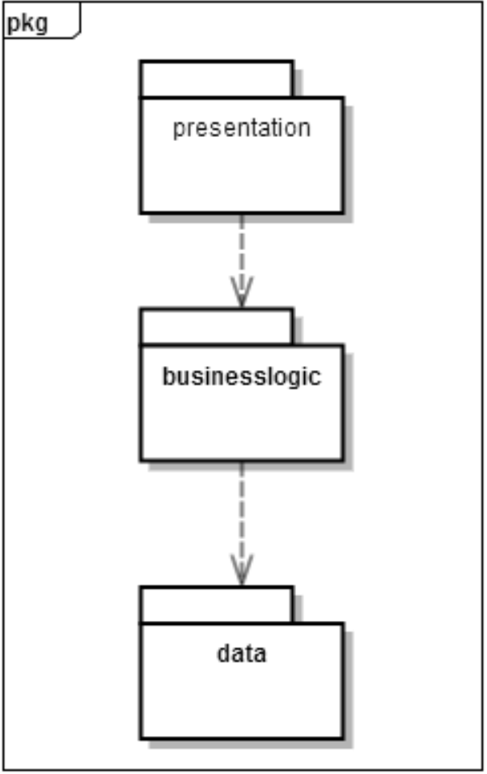

#
**企业进存销系统**  
 
 
 
#
 **SSASS(Stocking Selling and                               	Storing System)**
 
 
 
#
体系结构设计文档Storing System)
 
 
 
 
 
###**学院：南京大学软件学院** 
###**成员：潘羽 谢寅鹏 熊以恒 肖云帆** 
###**完成日期：2017年10月18日** 

##目录

##更新历史

#1.引言

##&nbsp;&nbsp;&nbsp;&nbsp;1.1编制目的
&nbsp;&nbsp;&nbsp;&nbsp;本报表详细完成对企业进销存系统的概要设计，达到指导详细设计和开发的目的，同时实现和测试人员及用户的沟通。
  &nbsp;&nbsp;&nbsp;&nbsp; 本报告面向开发人员、测试人员及最终用户而编写，是了解系统的导航。
 
 
 
##&nbsp;&nbsp;&nbsp;&nbsp;1.2词汇表
<table>
	<tr>
		<th>词汇名称</th>
		<th>词汇含义</th>
		<th>备注</th>
	</tr>
	<tr>
		<th>ui</th>
		<th>表示某展示层</th>
		<th>&nbsp;&nbsp;&nbsp;&nbsp;&nbsp;&nbsp;&nbsp;&nbsp;&nbsp;&nbsp;&nbsp;&nbsp;&nbsp;&nbsp;&nbsp;&nbsp;</th>
	</tr>
	<tr>
		<th>bl</th>
		<th>表示某逻辑层</th>
		<th>&nbsp;&nbsp;&nbsp;&nbsp;&nbsp;&nbsp;&nbsp;&nbsp;&nbsp;&nbsp;&nbsp;&nbsp;&nbsp;&nbsp;&nbsp;&nbsp;</th>
	</tr>
	<tr>
		<th>data</th>
		<th>表示某数据层</th>
		<th>&nbsp;&nbsp;&nbsp;&nbsp;&nbsp;&nbsp;&nbsp;&nbsp;&nbsp;&nbsp;&nbsp;&nbsp;&nbsp;&nbsp;&nbsp;&nbsp;</th>
	</tr>
	<tr>
		<th>RMI</th>
		<th>表示远程方法调用</th>
		<th>&nbsp;&nbsp;&nbsp;&nbsp;&nbsp;&nbsp;&nbsp;&nbsp;&nbsp;&nbsp;&nbsp;&nbsp;&nbsp;&nbsp;&nbsp;&nbsp;</th>
	</tr>
</table>
 
 

##&nbsp;&nbsp;&nbsp;&nbsp;1.3参考资料
<ol>
	<li>IEEE std 1471-2000</li>
<li>丁二玉，刘钦.计算与软件工程（卷二）[M]机械工业出版2012：134—182
</li>
</ol>

 
 
 
#2.产品概述
&nbsp;&nbsp;&nbsp;&nbsp;参考企业进销存系统系统用例文档和企业进销存系统软件需求规格说明文档中对产品的概括描述。企业进销存系统主要是应用于减少挤压库存，增加销售额，提高财务人员工作效率，为经理的决策做支持，主要功能见用例图如下。

_用例图.png)

 
 
 
#3.逻辑视角
&nbsp;&nbsp;&nbsp;&nbsp;企业进销存系统中，选择了分层体系结构风格，将系统分为3层(展示层、业务逻辑层、数据层)能够很好地示意整个高层抽象。展示层包含GUI页面的实现，业务逻辑层包含业务逻辑处理的实现，数据层负责数据的持久化和访问。分层体系结构的逻辑视角和逻辑设计方案如图1和图2所示。
 
 
 

 &nbsp;&nbsp;&nbsp;&nbsp;图一 参照体系结构风格的包图表达逻辑视角
 
 
 

 &nbsp;&nbsp;&nbsp;&nbsp;图二 软件体系结构逻辑设计方案
 

