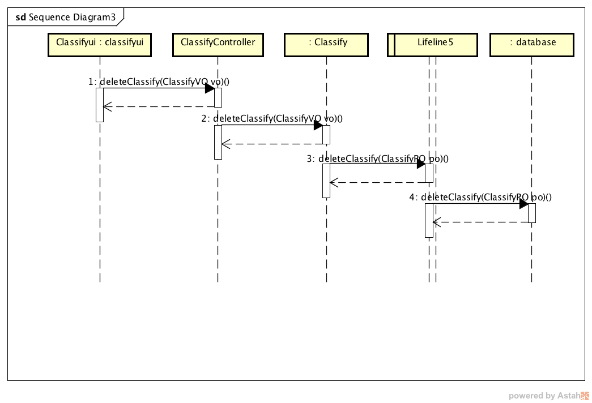
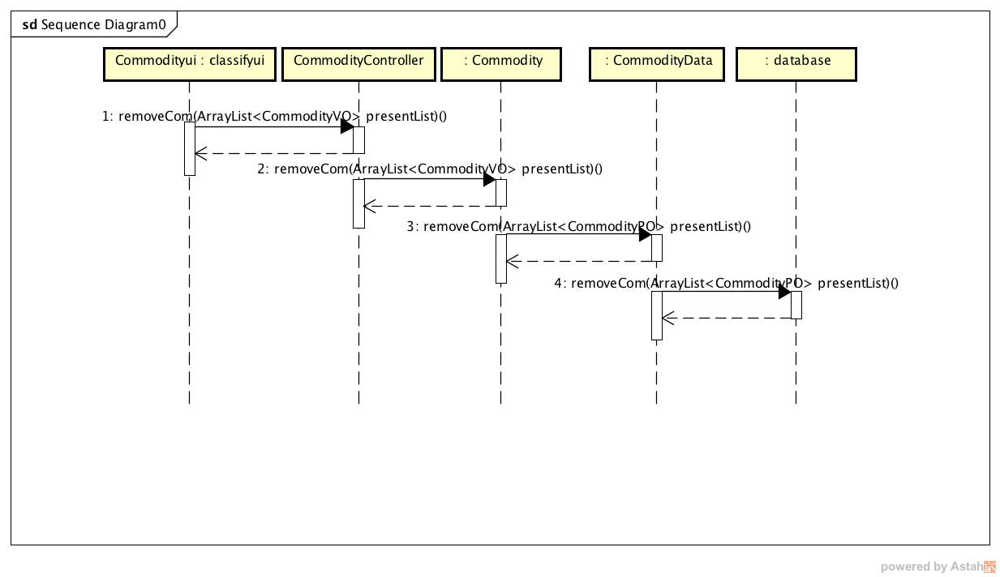
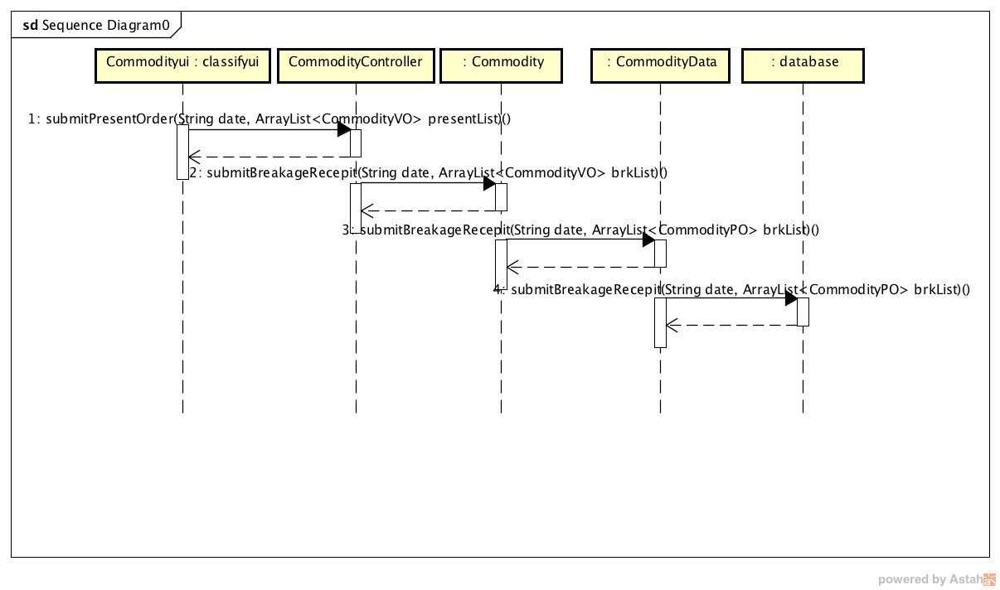
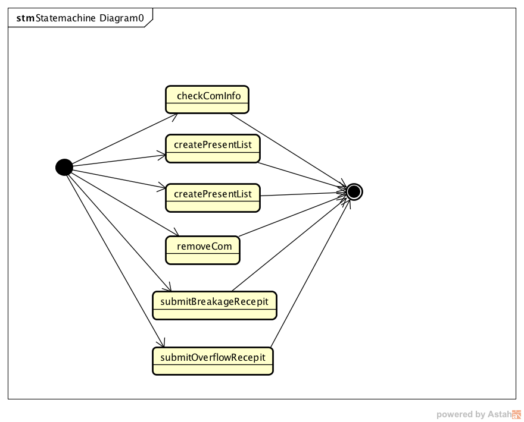
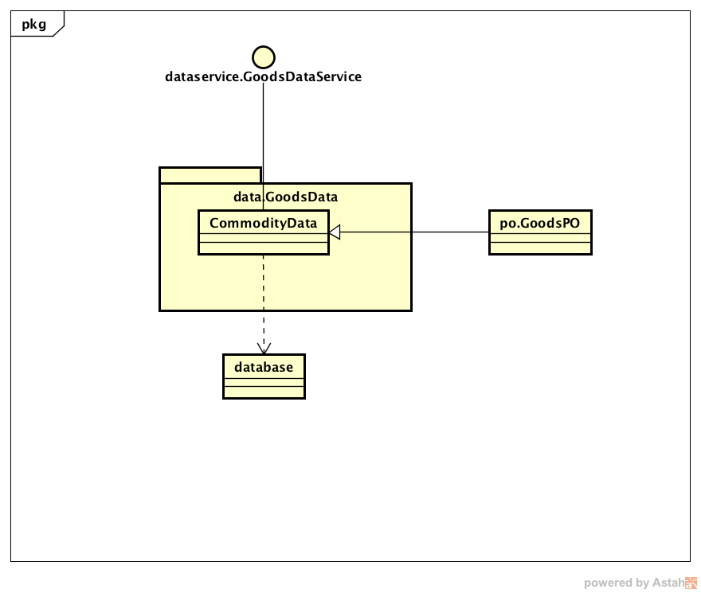
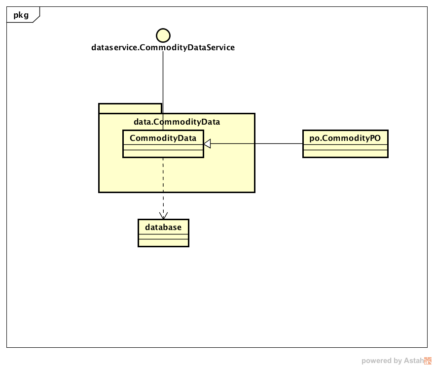
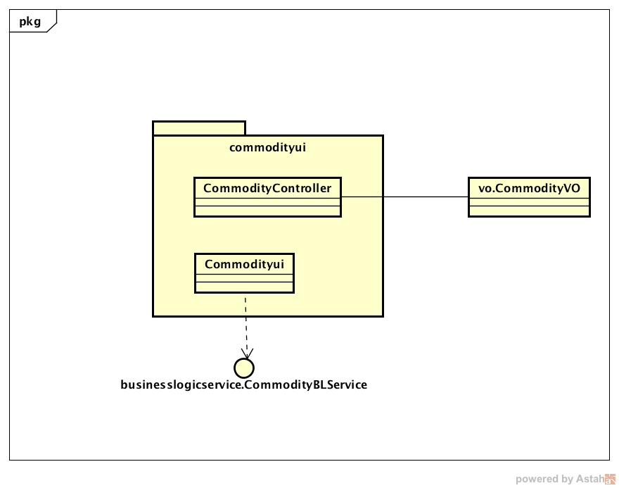

#
企业进存销系统
#
详细设计描述文档

 
 
 
##
学院：南京大学软件学院
##
成员：潘羽 谢寅鹏 熊以恒 肖云帆
##
完成日期:

##目录

目录
更新历史	
1. 引言	7
1.1编制目的	
1.2词汇表	
1.3参考资料	
2. 产品概述	
3. 体系结构设计概述	
4. 结构视角	
4.1业务逻辑层的分解	
业务逻辑层的开发包图参见软件体系结构说明文档图4.1	
4.1.1 classfybl模块	
4.1.2 goodsbl模块	
4.1.4 memberbl模块	
4.1.5 stockbl模块
4.1.6 returnbl模块
4.1.7 salebl模块
4.1.8 accountbl模块
4.1.9 bankbl模块
4.1.0 paybl模块
4.1.11 collect模块
4.1.12 managebl模块
4.1.13 promotionbl模块
4.1.14 checkbl模块
4.2数据层的分解	
4.1.1 classfydata模块	
4.1.2 goodsdata模块	
4.1.4 memberdata模块	
4.1.5 stockdata模块
4.1.6 returndata模块
4.1.7 saledata模块
4.1.8 accountdata模块
4.1.9 bankdata模块
4.1.0 paydata模块
4.1.11 collect模块
4.1.12 managedata模块
4.1.13 promotiondata模块
4.1.14 checkdata模块

4.3界面展示层的分解	
4.3.1 personui模块	
4.3.2 hotelworkerui模块	
4.3.3marketui模块	
4.3.4 managerui模块	
5. 依赖视角	
6. 耦合和内聚度量	

#更新历史

修改人员 | 修改日期|修改原因|版本号
---|---
全体人员 | 2017-11-10|最初定稿|V1.0
全体人员 |2017-11-13|修正了一些小错误|V2.0

#1.引言

##1.1编制目的
&nbsp;&nbsp;&nbsp;&nbsp;本报告详细完成对企业进销存系统的详细设计，达到指导后续软件构造的目的，同时实现和测试人员及用户的沟通。 
&nbsp;&nbsp;&nbsp;&nbsp;本报告面向开发人员、测试人员及最终用户而编写，是了解系统的导航。

 
##1.2词汇表

<table>
	<tr>
		<th>词汇名称</th>
		<th>词汇含义</th>
		<th>备注</th>
	</tr>
	<tr>
		<th>UI</th>
		<th>表示某展示层</th>
		<th></th>
	</tr>
	<tr>
		<th>bl</th>
		<th>表示某逻辑层</th>
		<th></th>
	</tr>
	<tr>
		<th>Data</th>
		<th>表示某数据层</th>
		<th></th>
	</tr>
</table>
 
 
 
##1.3参考资料
<ol>
	<li> IEEE std 1471-2000</li>
	<li>丁二玉，刘钦.计算与软件工程（卷二）[M]机械工业出版2012：134—182
	</li>
</ol>
 
 
 
#2.产品概述
&nbsp;&nbsp;&nbsp; &nbsp;一民营企业专业从事灯具照明行业，是某灯具的南京地区总代理，主要在南京负责品牌的推广及项目的落地销售、分销的批发等工作，服务对象包括项目业主、施工单位、分销商、设计院、终端用户等。现公司规模扩大，企业业务量、办公场所、员工数都发生增长，为适应新的环境，提高工作效率和用户满意度， 该公司聘请公司S开发一套进销存系统。
 &nbsp;&nbsp;&nbsp; &nbsp;企业进存销系统SSASS就是为满足民营企业新的业务要求而开发的，它包括一个数据库，消息提示系统和多个客户端。数据库将所有数据存储起来进行维护。用户通过客户端完成日常任务，消息提示系统发送消息给指定人员，客户端和数据库通过实时通信的方式完成数据交换。 
	&nbsp;&nbsp;&nbsp; &nbsp;产品功能如下：
	 SF1：&nbsp;&nbsp;分析商品库存，发现可能的商品积压，缺货和报废现象
 SF2：&nbsp;&nbsp;管理商品分类和商品信息
 SF3：&nbsp;&nbsp;处理查看库存
 SF4：&nbsp;&nbsp;管理客户信息
 SF5：&nbsp;&nbsp;处理商品入库和出库
 SF6：&nbsp;&nbsp;处理销售和销售退货
 SF7：&nbsp;&nbsp;管理银行账户
 SF8：&nbsp;&nbsp;处理收款和付款
 SF9：&nbsp;&nbsp;掌握销售明细
 SF10：查看分析经营历程和经营状况，掌握经营收支状况
 SF11：允许新建帐并记录期初信息
 SF11：帮助总经理处理单据，及时处理待审批单据并及时给予反馈
 SF11：制定促销手段处理积压商品
 SF11：掌握员工变动和授权情况
 SF12：划分客户级别，按不同级别提供不同的折让额度
 SF12：允许积分兑换商品和赠送吸引会员的礼品，提高会员满意度

 
 
 
#3.体系结构设计概述
 
 
 

#4.结构视角

##4.1业务逻辑层的分解
&nbsp;&nbsp;&nbsp;&nbsp;   业务逻辑层的开发包图参见软件体系结构说明文档图4.1 
##4.1.1 classifybl模块
&nbsp;&nbsp;&nbsp;&nbsp;(1)模块概述
classifybl模块承担的需求参见需求规格说明文档功能需求及相关功能需求。
 
&nbsp;&nbsp;&nbsp;&nbsp;orderbl模块的职责及接口参见软件体系结构描述文档。
 &nbsp;&nbsp;&nbsp;&nbsp;(2)整体结构 
&nbsp;&nbsp;&nbsp;&nbsp;根据体系结构的设计，采用分层风格，将系统分为展示层，业务逻辑层，数据层。每一层之间为了灵活性，添加了接口，以实现针对接口编程，隔离数据传输的职责，降低层与层之间耦合，添加的接口包括orderblservice , classifydataservice 两个接口。为了隔离业务逻辑职责和逻辑控制职责，我们添加ClassifyController，这样ClassifyController 将会将订单相关的业务逻辑职责和逻辑控制委托给classifybl对象。ClassifyPO是做为管理信息的持久化对象被添加到设计模型中的。 
 &nbsp;&nbsp;&nbsp;&nbsp; classifybl的模块设计见图4.1.1-1。
  
 
 
 <table>
 	<tr>
 		<th>类</th>
 		<th>职责</th>
 	</tr>
 	<tr>
 		<th>ClassifyController</th>
 		<th>负责实现所有与商品分类有关的界面所需的服务</th>
 	</tr>
 	<tr>
 		<th>classify</th>
		<th>商品分类的领域模型对象，拥有商品分类信息，可以帮助完成与商品分类操作有关的活动，包括对商品分类的增加，商品分类的修改，商品分类的删除。</th>
</table>
表4.1.1-1 classifybl模块的各个类的职责
 
<table>
	<tr>
		<th colspan="3">提供的服务（供接口）</th>
	</tr>
	<tr>
		<th rowspan="3">ClassifyController.checkClassify</th>
		<th>语法</th>
		<th> public ArrayList&lt;ClassifyVO> checkClassify(String node)</th>
		</tr>
		<tr>
			<th>前置条件</th>
			<th>商品分类需更新</th>
		</tr>
		<tr>
			<th>后置条件</th>
			<th>返回最新的商品分类列表</th>		</tr>	
<tr>
		<th rowspan="3">ClassifyController.addClassify</th>
		<th>语法</th>
		<th> public ResultMessage addClassify(ClassifyVO vo);</th>
		</tr>
		<tr>
			<th>前置条件</th>
			<th>库存管理人员增加商品分类</th>
		</tr>
		<tr>
			<th>后置条件</th>
			<th>增加存储的商品分类</th>
</tr>	
<tr>
		<th rowspan="3">ClassifyController.deleteClassify</th>
		<th>语法</th>
		<th>   public ResultMessage deleteClassify(ClassifyVO vo);</th>
		</tr>
		<tr>
			<th>前置条件</th>
			<th>库存管理人员删除商品分类</th>
		</tr>
		<tr>
			<th>后置条件</th>
			<th>删除存储的商品分类</th>
</tr>	
<tr>
		<th rowspan="3">ClassifyController.modifyClassify</th>
		<th>语法</th>
		<th>public ResultMessage modifyClassify(ClassifyVO vo);</th>
		</tr>
		<tr>
			<th>前置条件</th>
			<th>库存管理人员修改商品分类</th>
		</tr>
		<tr>
			<th>后置条件</th>
			<th>改变存储的商品分类</th>
</tr>	

<tr><th colspan="4">需要的服务（需接口)</th></tr>
<tr><th>服务名</th><th colspan="2">服务</th>
<tr><th>ClassfiyBLService.add(ClassifyPO po);</th>
<th colspan="2">增加一个商品分类</th> </tr>
<tr><th>ClassfiyBLService.find(String keywords);</th>
<th colspan="2">查找一个商品分类，已知商品关键字</th> </tr>
<tr><th>ClassfiyBLService.delete(ClassifyPO po);
<th colspan="2">删除一个商品分类</th> </th></tr>
<tr><th>ClassfiyBLService.modify(ClassifyPO po);</th>
<th colspan="2">修改一个商品分类</th> </tr>
</table>
 

表4.1.1-2 ClassifyBLService类的接口规范
<table>
<tr>
		<th colspan="3">提供的服务（供接口）</th>
	</tr>
	<tr>
		<th rowspan="3">ClassifyBLService.checkClassfiy</th>
		<th>语法</th>
		<th>public ArrayList&lt;ClassifyVO> checkClassify(String node);</th>
		</tr>
		<tr>
			<th>前置条件</th>
			<th>商品分类需更新</th>
		</tr>
		<tr>
			<th>后置条件</th>
			<th>返回最新的商品分类列表</th>		</tr>	
<tr>
		<th rowspan="3">ClassifyBLService.addClassify</th>
		<th>语法</th>
		<th> public ResultMessage addClassify(ClassifyVO vo);</th>
		</tr>
		<tr>
			<th>前置条件</th>
			<th>库存管理人员增加商品分类</th>
		</tr>
		<tr>
			<th>后置条件</th>
			<th>增加存储的商品分类</th>
</tr>	
<tr>
		<th rowspan="3">ClassifyBLService.deleteClassify</th>
		<th>语法</th>
		<th>   public ResultMessage deleteClassify(ClassifyVO vo);</th>
		</tr>
		<tr>
			<th>前置条件</th>
			<th>库存管理人员删除商品分类</th>
		</tr>
		<tr>
			<th>后置条件</th>
			<th>删除存储的商品分类</th>
</tr>	
<tr>
		<th rowspan="3">ClassifyBLService.modifyClassify</th>
		<th>语法</th>
		<th>public ResultMessage modifyClassify(ClassifyVO vo);</th>
		</tr>
		<tr>
			<th>前置条件</th>
			<th>库存管理人员修改商品分类</th>
		</tr>
		<tr>
			<th>后置条件</th>
			<th>改变存储的商品分类</th>
</tr>	

<tr><th colspan="4">需要的服务（需接口)</th></tr>
<tr><th>服务名</th><th colspan="2">服务</th>
<tr><th>ClassfiyDataService.add(ClassifyPO po);</th>
<th colspan="2">增加一个商品分类</th> </tr>
<tr><th>ClassfiyDataService.find(String keywords);</th>
<th colspan="2">查找一个商品分类，已知商品关键字</th> </tr>
<tr><th>ClassfiyDataService.delete(ClassifyPO po);
<th colspan="2">删除一个商品分类</th> </th></tr>
<tr><th>ClassfiyDataService.modify(ClassifyPO po);</th>
<th colspan="2">修改一个商品分类</th> </tr>
</table>

（4） 业务逻辑层的动态模型

如图4.1.1-2表明了企业进销存系统中，当库存管理人员增加商品分类后，增加商品分类业务逻辑处理相关对象之间的协作。
图4.1.1-2 增加商品分类的顺序图 

如图4.1.1-3表明了企业进销存系统中，当库存管理人员删除商品分类后，删除商品分类业务逻辑处理相关对象之间的协作。
图4.1.1-3 删除商品分类的顺序图 

如图4.1.1-4表明了企业进销存系统中，当库存管理人员修改商品分类后，修改商品分类业务逻辑处理相关对象之间的协作。
图4.1.1-4 修改商品分类的顺序图 

如图4.1.1-5表明了企业进销存系统中，当库存管理人员查看商品分类后，显示商品分类业务逻辑处理相关对象之间的协作。
图4.1.1-5 查看商品分类的顺序图 

如图4.1.1-6描述了classify对象在生存时的状态序列，在经过addClassify, deleteClassify, modifyClassify，checkClassify并且在结束操作商品分类后结束生命

图4.1.1-6 classify对象的状态图 

##4.1.2 goodsbl模块
（1）模块概述
 goodsbl模块承担的需求参见需求规格说明文档功能需求及相关功能需求。goodsbl模块的职责及接口参见软件体系结构描述文档。
  (2)整体结构 goodsbl模块承担的需求参见需求规格说明文档功能需求及相关非功能需求。userbl模块的职责及接口参见软件体系结构描述文档。根据体系结构的设计，采用分层风格，将系统分为展示层，业务逻辑层，数据层。为了隔离业务逻辑职责和逻辑控制职责，我们添加了UserController，这样GoodsController 将会将用户管理相关的业务逻辑职责和逻辑控制委托给goodsbl 对象。GoodsPO是做为管理信息的持久化对象被添加到设计模型中的。
&nbsp;&nbsp;&nbsp;&nbsp; goodsbl的模块设计见图4.1.2-1。
 

 <table>
 	<tr>
 		<th>类</th>
 		<th>职责</th>
 	</tr>
 	<tr>
 		<th>GoodsController</th>
 		<th>负责实现所有与商品有关的界面所需的服务</th>
 	</tr>
 	<tr>
 		<th>classify</th>
		<th>商品的领域模型对象，拥有商品信息，可以帮助完成与商品操作有关的活动，包括对商品的增加，商品的修改，商品的删除。</th>
</table>

<table>
	<tr>
		<th colspan="3">提供的服务（供接口）</th>
	</tr>
	<tr>
		<th rowspan="3">GoodsBlController.addGoods</th>
		<th>语法</th>
		<th>public ResultMessage addGoods(GoodsVO vo);</th>
		</tr>
		<tr>
			<th>前置条件</th>
			<th>库存管理人员增加库存商品</th>
		</tr>
		<tr>
			<th>后置条件</th>
			<th>增加存储的商品</th>	
		</tr>	
<tr>
		<th rowspan="3">GoodsBlController.deleteGoods</th>
		<th>语法</th>
		<th>public ResultMessage deleteGoods(GoodsVO vo);</th>
		</tr>
		<tr>
			<th>前置条件</th>
			<th>库存管理人员删除商品</th>
		</tr>
		<tr>
			<th>后置条件</th>
			<th>删除存储的商品</th>
</tr>	
<tr>
		<th rowspan="3">GoodsBlController.modifyGoods</th>
		<th>语法</th>
		<th>public ResultMessage modifyGoods(GoodsVO vo);</th>
		</tr>
		<tr>
			<th>前置条件</th>
			<th>库存管理人员修改商品</th>
		</tr>
		<tr>
			<th>后置条件</th>
			<th>改变存储的商品信息</th>
</tr>	
<tr>
		<th rowspan="3">GoodsBlController.findGoods</th>
		<th>语法</th>
		<th>public ArrayList&lt;GoodsVO&gt;findGoods(String keywords);</th>
		</tr>
		<tr>
			<th>前置条件</th>
			<th>库存管理人员通过关键字查找商品修改商品</th>
		</tr>
		<tr>
			<th>后置条件</th>
			<th>显示商品信息列表</th>
</tr>	
<tr>
		<th rowspan="3">GoodsBlController.getGoods</th>
		<th>语法</th>
		<th>public ArrayList&lt;GoodsVO> getGoods(String Node);</th>
		</tr>
		<tr>
			<th>前置条件</th>
			<th>库存管理人员点击商品分类节点</th>
		</tr>
		<tr>
			<th>后置条件</th>
			<th>返回商品信息</th>
</tr>	

<tr><th colspan="4">需要的服务（需接口)</th></tr>
<tr><th>服务名</th><th colspan="2">服务</th>
<tr><th>GoodsBLService.add(GoodsPO po);</th>
<th colspan="2">增加一个商品</th> </tr>
<tr><th>GoodsBLService.find(String keywords);</th>
<th colspan="2">查找一个商品</th> </tr>
<tr><th>GoodsBLService.delete(GoodsPO po);
<th colspan="2">删除一个商品</th> </th></tr>
<tr><th>GoodsBLService.modify(GoodsPO po);</th>
<th colspan="2">修改一个商品</th> </tr>
</table>

表4.1.1-2 GoodsBLService类的接口规范
<table>
	<tr>
		<th colspan="3">提供的服务（供接口）</th>
	</tr>
	<tr>
		<th rowspan="3">GoodsBLService.addGoods</th>
		<th>语法</th>
		<th>public ResultMessage addGoods(GoodsVO vo);</th>
		</tr>
		<tr>
			<th>前置条件</th>
			<th>库存管理人员增加库存商品</th>
		</tr>
		<tr>
			<th>后置条件</th>
			<th>增加存储的商品</th>	
		</tr>	
<tr>
		<th rowspan="3">GoodsBLService.deleteGoods</th>
		<th>语法</th>
		<th>public ResultMessage deleteGoods(GoodsVO vo);</th>
		</tr>
		<tr>
			<th>前置条件</th>
			<th>库存管理人员删除商品</th>
		</tr>
		<tr>
			<th>后置条件</th>
			<th>删除存储的商品</th>
</tr>	
<tr>
		<th rowspan="3">GoodsBLService.modifyGoods</th>
		<th>语法</th>
		<th>public ResultMessage modifyGoods(GoodsVO vo);</th>
		</tr>
		<tr>
			<th>前置条件</th>
			<th>库存管理人员修改商品</th>
		</tr>
		<tr>
			<th>后置条件</th>
			<th>改变存储的商品信息</th>
</tr>	
<tr>
		<th rowspan="3">GoodsBLService.findGoods</th>
		<th>语法</th>
		<th>public ArrayList&lt;GoodsVO&gt;findGoods(String keywords);</th>
		</tr>
		<tr>
			<th>前置条件</th>
			<th>库存管理人员通过关键字查找商品修改商品</th>
		</tr>
		<tr>
			<th>后置条件</th>
			<th>显示商品信息列表</th>
</tr>	
<tr>
		<th rowspan="3">GoodsBLService.getGoods</th>
		<th>语法</th>
		<th>public ArrayList&lt;GoodsVO> getGoods(String Node);</th>
		</tr>
		<tr>
			<th>前置条件</th>
			<th>库存管理人员点击商品分类节点</th>
		</tr>
		<tr>
			<th>后置条件</th>
			<th>返回商品信息</th>
</tr>	

<tr><th colspan="4">需要的服务（需接口)</th></tr>
<tr><th>服务名</th><th colspan="2">服务</th>
<tr><th>GoodsDataService.add(GoodsPO po);</th>
<th colspan="2">增加一个商品</th> </tr>
<tr><th>GoodsDataService.find(String keywords);</th>
<th colspan="2">查找一个商品</th> </tr>
<tr><th>GoodsDataService.delete(GoodsPO po);
<th colspan="2">删除一个商品</th> </th></tr>
<tr><th>GoodsDataService.modify(GoodsPO po);</th>
<th colspan="2">修改一个商品</th> </tr>
</table>

如图4.1.2-2表明了企业进销存系统中，当库存管理人员增加商品后，增加商品业务逻辑处理相关对象之间的协作。
图4.1.2-2 增加商品的顺序图 

如图4.1.2-3表明了企业进销存系统中，当库存管理人员删除商品分类后，删除商品分类业务逻辑处理相关对象之间的协作。
图4.1.2-3 删除商品的顺序图 

如图4.1.2-4表明了企业进销存系统中，当库存管理人员修改商品信息后，修改商品信息业务逻辑处理相关对象之间的协作。
图4.1.2-4 修改商品信息的顺序图 

如图4.1.2-5表明了企业进销存系统中，当库存管理人员查找商品后，显示商品信息逻辑处理相关对象之间的协作。
图4.1.2-5 查找商品信息的顺序图 

如图4.1.2-5表明了企业进销存系统中，当库存管理人员获取商品信息后，显示商品信息逻辑处理相关对象之间的协作。
图4.1.2-5 查找商品信息的顺序图 

如图4.1.1-6描述了goods对象在生存时的状态序列，在经过addGoods, deleteGoods, modifyGoods，findGoods, getGoods并且在结束操作商品后结束生命

##4.1.3 commoditybl模块
（1）模块概述
 commoditybl模块承担的需求参见需求规格说明文档功能需求及相关功能需求。commoditybl模块的职责及接口参见软件体系结构描述文档。
  (2)整体结构 commoditybl模块承担的需求参见需求规格说明文档功能需求及相关非功能需求。commoditybl模块的职责及接口参见软件体系结构描述文档。根据体系结构的设计，采用分层风格，将系统分为展示层，业务逻辑层，数据层。为了隔离业务逻辑职责和逻辑控制职责，我们添加了CommodityController，这样CommodityController 将会将用户管理相关的业务逻辑职责和逻辑控制委托给commoditybl 对象。CommodityPO是做为管理信息的持久化对象被添加到设计模型中的。
&nbsp;&nbsp;&nbsp;&nbsp; commoditybl的模块设计见图4.1.4-1。

 <table>
 	<tr>
 		<th>类</th>
 		<th>职责</th>
 	</tr>
 	<tr>
 		<th>CommodityController</th>
 		<th>负责实现所有与商品有关的界面所需的服务</th>
 	</tr>
 	<tr>
 		<th>commodity</th>
		<th>库存的领域模型对象，拥有库存信息，包括商品分类，数量，时间日期，出入库数量金额，进货销售数量金额，可以帮助完成与库存操作有关的活动，包括获取出入库金额，进货销售数量金额。</th>
</table>

<table>
	<tr>
		<th colspan="3">提供的服务（供接口）</th>
	</tr>
	<tr>
		<th rowspan="3">CommodityController.InTime</th>
		<th>语法</th>
		<th>public ResultMessage inTime(String currentTime);</th>
		</tr>
		<tr>
			<th>前置条件</th>
			<th>库存管理人员在预设时间查看库存</th>
		</tr>
		<tr>
			<th>后置条件</th>
			<th>根据时间允许查看库存</th>	
		</tr>	
<tr>
		<th rowspan="3">CommodityController.getComInfo</th>
		<th>语法</th>
		<th>public  ArrayList&lt;CommodityVO> getComInfo(String date);</th>
		</tr>
		<tr>
			<th>前置条件</th>
			<th>库存管理人员查看库存</th>
		</tr>
		<tr>
			<th>后置条件</th>
			<th>返回库存属性列表</th>
</tr>	
<tr>
		<th rowspan="3">CommodityController.checkComInfo</th>
		<th>语法</th>
		<th>public  ArrayList&lt;commodityVO> checkComInfo(String date)</th>
		</tr>
		<tr>
			<th>前置条件</th>
			<th>库存管理人员盘点库存</th>
		</tr>
		<tr>
			<th>后置条件</th>
			<th>返回库存商品列表</th>
</tr>	
<tr>
<tr>
		<th rowspan="3">CommodityController.createPresentList</th>
		<th>语法</th>
		<th>public ArrayList&lt;commodityVO> createPresentList(String date);</th>
		</tr>
		<tr>
			<th>前置条件</th>
			<th>库存管理人员选择商品赠送</th>
		</tr>
		<tr>
			<th>后置条件</th>
			<th>显示赠送商品列表</th>
</tr>	
<tr>
		<th rowspan="3">CommodityController.submitPresentOrder</th>
		<th>语法</th>
		<th>public  boolean submitPresentOrder(String date, ArrayList&lt;commodityVO> presentLst)</th>
		</tr>
		<tr>
			<th>前置条件</th>
			<th>库存管理人员提交商品赠送单</th>
		</tr>
		<tr>
			<th>后置条件</th>
			<th>保存赠送单信息</th>
</tr>	
<tr>
		<th rowspan="3">CommodityController.removeCom</th>
		<th>语法</th>
		<th>public  ResultMessage removeCom(String date, ArrayList&lt;commodityVO> presentLst)</th>
		</tr>
		<tr>
			<th>前置条件</th>
			<th>库存管理人员已经选择商品赠送</th>
		</tr>
		<tr>
			<th>后置条件</th>
			<th>库存减去赠送商品并保存</th>
</tr>	
<tr>
		<th rowspan="3">CommodityController.submitBreakageRecepit</th>
		<th>语法</th>
		<th>public  boolean submitBreakageRecepit(String date, ArrayList&lt;commodityVO> brkLst)</th>
		</tr>
		<tr>
			<th>前置条件</th>
			<th>库存报损</th>
		</tr>
		<tr>
			<th>后置条件</th>
			<th>提交库存报损单</th>
</tr>	
<tr>
		<th rowspan="3">CommodityController.submitOverflowRecepit</th>
		<th>语法</th>
		<th>public  ResultMessage submitOverflowRecepit(String date, ArrayList&lt;commodityVO> overflowLst)</th>
		</tr>
		<tr>
			<th>前置条件</th>
			<th>库存报溢</th>
		</tr>
		<tr>
			<th>后置条件</th>
			<th>提交库存报溢单</th>
</tr>	

<tr><th colspan="4">需要的服务（需接口)</th></tr>
<tr><th>服务名</th><th colspan="2">服务</th>
<tr><th> CommodityBLService.isInTime(String time);</th>
<th colspan="2">检查库存在预设时间内</th> </tr>
<tr><th>CommodityBLService.getComInfo(String date);</th>
<th colspan="2">查询库存</th> </tr>
<tr><th>CommodityBLService.getGoods(String goodsNode);
<th colspan="2">获得商品信息</th> </th></tr>
<tr><th>CommodityBLService.createPresentList(String date);</th>
<th colspan="2">创建赠送方案</th> </th></tr>
<tr><th>CommodityBLService.removeCom(String date, ArrayList&It;CommodityPO> lst)</th>
<th colspan="2">删除赠送商品</th> </tr>
<tr><th>CommodityBLService.submitBreakageRecepit	(String date, ArrayList&It;CommodityPO> lst)</th>
<th colspan="2">提交报损单</th> </tr>
<tr><th>CommodityBLService.submitOverflowRecepit	(String date, ArrayList&It;CommodityPO> lst)</th>
<th colspan="2">提交报溢单</th> </tr>
<tr><th>CommodityBLService.submitWarningRecepit(String date, ArrayList&It;CommodityPO> lst)</th>
<th colspan="2">提交报警单</th> </tr>
</table>

表4.1.1-2 CommodityBLService类的接口规范

<table>
	<tr>
		<th colspan="3">提供的服务（供接口）</th>
	</tr>
	<tr>
		<th rowspan="3">CommodityBLService.InTime</th>
		<th>语法</th>
		<th>public ResultMessage inTime(String currentTime);</th>
		</tr>
		<tr>
			<th>前置条件</th>
			<th>库存管理人员在预设时间查看库存</th>
		</tr>
		<tr>
			<th>后置条件</th>
			<th>根据时间允许查看库存</th>	
		</tr>	
<tr>
		<th rowspan="3">CommodityBLService.getComInfo</th>
		<th>语法</th>
		<th>public  ArrayList&lt;CommodityVO> getComInfo(String date);</th>
		</tr>
		<tr>
			<th>前置条件</th>
			<th>库存管理人员查看库存</th>
		</tr>
		<tr>
			<th>后置条件</th>
			<th>返回库存属性列表</th>
</tr>	
<tr>
		<th rowspan="3">CommodityBLService.checkComInfo</th>
		<th>语法</th>
		<th>public  ArrayList&lt;commodityVO> checkComInfo(String date)</th>
		</tr>
		<tr>
			<th>前置条件</th>
			<th>库存管理人员盘点库存</th>
		</tr>
		<tr>
			<th>后置条件</th>
			<th>返回库存商品列表</th>
</tr>	
<tr>
<tr>
		<th rowspan="3">CommodityBLService.createPresentList</th>
		<th>语法</th>
		<th>public ArrayList&lt;commodityVO> createPresentList(String date);</th>
		</tr>
		<tr>
			<th>前置条件</th>
			<th>库存管理人员选择商品赠送</th>
		</tr>
		<tr>
			<th>后置条件</th>
			<th>显示赠送商品列表</th>
</tr>	
<tr>
		<th rowspan="3">CommodityBLService.submitPresentOrder</th>
		<th>语法</th>
		<th>public  boolean submitPresentOrder(String date, ArrayList&lt;commodityVO> presentLst)</th>
		</tr>
		<tr>
			<th>前置条件</th>
			<th>库存管理人员提交商品赠送单</th>
		</tr>
		<tr>
			<th>后置条件</th>
			<th>保存赠送单信息</th>
</tr>	
<tr>
		<th rowspan="3">CommodityBLService.removeCom</th>
		<th>语法</th>
		<th>public  ResultMessage removeCom(String date, ArrayList&lt;commodityVO> presentLst)</th>
		</tr>
		<tr>
			<th>前置条件</th>
			<th>库存管理人员已经选择商品赠送</th>
		</tr>
		<tr>
			<th>后置条件</th>
			<th>库存减去赠送商品并保存</th>
</tr>	
<tr>
		<th rowspan="3">CommodityBLService.submitBreakageRecepit</th>
		<th>语法</th>
		<th>public  boolean submitBreakageRecepit(String date, ArrayList&lt;commodityVO> brkLst)</th>
		</tr>
		<tr>
			<th>前置条件</th>
			<th>库存报损</th>
		</tr>
		<tr>
			<th>后置条件</th>
			<th>提交库存报损单</th>
</tr>	
<tr>
		<th rowspan="3">CommodityBLService.submitOverflowRecepit</th>
		<th>语法</th>
		<th>public  ResultMessage submitOverflowRecepit(String date, ArrayList&lt;commodityVO> overflowLst)</th>
		</tr>
		<tr>
			<th>前置条件</th>
			<th>库存报溢</th>
		</tr>
		<tr>
			<th>后置条件</th>
			<th>提交库存报溢单</th>
</tr>	

<tr><th colspan="4">需要的服务（需接口)</th></tr>
<tr><th>服务名</th><th colspan="2">服务</th>
<tr><th> CommodityDataService.isInTime(String time);</th>
<th colspan="2">检查库存在预设时间内</th> </tr>
<tr><th>CommodityDataService.getComInfo(String date);</th>
<th colspan="2">查询库存</th> </tr>
<tr><th>CommodityDataService.getGoods(String goodsNode);
<th colspan="2">获得商品信息</th> </th></tr>
<tr><th>CommodityDataService.createPresentList(String date);</th>
<th colspan="2">创建赠送方案</th> </th></tr>
<tr><th>CommodityDataService.removeCom(String date, ArrayList&It;CommodityPO> lst)</th>
<th colspan="2">删除赠送商品</th> </tr>
<tr><th>CommodityDataService.submitBreakageRecepit	(String date, ArrayList&It;CommodityPO> lst)</th>
<th colspan="2">提交报损单</th> </tr>
<tr><th>CommodityDataService.submitOverflowRecepit	(String date, ArrayList&It;CommodityPO> lst)</th>
<th colspan="2">提交报溢单</th> </tr>
<tr><th>CommodityDataService.submitWarningRecepit(String date, ArrayList &It;CommodityPO> lst)</th>
<th colspan="2">提交报警单</th> </tr>
</table>
（4） 业务逻辑层的动态模型

如图4.1.4-2表明了企业进销存系统中，当库存管理人员查看库存后，库存信息业务逻辑处理相关对象之间的协作。
图4.1.4-2 查看库存的顺序图 

如图4.1.4-3表明了企业进销存系统中，当库存管理人员增加商品赠送单后，增加商品赠送单业务逻辑处理相关对象之间的协作。
图4.1.4-3增加商品赠送单的顺序图 

如图4.1.4-4表明了企业进销存系统中，当库存管理人员去除库存后，减少库存分类业务逻辑处理相关对象之间的协作。
图4.1.4-4 减少库存的顺序图 

如图4.1.4-5表明了企业进销存系统中，当库存管理人员提交报损单后，商品报损单业务逻辑处理相关对象之间的协作。
图4.1.4-5 库存报损单的顺序图 

如图4.1.4-6表明了企业进销存系统中，当库存管理人员提交报溢单后，商品报溢单业务逻辑处理相关对象之间的协作。
图4.1.4-6 库存报溢单的顺序图 

如图4.1.1-6描述了commodity对象在生存时的状态序列，在经过checkComInfo, createPresentList, removeCom，submitBreakageReceipt, submitOverflowRecipt并且在结束操作商品分类后结束生命

图4.1.1-6 classify对象的状态图 

#### 4.1.4 memeberbl模块
##### （1）模块描述 
memberbl模块承担的需求参见需求规格说明文档功能需求及相关功能需求。  
memberbl模块职责及接口参见软件体系结构描述文档。
##### （2）整体结构
根据体系结构的设计，采用分层风格，将系统分为展示层，业务逻辑层，数据层。每一层之间为了灵活性，添加了接口，以实现针对接口编程，隔离数据传输的职责，降低层与层之间耦合，添加的接口包括memberblservice , memberdataservice 两个接口。为了隔离业务逻辑职责和逻辑控制职责，我们添加memberController，这样memberController 将会将客户信息相关的业务逻辑职责和逻辑控制委托给memeberbl对象。memberPO是做为管理信息的持久化对象被添加到设计模型中的。  

memberbl模块的设计如图4.1.4-1所示.  
  
  
  
表4.1.4-1 memberbl模块的各个类的职责

<table>
	<tr>
		<th>类</th>
		<th>职责</th>
	</tr>
<tr>
		<th>memberController</th>
		<th>负责实现所有与客户信息有关的界面所需的服务</th>
	</tr>
<tr>
		<th>member</th>
		<th>客户信息的领域模型对象，拥有客户姓名、ID、地址、电话号码、电子邮箱等信息，可以帮助完成与客户信息有关界面的服务。</th>
	</tr>
</table>

##### （3）模块内部类的接口模范

表4.1.4-2 MemberController模块的接口规范
<table>
	<tr>
		<th colspan="3">提供的服务（供接口）</th>
	</tr>
	<tr>
		<th rowspan="3">MemberController.add</th>
		<th>语法</th>
		<th> public ResultMessage add(MemberVO vo);</th>
		</tr>
		<tr>
			<th>前置条件</th>
			<th>新增一条客户信息</th>
		</tr>
		<tr>
			<th>后置条件</th>
			<th>系统新增客户并分配id</th>	
		</tr>	
<tr>
		<th rowspan="3">MemberController.delete</th>
		<th>语法</th>
		<th>public ResultMessage delete(MemberVO vo);</th>
		</tr>
		<tr>
			<th>前置条件</th>
			<th>删除一条客户信息</th>
		</tr>
		<tr>
			<th>后置条件</th>
			<th>系统删除客户的信息</th>
</tr>	
<tr>
		<th rowspan="3">MemberController.modify</th>
		<th>语法</th>
		<th>public ResultMessage modify(MembeVO vo);</th>
		</tr>
		<tr>
			<th>前置条件</th>
			<th>修改已有客户信息</th>
		</tr>
		<tr>
			<th>后置条件</th>
			<th>系统中客户信息修改完成</th>
</tr>	
<tr>
		<th rowspan="3">MemberController.find</th>
		<th>语法</th>
		<th>public ArrayList&lt;MemberVO> find(String keywords);</th>
		</tr>
		<tr>
			<th>前置条件</th>
			<th>通过关键字查找客户</th>
		</tr>
		<tr>
			<th>后置条件</th>
			<th>显示客户信息列表</th>
</tr>	

<tr><th colspan="4">需要的服务（需接口)</th></tr>
<tr><th>服务名</th><th colspan="2">服务</th>
<tr><th>Member.add(MemberPO po);</th>
<th colspan="2">增加一个商品</th> </tr>
<tr><th>Member.find(String keywords);</th>
<th colspan="2">查找一个商品</th> </tr>
<tr><th>Member.delete(MemberPO po);
<th colspan="2">删除一个商品</th> </th></tr>
<tr><th>Member.modify(MemberPO po);</th>
<th colspan="2">修改一个商品</th> </tr>
</table>

表4.1.4-3 Member类的接口规范
<table>
	<tr>
		<th colspan="3">提供的服务（供接口）</th>
	</tr>
	<tr>
		<th rowspan="3">Member.add</th>
		<th>语法</th>
		<th>public ResultMessage add(MemberPO po)</th>
		</tr>
		<tr>
			<th>前置条件</th>
			<th>数据库不存在同样ID的客户</th>
		</tr>
		<tr>
			<th>后置条件</th>
			<th>在数据库中增加一条客户记录，并且把序列化文件保存到本地</th>
		</tr>	
		<tr>
		<th rowspan="3">Member.exceptionFind </th>
		<th>语法</th>
		<th>public ArrayList&lt;MemberPO> exceptionFind ();</th>
		</tr>
		<tr>
			<th>前置条件</th>
			<th>无</th>
		</tr>
		<tr>
			<th>后置条件</th>
			<th>无</th>
</tr>	

<tr>
		<th rowspan="3">Member.delete</th>
		<th>语法</th>
		<th>public ResultMessage delete(MemberPO po);</th>
		</tr><tr>
			<th>前置条件</th>
			<th>数据库存在此ID的商品<客户/th>
		</tr>
		<tr>
			<th>后置条件</th>
			<th>在数据库中删除客户信息，并且把序列化文件保存到本地</th>
</tr>	
<tr>
		<th rowspan="3">Member.modify</th>
		<th>语法</th>
		<th>public ResultMessage modify(MemberPO po);</th>
		</tr>
		<tr>
			<th>前置条件</th>
			<th>数据库存在此ID的客户</th>
		</tr>
		<tr>
			<th>后置条件</th>
			<th>在数据库中修改客户信息，并且把序列化文件保存到本地</th>
</tr>	
<tr>
		<th rowspan="3">Member.find</th>
		<th>语法</th>
		<th> public ArrayList&lt;MemberPO>find(String keywords);</th>
		</tr>
		<tr>
			<th>前置条件</th>
			<th>数据库存在此关键字的客户</th>
		</tr>
		<tr>
			<th>后置条件</th>
			<th>显示客户信息列表</th>
</tr>	

<tr><th colspan="4">需要的服务（需接口)</th></tr>
<tr><th>服务名</th><th colspan="2">服务</th>
<tr><th>MemberDataService.add(MemberPO po);</th>
<th colspan="2">增加一个商品</th> </tr>
<tr><th>MemberDataService.find(String keywords);</th>
<th colspan="2">查找一个商品</th> </tr>
<tr><th>MemberDataService.delete(MemberPO po);
<th colspan="2">删除一个商品</th> </th></tr>
<tr><th>MemberDataService.modify(MemberPO po);</th>
<th colspan="2">修改一个商品</th> </tr>
</table>

##### （4）业务逻辑层的动态模型
如图4.1.4-2表明了客户信息管理系统中，进货销售人员处理客户信息中，客户信息管理逻辑处理相关对象之间的协作。  

  
图4.1.4-2 member.search 的顺序图    

如图4.1.4-3表明了客户信息管理系统中，进货销售人员处理客户信息中，客户信息管理逻辑处理相关对象之间的协作。  

  
图4.1.4-3 member.edit的顺序图 

  

 #### 4.1.5 stockbl模块
##### （1）模块描述 
stockbl模块承担的需求参见需求规格说明文档功能需求及相关功能需求。  
stockbl模块职责及接口参见软件体系结构描述文档。
##### （2）整体结构
根据体系结构的设计，采用分层风格，将系统分为展示层，业务逻辑层，数据层。每一层之间为了灵活性，添加了接口，以实现针对接口编程，隔离数据传输的职责，降低层与层之间耦合，添加的接口包括stockblservice , stockdataservice 两个接口。为了隔离业务逻辑职责和逻辑控制职责，我们添加stockController，这样stockController 将会将客户信息相关的业务逻辑职责和逻辑控制委托给stockbl对象。stockPO是做为管理信息的持久化对象被添加到设计模型中的。  

stockbl模块的设计如图4.1.5-1所示.  
  
  
  
表4.1.5-1 stockbl模块的各个类的职责

<table>
	<tr>
		<th>类</th>
		<th>职责</th>
	</tr>
<tr>
		<th>stockController</th>
		<th>负责实现所有与进货单有关的界面所需的服务</th>
	</tr>
<tr>
		<th>stock</th>
		<th>货单的领域模型对象，拥有货单类型、ID、具体商品信息等信息，可以帮助完成与进货单信息有关界面的服务。</th>
	</tr>
</table>

##### （3）模块内部类的接口模范

表4.1.5-2 StockController模块的接口规范
<table>
	<tr>
		<th colspan="3">提供的服务（供接口）</th>
	</tr>
	<tr>
		<th rowspan="3">StockController.addGoods</th>
		<th>语法</th>
		<th>public ResultMessage createReceipt(StockVO vo);</th>
		</tr>
		<tr>
			<th>前置条件</th>
			<th>进货销售人员创建货单</th>
		</tr>
		<tr>
			<th>后置条件</th>
			<th>货单创建初始化</th>	
		</tr>	
<tr>
		<th rowspan="3">StockController.deleteGoods</th>
		<th>语法</th>
		<th>public ResultMessage cancelReceipt(StockVO vo);</th>
		</tr>
		<tr>
			<th>前置条件</th>
			<th>进货销售人员移除货单</th>
		</tr>
		<tr>
			<th>后置条件</th>
			<th>系统清除货单</th>
</tr>	
<tr>
		<th rowspan="3">StockController.modifyGoods</th>
		<th>语法</th>
		<th>public ResultMessage finshReceipt(StockVO vo);</th>
		</tr>
		<tr>
			<th>前置条件</th>
			<th>进货销售人员编辑货单</th>
		</tr>
		<tr>
			<th>后置条件</th>
			<th>改变存储的货单信息</th>
</tr>	
<tr>
		<th rowspan="3">StockController.findGoods</th>
		<th>语法</th>
		<th>public ArrayList&lt;StockVO> getReceipt(StockVO vo);</th>
		</tr>
		<tr>
			<th>前置条件</th>
			<th>进货销售人员通过关键字查找货单</th>
		</tr>
		<tr>
			<th>后置条件</th>
			<th>显示货单信息列表</th>
</tr>	
<tr>
		<th rowspan="3">StockController.getGoods</th>
		<th>语法</th>
		<th>public ResultMessage changeMoney(StockVO vo);</th>
		</tr>
		<tr>
			<th>前置条件</th>
			<th>进货销售人员修改金额</th>
		</tr>
		<tr>
			<th>后置条件</th>
			<th>返回修改后金额</th>
</tr>	

<tr><th colspan="4">需要的服务（需接口)</th></tr>
<tr><th>服务名</th><th colspan="2">服务</th>
<tr><th>Stock.add(StockPO po);</th>
<th colspan="2">新增货单</th> </tr>
<tr><th>Stock.getReceipt(StockPO po)</th>
<th colspan="2">得到货单信息</th> </tr>
<tr><th>Stock.remove(StockPO po);
<th colspan="2">删除货单</th> </th></tr>
<tr><th>Stock.modify(StockPO po);</th>
<th colspan="2">修改货单</th> </tr>
<tr><th>Stock.stockCom(CommodityPO po, ArrayList&lt;StockPO> receipt);</th>
<th colspan="2">增加库存</th> </tr>
</table>

表4.1.5-3 Stock类的接口规范
<table>
	<tr>
		<th colspan="3">提供的服务（供接口）</th>
	</tr>
	<tr>
		<th rowspan="3">Stock.add</th>
		<th>语法</th>
		<th>public ResultMessage add(StockPO po)</th>
		</tr>
		<tr>
			<th>前置条件</th>
			<th>数据库不存在同样ID的货单</th>
		</tr>
		<tr>
			<th>后置条件</th>
			<th>在数据库中增加一条货单记录，并且把序列化文件保存到本地</th>
		</tr>	
		<tr>
		<th rowspan="3">Stock.exceptionFind </th>
		<th>语法</th>
		<th>public ArrayList&lt;StockPO> exceptionFind ();</th>
		</tr>
		<tr>
			<th>前置条件</th>
			<th>无</th>
		</tr>
		<tr>
			<th>后置条件</th>
			<th>无</th>
</tr>	

<tr>
		<th rowspan="3">Stock.remove</th>
		<th>语法</th>
		<th>public ResultMessage remove(StockPO po);</th>
		</tr><tr>
			<th>前置条件</th>
			<th>数据库存在此ID的货单</th>
		</tr>
		<tr>
			<th>后置条件</th>
			<th>在数据库中删除货单，并且把序列化文件保存到本地</th>
</tr>	
<tr>
		<th rowspan="3">Stock.modify</th>
		<th>语法</th>
		<th>public ResultMessage modify(StockPO po);</th>
		</tr>
		<tr>
			<th>前置条件</th>
			<th>数据库存在此ID的货单</th>
		</tr>
		<tr>
			<th>后置条件</th>
			<th>在数据库中修改货单，并且把序列化文件保存到本地</th>
</tr>	
<tr>
		<th rowspan="3">Stock.find</th>
		<th>语法</th>
		<th> public ArrayList&lt;StockPO> getReceipt(StockPO po);</th>
		</tr>
		<tr>
			<th>前置条件</th>
			<th>数据库存在此信息的货单</th>
		</tr>
		<tr>
			<th>后置条件</th>
			<th>显示货单信息列表</th>
</tr>	
<tr>
		<th rowspan="3">Stock.find</th>
		<th>语法</th>
		<th> public CommodityPO stockCom(CommodityPO po, ArrayList&lt;StockPO> receipt);</th>
		</tr>
		<tr>
			<th>前置条件</th>
			<th>数据库存在此信息的货单</th>
		</tr>
		<tr>
			<th>后置条件</th>
			<th>变更库存</th>
</tr>	

<tr><th colspan="4">需要的服务（需接口)</th></tr>
<tr><th>服务名</th><th colspan="2">服务</th>
<tr><th>StockDataService.add(StockPO po);</th>
<th colspan="2">新增货单</th> </tr>
<tr><th>StockDataService.getReceipt(StockPO po)</th>
<th colspan="2">得到货单信息</th> </tr>
<tr><th>StockDataService.remove(StockPO po);
<th colspan="2">删除货单</th> </th></tr>
<tr><th>StockDataService.modify(StockPO po);</th>
<th colspan="2">修改货单</th> </tr>
<tr><th>StockDataService.stockCom(CommodityPO po, ArrayList&lt;StockPO> receipt);</th>
<th colspan="2">增加库存</th> </tr>
</table>

##### （4）业务逻辑层的动态模型
如图4.1.5-2表明了客户信息管理系统中，进货销售人员处理客户信息中，客户信息管理逻辑处理相关对象之间的协作。  

  
图4.1.5-2  stock.search 的顺序图    

如图4.1.5-3表明了客户信息管理系统中，进货销售人员处理客户信息中，客户信息管理逻辑处理相关对象之间的协作。  

  
图4.1.5-3  stock.create 的顺序图 

如图4.1.5-4表明了客户信息管理系统中，进货销售人员处理客户信息中，客户信息管理逻辑处理相关对象之间的协作。  

  
图4.1.5-4  stock.edit的顺序图   

#### 4.1.6 returnbl模块
##### （1）模块描述 
returnbl模块承担的需求参见需求规格说明文档功能需求及相关功能需求。  
returnbl模块职责及接口参见软件体系结构描述文档。
##### （2）整体结构
根据体系结构的设计，采用分层风格，将系统分为展示层，业务逻辑层，数据层。每一层之间为了灵活性，添加了接口，以实现针对接口编程，隔离数据传输的职责，降低层与层之间耦合，添加的接口包括returnblservice , returndataservice 两个接口。为了隔离业务逻辑职责和逻辑控制职责，我们添加returnController，这样returnController 将会将客户信息相关的业务逻辑职责和逻辑控制委托给returnbl对象。returnPO是做为管理信息的持久化对象被添加到设计模型中的。  

returnbl模块的设计如图4.1.6-1所示.  
  
  
  
表4.1.6-1 returnbl模块的各个类的职责

<table>
	<tr>
		<th>类</th>
		<th>职责</th>
	</tr>
<tr>
		<th>returnController</th>
		<th>负责实现所有与退货单信息有关的界面所需的服务</th>
	</tr>
<tr>
		<th>return</th>
		<th>货单信息的领域模型对象，拥有货单类型、ID、具体商品信息等信息，可以帮助完成与退货单信息有关界面的服务。</th>
	</tr>
</table>

##### （3）模块内部类的接口模范

表4.1.6-2 ReturnController模块的接口规范
<table>
    <tr>
        <th colspan="3">提供的服务（供接口）</th>
    </tr>
    <tr>
        <th rowspan="3">ReturnController.addGoods</th>
        <th>语法</th>
        <th>public ResultMessage createReceipt(ReturnVO vo);</th>
        </tr>
        <tr>
            <th>前置条件</th>
            <th>进货销售人员创建货单</th>
        </tr>
        <tr>
            <th>后置条件</th>
            <th>货单创建初始化</th>    
        </tr>   
<tr>
        <th rowspan="3">ReturnController.deleteGoods</th>
        <th>语法</th>
        <th>public ResultMessage cancelReceipt(ReturnVO vo);</th>
        </tr>
        <tr>
            <th>前置条件</th>
            <th>进货销售人员移除货单</th>
        </tr>
        <tr>
            <th>后置条件</th>
            <th>系统清除货单</th>
</tr>   
<tr>
        <th rowspan="3">ReturnController.modifyGoods</th>
        <th>语法</th>
        <th>public ResultMessage finshReceipt(ReturnVO vo);</th>
        </tr>
        <tr>
            <th>前置条件</th>
            <th>进货销售人员编辑货单</th>
        </tr>
        <tr>
            <th>后置条件</th>
            <th>改变存储的货单信息</th>
</tr>   
<tr>
        <th rowspan="3">ReturnController.findGoods</th>
        <th>语法</th>
        <th>public ArrayList&lt;ReturnVO> getReceipt(ReturnVO vo);</th>
        </tr>
        <tr>
            <th>前置条件</th>
            <th>进货销售人员通过关键字查找货单</th>
        </tr>
        <tr>
            <th>后置条件</th>
            <th>显示货单信息列表</th>
</tr>   
<tr>
        <th rowspan="3">ReturnController.getGoods</th>
        <th>语法</th>
        <th>public ResultMessage changeMoney(ReturnVO vo);</th>
        </tr>
        <tr>
            <th>前置条件</th>
            <th>进货销售人员修改金额</th>
        </tr>
        <tr>
            <th>后置条件</th>
            <th>返回修改后金额</th>
</tr>   

<tr><th colspan="4">需要的服务（需接口)</th></tr>
<tr><th>服务名</th><th colspan="2">服务</th>
<tr><th>Return.add(ReturnPO po);</th>
<th colspan="2">新增货单</th> </tr>
<tr><th>Return.getReceipt(ReturnPO po)</th>
<th colspan="2">得到货单信息</th> </tr>
<tr><th>Return.remove(ReturnPO po);
<th colspan="2">删除货单</th> </th></tr>
<tr><th>Return.modify(ReturnPO po);</th>
<th colspan="2">修改货单</th> </tr>
<tr><th>Return.returnCom(CommodityPO po, ArrayList&lt;ReturnPO> receipt);</th>
<th colspan="2">减少库存</th> </tr>
</table>

表4.1.6-3 Return类的接口规范
<table>
    <tr>
        <th colspan="3">提供的服务（供接口）</th>
    </tr>
    <tr>
        <th rowspan="3">Return.add</th>
        <th>语法</th>
        <th>public ResultMessage add(ReturnPO po)</th>
        </tr>
        <tr>
            <th>前置条件</th>
            <th>数据库不存在同样ID的货单</th>
        </tr>
        <tr>
            <th>后置条件</th>
            <th>在数据库中增加一条货单记录，并且把序列化文件保存到本地</th>
        </tr>   
        <tr>
        <th rowspan="3">Return.exceptionFind </th>
        <th>语法</th>
        <th>public ArrayList&lt;ReturnPO> exceptionFind ();</th>
        </tr>
        <tr>
            <th>前置条件</th>
            <th>无</th>
        </tr>
        <tr>
            <th>后置条件</th>
            <th>无</th>
</tr>   

<tr>
        <th rowspan="3">Return.remove</th>
        <th>语法</th>
        <th>public ResultMessage remove(ReturnPO po);</th>
        </tr><tr>
            <th>前置条件</th>
            <th>数据库存在此ID的货单</th>
        </tr>
        <tr>
            <th>后置条件</th>
            <th>在数据库中删除货单，并且把序列化文件保存到本地</th>
</tr>   
<tr>
        <th rowspan="3">Return.modify</th>
        <th>语法</th>
        <th>public ResultMessage modify(ReturnPO po);</th>
        </tr>
        <tr>
            <th>前置条件</th>
            <th>数据库存在此ID的货单</th>
        </tr>
        <tr>
            <th>后置条件</th>
            <th>在数据库中修改货单，并且把序列化文件保存到本地</th>
</tr>   
<tr>
        <th rowspan="3">Return.find</th>
        <th>语法</th>
        <th> public ArrayList&lt;ReturnPO> getReceipt(ReturnPO po);</th>
        </tr>
        <tr>
            <th>前置条件</th>
            <th>数据库存在此信息的货单</th>
        </tr>
        <tr>
            <th>后置条件</th>
            <th>显示货单信息列表</th>
</tr>   
<tr>
        <th rowspan="3">Return.find</th>
        <th>语法</th>
        <th> public CommodityPO returnCom(CommodityPO po, ArrayList&lt;ReturnPO> receipt);</th>
        </tr>
        <tr>
            <th>前置条件</th>
            <th>数据库存在此信息的货单</th>
        </tr>
        <tr>
            <th>后置条件</th>
            <th>变更库存</th>
</tr>   

<tr><th colspan="4">需要的服务（需接口)</th></tr>
<tr><th>服务名</th><th colspan="2">服务</th>
<tr><th>ReturnDataService.add(ReturnPO po);</th>
<th colspan="2">新增货单</th> </tr>
<tr><th>ReturnDataService.getReceipt(ReturnPO po)</th>
<th colspan="2">得到货单信息</th> </tr>
<tr><th>ReturnDataService.remove(ReturnPO po);
<th colspan="2">删除货单</th> </th></tr>
<tr><th>ReturnDataService.modify(ReturnPO po);</th>
<th colspan="2">修改货单</th> </tr>
<tr><th>ReturnDataService.returnCom(CommodityPO po, ArrayList&lt;ReturnPO> receipt);</th>
<th colspan="2">减少库存</th> </tr>
</table>

##### （4）业务逻辑层的动态模型
如图4.1.6-2表明了客户信息管理系统中，进货销售人员处理客户信息中，客户信息管理逻辑处理相关对象之间的协作。  

  
图4.1.6-2  return.search的顺序图    

如图4.1.6-3表明了客户信息管理系统中，进货销售人员处理客户信息中，客户信息管理逻辑处理相关对象之间的协作。  

  
图4.1.6-3  return.create的顺序图 

如图4.1.6-4表明了客户信息管理系统中，进货销售人员处理客户信息中，客户信息管理逻辑处理相关对象之间的协作。  

  
图4.1.6-4   return.edit的顺序图   

#### 4.1.7 salebl模块
##### （1）模块描述 
returnbl模块承担的需求参见需求规格说明文档功能需求及相关功能需求。  
returnbl模块职责及接口参见软件体系结构描述文档。
##### （2）整体结构
根据体系结构的设计，采用分层风格，将系统分为展示层，业务逻辑层，数据层。每一层之间为了灵活性，添加了接口，以实现针对接口编程，隔离数据传输的职责，降低层与层之间耦合，添加的接口包括saleblservice , saledataservice 两个接口。为了隔离业务逻辑职责和逻辑控制职责，我们添加saleController，这样saleController 将会将客户信息相关的业务逻辑职责和逻辑控制委托给salebl对象。salePO是做为管理信息的持久化对象被添加到设计模型中的。  

salebl模块的设计如图4.1.7-1所示.  
  
  
  
表4.1.7-1 salebl模块的各个类的职责

<table>
	<tr>
		<th>类</th>
		<th>职责</th>
	</tr>
<tr>
		<th>saleController</th>
		<th>负责实现所有与销售单信息有关的界面所需的服务</th>
	</tr>
<tr>
		<th>sale</th>
		<th>销售单信息的领域模型对象，拥有货单类型、ID、具体商品信息等信息，可以帮助完成与销售单信息有关界面的服务。</th>
	</tr>
</table>

##### （3）模块内部类的接口模范

表4.1.7-2 SaleController模块的接口规范
<table>
    <tr>
        <th colspan="3">提供的服务（供接口）</th>
    </tr>
    <tr>
        <th rowspan="3">SaleController.addGoods</th>
        <th>语法</th>
        <th>public ResultMessage createReceipt(SaleVO vo);</th>
        </tr>
        <tr>
            <th>前置条件</th>
            <th>进货销售人员创建销售单</th>
        </tr>
        <tr>
            <th>后置条件</th>
            <th>销售单创建初始化</th>    
        </tr>   
<tr>
        <th rowspan="3">SaleController.deleteGoods</th>
        <th>语法</th>
        <th>public ResultMessage cancelReceipt(SaleVO vo);</th>
        </tr>
        <tr>
            <th>前置条件</th>
            <th>进货销售人员移除销售单</th>
        </tr>
        <tr>
            <th>后置条件</th>
            <th>系统清除销售单</th>
</tr>   
<tr>
        <th rowspan="3">SaleController.modifyGoods</th>
        <th>语法</th>
        <th>public ResultMessage finshReceipt(SaleVO vo);</th>
        </tr>
        <tr>
            <th>前置条件</th>
            <th>进货销售人员编辑销售单</th>
        </tr>
        <tr>
            <th>后置条件</th>
            <th>改变存储的销售单信息</th>
</tr>   
<tr>
        <th rowspan="3">SaleController.findGoods</th>
        <th>语法</th>
        <th>public ArrayList&lt;SaleVO> getReceipt(SaleVO vo);</th>
        </tr>
        <tr>
            <th>前置条件</th>
            <th>进货销售人员通过关键字查找销售单</th>
        </tr>
        <tr>
            <th>后置条件</th>
            <th>显示销售单信息列表</th>
</tr>   
<tr>
        <th rowspan="3">SaleController.getGoods</th>
        <th>语法</th>
        <th>public ResultMessage changeMoney(SaleVO vo);</th>
        </tr>
        <tr>
            <th>前置条件</th>
            <th>进货销售人员修改金额</th>
        </tr>
        <tr>
            <th>后置条件</th>
            <th>返回修改后金额</th>
</tr>   

<tr><th colspan="4">需要的服务（需接口)</th></tr>
<tr><th>服务名</th><th colspan="2">服务</th>
<tr><th>Sale.add(SalePO po);</th>
<th colspan="2">新增销售单</th> </tr>
<tr><th>Sale.getReceipt(SalePO po)</th>
<th colspan="2">得到销售单信息</th> </tr>
<tr><th>Sale.remove(SalePO po);
<th colspan="2">删除销售单</th> </th></tr>
<tr><th>Sale.modify(SalePO po);</th>
<th colspan="2">修改销售单</th> </tr>
<tr><th>Sale.saleCom(CommodityPO po, ArrayList&lt;SalePO> receipt);</th>
<th colspan="2">增加库存</th> </tr>
</table>

表4.1.7-3 Sale类的接口规范
<table>
    <tr>
        <th colspan="3">提供的服务（供接口）</th>
    </tr>
    <tr>
        <th rowspan="3">Sale.add</th>
        <th>语法</th>
        <th>public ResultMessage add(SalePO po)</th>
        </tr>
        <tr>
            <th>前置条件</th>
            <th>数据库不存在同样ID的货单</th>
        </tr>
        <tr>
            <th>后置条件</th>
            <th>在数据库中增加一条销售单记录，并且把序列化文件保存到本地</th>
        </tr>   
        <tr>
        <th rowspan="3">Sale.exceptionFind </th>
        <th>语法</th>
        <th>public ArrayList&lt;SalePO> exceptionFind ();</th>
        </tr>
        <tr>
            <th>前置条件</th>
            <th>无</th>
        </tr>
        <tr>
            <th>后置条件</th>
            <th>无</th>
</tr>   

<tr>
        <th rowspan="3">Sale.remove</th>
        <th>语法</th>
        <th>public ResultMessage remove(SalePO po);</th>
        </tr><tr>
            <th>前置条件</th>
            <th>数据库存在此ID的销售单</th>
        </tr>
        <tr>
            <th>后置条件</th>
            <th>在数据库中删除销售单，并且把序列化文件保存到本地</th>
</tr>   
<tr>
        <th rowspan="3">Sale.modify</th>
        <th>语法</th>
        <th>public ResultMessage modify(SalePO po);</th>
        </tr>
        <tr>
            <th>前置条件</th>
            <th>数据库存在此ID的销售单</th>
        </tr>
        <tr>
            <th>后置条件</th>
            <th>在数据库中修改销售单，并且把序列化文件保存到本地</th>
</tr>   
<tr>
        <th rowspan="3">Sale.find</th>
        <th>语法</th>
        <th> public ArrayList&lt;SalePO> getReceipt(SalePO po);</th>
        </tr>
        <tr>
            <th>前置条件</th>
            <th>数据库存在此信息的销售单</th>
        </tr>
        <tr>
            <th>后置条件</th>
            <th>显示销售单信息列表</th>
</tr>   
<tr>
        <th rowspan="3">Sale.find</th>
        <th>语法</th>
        <th> public CommodityPO saleCom(CommodityPO po, ArrayList&lt;SalePO> receipt);</th>
        </tr>
        <tr>
            <th>前置条件</th>
            <th>数据库存在此信息的销售单</th>
        </tr>
        <tr>
            <th>后置条件</th>
            <th>变更库存</th>
</tr>   

<tr><th colspan="4">需要的服务（需接口)</th></tr>
<tr><th>服务名</th><th colspan="2">服务</th>
<tr><th>SaleDataService.add(SalePO po);</th>
<th colspan="2">新增销售单</th> </tr>
<tr><th>SaleDataService.getReceipt(SalePO po)</th>
<th colspan="2">得到销售单信息</th> </tr>
<tr><th>SaleDataService.remove(SalePO po);
<th colspan="2">删除销售单</th> </th></tr>
<tr><th>SaleDataService.modify(SalePO po);</th>
<th colspan="2">修改销售单</th> </tr>
<tr><th>SaleDataService.saleCom(CommodityPO po, ArrayList&lt;SalePO> receipt);</th>
<th colspan="2">增加库存</th> </tr>
</table>

##### （4）业务逻辑层的动态模型
如图4.1.7-2表明了客户信息管理系统中，进货销售人员处理客户信息中，客户信息管理逻辑处理相关对象之间的协作。  

  
图4.1.7-2  sale.search的顺序图    

如图4.1.7-3表明了客户信息管理系统中，进货销售人员处理客户信息中，客户信息管理逻辑处理相关对象之间的协作。  

  
图4.1.7-3  sale.create的顺序图 

如图4.1.7-4表明了客户信息管理系统中，进货销售人员处理客户信息中，客户信息管理逻辑处理相关对象之间的协作。  

  
图4.1.7-4  sale.edit的顺序图   

##4.1.8 Accountbl模块
&nbsp;&nbsp;&nbsp;&nbsp;(1)模块概述
Accountbl模块承担的需求参见需求规格说明文档功能需求及相关功能需求。
 
&nbsp;&nbsp;&nbsp;&nbsp;orderbl模块的职责及接口参见软件体系结构描述文档。
 &nbsp;&nbsp;&nbsp;&nbsp;(2)整体结构 
根据体系结构的设计，采用分层风格，将系统分为展示层，业务逻辑层，数据层。每一层之间为了灵活性，添加了接口，以实现针对接口编程，隔离数据传输的职责，降低层与层之间耦合，添加的接口包括Accountdataservice 。为了隔离业务逻辑职责和逻辑控制职责，我们添加AccountController，这样AccountController 将会将订单相关的业务逻辑职责和逻辑控制委托给Accountbl对象。AccountPO是做为管理信息的持久化对象被添加到设计模型中的。 
 &nbsp;&nbsp;&nbsp;&nbsp; Accountbl的模块设计见图4.1.8-1。
  

accountbl模块的设计如图所示：

 <table>
 	<tr>
 		<th>类</th>
 		<th>职责</th>
 	</tr>
 	<tr>
 		<th>AccountblController</th>
 		<th>负责实现所有与商品分类有关的界面所需的服务</th>
 	</tr>
 	<tr>
 		<th>AccountData</th>
		<th>商品分类的领域模型对象，拥有商品分类信息，可以帮助完成与商品分类操作有关的活动，包括对商品分类的增加，商品分类的修改，商品分类的删除。</th>
</table>

表5.3.2-12 AccountController模块的接口规范

<table>

<tr>
	<th colspan="3">提供的服务（供接口）</th>
</tr>
<tr>
	<th rowspan="3">AccountController.add</th>
	<th>语法</th>
	<th>public ResultMessage add (AccountVO account);</th>
	</tr>
	<tr>
		<th>前置条件</th>
		<th>添加一个账本</th>
	</tr>
	<tr>
		<th>后置条件</th>
		<th>添加账本信息并返回保存结果</th>	
	</tr>	

<tr>
		<th rowspan="3">AccountController.get</th>
		<th>语法</th>
		<th>public ArrayList&lt;AccountPO> get ();</th>
		</tr>
		<tr>
			<th>前置条件</th>
			<th>得到所有帐本</th>
		</tr>
		<tr>
			<th>后置条件</th>
			<th>返回所有帐本</th>
</tr>	
<tr>
		<th rowspan="3">AccountController.delete</th>
		<th>语法</th>
		<th>public ResultMessage delete (AccountVO Account);</th>
		</tr>
		<tr>
			<th>前置条件</th>
			<th>删除一个账本，已知删除的账本</th>
		</tr>
		<tr>
			<th>后置条件</th>
			<th>删除账本并返回保存结果</th>
</tr>	

<tr><th colspan="4">需要的服务（需接口);</th></tr>
<tr><th>服务名</th><th colspan="2">服务</th>
<tr><th>AccountData. add(AccountPO account);</th>
<th colspan="2">新增一个账本信息</th> </tr>
<tr><th>AccountData.delete (AccountPO Account);</th>
<th colspan="2">删除一个账本信息</th> </tr>
<tr><th>AccountData.ArrayList&lt;AccountPO> get ();</th>
<th colspan="2">得到所有账本</th> </th></tr>

</table>

表5.3.2-12 AccountData模块的接口规范
<table>
    <tr>
        <th colspan="3">提供的服务（供接口）</th>
    </tr>
    <tr>
        <th rowspan="3">AccountData.add</th>
        <th>语法</th>
        <th>public ResultMessage add (AccountPO account);</th>
        </tr>
        <tr>
            <th>前置条件</th>
            <th>添加一个账本</th>
        </tr>
        <tr>
            <th>后置条件</th>
            <th>添加账本信息并返回保存结果</th>
        </tr>   
        <tr>
        <th rowspan="3">AccountData.get</th>
        <th>语法</th>
        <th>public ArrayList&lt;AccountPO> get ();</th>
        </tr>
        <tr>
            <th>前置条件</th>
            <th>得到所有帐本</th>
        </tr>
        <tr>
            <th>后置条件</th>
            <th>返回所有帐本</th>
</tr>   

<tr>
        <th rowspan="3">AccountData.remove</th>
        <th>语法</th>
        <th>public ResultMessage delete (AccountPO Account);</th>
        </tr><tr>
            <th>前置条件</th>
            <th>删除一个账本，已知删除的账本</th>
        </tr>
        <tr>
            <th>后置条件</th>
            <th>删除账本并返回保存结果</th>
</tr>   

</table> 

 ##4.1.9 Bankbl模块
&nbsp;&nbsp;&nbsp;&nbsp;(1)模块概述
Bankbl模块承担的需求参见需求规格说明文档功能需求及相关功能需求。
 
&nbsp;&nbsp;&nbsp;&nbsp;orderbl模块的职责及接口参见软件体系结构描述文档。
 &nbsp;&nbsp;&nbsp;&nbsp;(2)整体结构 
&nbsp;&nbsp;&nbsp;&nbsp;根据体系结构的设计，采用分层风格，将系统分为展示层，业务逻辑层，数据层。每一层之间为了灵活性，添加了接口，以实现针对接口编程，隔离数据传输的职责，降低层与层之间耦合，添加的接口包括Bankdataservice 。为了隔离业务逻辑职责和逻辑控制职责，我们添加BankController，这样BankController 将会将订单相关的业务逻辑职责和逻辑控制委托给Bankbl对象。BankPO是做为管理信息的持久化对象被添加到设计模型中的。 
 &nbsp;&nbsp;&nbsp;&nbsp; Bankbl的模块设计见图4.1.1-1。
  

<table>
 	<tr>
 		<th>类</th>
 		<th>职责</th>
 	</tr>
 	<tr>
 		<th>BankblController</th>
 		<th>负责实现所有与商品分类有关的界面所需的服务</th>
 	</tr>
 	<tr>
 		<th>BankData</th>
		<th>商品分类的领域模型对象，拥有商品分类信息，可以帮助完成与商品分类操作有关的活动，包括对商品分类的增加，商品分类的修改，商品分类的删除。</th>
</table>

<table>
    <tr>
        <th colspan="3">提供的服务（供接口）</th>
    </tr>
    <tr>
        <th rowspan="3">BankController.add</th>
        <th>语法</th>
        <th>public ResultMessage add (BankVO bank);</th>
        </tr>
        <tr>
            <th>前置条件</th>
            <th>已知新增的银行账户信息</th>
        </tr>
        <tr>
            <th>后置条件</th>
            <th>新增银行账户信息并返回保存结果</th>    
        </tr>   
<tr>
        <th rowspan="3">BankController.update</th>
        <th>语法</th>
        <th>public ResultMessage update(BankVO bank);</th>
        </tr>
        <tr>
            <th>前置条件</th>
            <th>修改一个银行账户信息，已知要修改的银行账户信息</th>
        </tr>
        <tr>
            <th>后置条件</th>
            <th>修改银行账户信息并返回保存结果</th>
</tr>   
<tr>
        <th rowspan="3">BankController.deleteBank</th>
        <th>语法</th>
        <th>public ResultMessage deleteBank (BankVO bank);</th>
        </tr>
        <tr>
            <th>前置条件</th>
            <th>删除一个银行账户信息，已知要修改的银行账户信息</th>
        </tr>
        <tr>
            <th>后置条件</th>
            <th>删除银行账户信息并返回保存结果</th>
</tr>   
<tr>
        <th rowspan="3">BankController.get</th>
        <th>语法</th>
        <th>public BankVO get(String Number);</th>
        </tr>
        <tr>
            <th>前置条件</th>
            <th>通过关键字查找银行账户</th>
        </tr>
        <tr>
            <th>后置条件</th>
            <th>显示账户信息列表</th>
</tr>   
<tr>
        <th rowspan="3">BankController.getList</th>
        <th>语法</th>
        <th>public ArrayList&lt;BankVO> getList();</th>
        </tr>
        <tr>
            <th>前置条件</th>
            <th>无</th>
        </tr>
        <tr>
            <th>后置条件</th>
            <th>无</th>
</tr>   

<tr><th colspan="4">需要的服务（需接口)</th></tr>
<tr><th>服务名</th><th colspan="2">服务</th>
<tr><th>BankData.add(BankPO bank);</th>
<th colspan="2">新增账户</th> </tr>
<tr><th>BankData.update(BankPO bank);</th>
<th colspan="2">修改银行账户信息</th> </tr>
<tr><th>BankData.deleteBank (BankPO bank);
<th colspan="2">删除账户</th> </th></tr>
<tr><th>BankData.get(String Number);</th>
<th colspan="2">显示账户信息列表</th> </tr>
<tr><th>BankData.ArrayList&lt;BankPO> getList();</th>
<th colspan="2">显示所有账户信息列表</th> </tr>
</table>

表5.3.2-7 BankData模块的接口规范
<table>
    <tr>
        <th colspan="3">提供的服务（供接口）</th>
    </tr>
    <tr>
        <th rowspan="3">BankData.add</th>
        <th>语法</th>
        <th>public ResultMessage add (BankPO bank);</th>
        </tr>
        <tr>
            <th>前置条件</th>
            <th>数据库不存在同样ID的账户</th>
        </tr>
        <tr>
            <th>后置条件</th>
            <th>在数据库中增加一条银行账户，并且把序列化文件保存到本地</th>
        </tr>   
        <tr>
        <th rowspan="3">BankData.update </th>
        <th>语法</th>
        <th>public ResultMessage update(BankPO bank);</th>
        </tr>
        <tr>
            <th>前置条件</th>
            <th>修改账户信息</th>
        </tr>
        <tr>
            <th>后置条件</th>
            <th>在数据库中修改一条银行账户信息，并且把序列化文件保存到本地</th>
</tr>   

<tr>
        <th rowspan="3">BankData.deleteBank</th>
        <th>语法</th>
        <th>public ResultMessage deleteBank (BankPO bank);</th>
        </tr><tr>
            <th>前置条件</th>
            <th>数据库存在此ID的银行账户</th>
        </tr>
        <tr>
            <th>后置条件</th>
            <th>在数据库中删除一条银行账户信息，并且把序列化文件保存到本地</th>
</tr>   
<tr>
        <th rowspan="3">BankData.get</th>
        <th>语法</th>
        <th>public BankPO get(String Number);</th>
        </tr>
        <tr>
            <th>前置条件</th>
            <th>数据库存在此ID的银行账户</th>
        </tr>
        <tr>
            <th>后置条件</th>
            <th>在数据库中调出该账户信息</th>
</tr>   
<tr>
        <th rowspan="3">BankData.getList</th>
        <th>语法</th>
        <th> public ArrayList&lt;BankPO> getList();</th>
        </tr>
        <tr>
            <th>前置条件</th>
            <th>数据库存在银行账户信息</th>
        </tr>
        <tr>
            <th>后置条件</th>
            <th>显示银行账户信息列表</th>
</tr>   
</table>

##4.1.10 Paybl模块
&nbsp;&nbsp;&nbsp;&nbsp;(1)模块概述
Paybl模块承担的需求参见需求规格说明文档功能需求及相关功能需求。
 
&nbsp;&nbsp;&nbsp;&nbsp;orderbl模块的职责及接口参见软件体系结构描述文档。
 &nbsp;&nbsp;&nbsp;&nbsp;(2)整体结构 
&nbsp;&nbsp;&nbsp;&nbsp;根据体系结构的设计，采用分层风格，将系统分为展示层，业务逻辑层，数据层。每一层之间为了灵活性，添加了接口，以实现针对接口编程，隔离数据传输的职责，降低层与层之间耦合，添加的接口包括Paydataservice 。为了隔离业务逻辑职责和逻辑控制职责，我们添加PayController，这样PayController 将会将订单相关的业务逻辑职责和逻辑控制委托给Paybl对象。PayPO是做为管理信息的持久化对象被添加到设计模型中的。 
 &nbsp;&nbsp;&nbsp;&nbsp; Paybl的模块设计见图4.1.1-1。
  

 <table>
 	<tr>
 		<th>类</th>
 		<th>职责</th>
 	</tr>
 	<tr>
 		<th>PayblController</th>
 		<th>负责实现所有与商品分类有关的界面所需的服务</th>
 	</tr>
 	<tr>
 		<th>PayData</th>
		<th>商品分类的领域模型对象，拥有商品分类信息，可以帮助完成与商品分类操作有关的活动，包括对商品分类的增加，商品分类的修改，商品分类的删除。</th>
</table>

表4.1.10-10 PayController模块的接口规范
<table>
	<tr>
		<th colspan="3">提供的服务（供接口）</th>
	</tr>
	<tr>
		<th rowspan="3">PayController.payAdd</th>
		<th>语法</th>
		<th>public ResultMessage payAdd (PayVO Payinfo);</th>
		</tr>
		<tr>
			<th>前置条件</th>
			<th>增加一个付款单信息，已知新增的付款单信息</th>
		</tr>
		<tr>
			<th>后置条件</th>
			<th>新增付款单信息并返回保存结果</th>	
		</tr>	
<tr>
		<th rowspan="3">PayController.payUpload</th>
		<th>语法</th>
		<th>public ResultMessage payUpload (PayVO Payinfo);</th>
		</tr>
		<tr>
			<th>前置条件</th>
			<th>提交一个付款单信息，已知新增的付款单信息</th>
		</tr>
		<tr>
			<th>后置条件</th>
			<th>提交付款单信息并返回保存结果</th>
</tr>	
<tr>
		<th rowspan="3">PayController.payExecute</th>
		<th>语法</th>
		<th>public ResultMessage payExecute (PayVO colllectinfo);</th>
		</tr>
		<tr>
			<th>前置条件</th>
			<th>执行付款单信息</th>
		</tr>
		<tr>
			<th>后置条件</th>
			<th>根据注册信息更新网站用户信息并返回注册结果</th>
</tr>	

<tr><th colspan="4">需要的服务（需接口);</th></tr>
<tr><th>服务名</th><th colspan="2">服务</th>
<tr><th>PayData.addPay (payPO payInfo)</th>
<th colspan="2">新增付款单信息</th> </tr>
<tr><th>CheckData.addPay(payPO payInfo);</th>
<th colspan="2">提交付款单信息</th> </tr>
<tr><th>BankData.updatePay (String PayNumber);
<th colspan="2">修改银行账户信息</th> </th></tr>
<tr><th>BankData.getBank (String PayNumber);</th>
<th colspan="2">寻找银行账户信息</th> </tr>
<tr><th>StockData.stockCom(CommodityPO po, ArrayList&lt;StockPO> receipt);</th>
<th colspan="2">增加库存</th> </tr>
</table>

表4.1.10-10 PayData模块的接口规范
<table>
    <tr>
        <th colspan="3">提供的服务（供接口）</th>
    </tr>
    <tr>
        <th rowspan="3">PayData.add (payPO pay)</th>
        <th>语法</th>
        <th>public ResultMessage add (PayPO Pay);</th>
        </tr>
        <tr>
            <th>前置条件</th>
            <th>增加一个付款单信息，已知新增的付款单信息</th>
        </tr>
        <tr>
            <th>后置条件</th>
            <th>新增付款单信息并返回保存结果</th>
        </tr>        
</table>

##4.1.11 Collectbl模块
&nbsp;&nbsp;&nbsp;&nbsp;(1)模块概述
Collectbl模块承担的需求参见需求规格说明文档功能需求及相关功能需求。
 
&nbsp;&nbsp;&nbsp;&nbsp;orderbl模块的职责及接口参见软件体系结构描述文档。
 &nbsp;&nbsp;&nbsp;&nbsp;(2)整体结构 
&nbsp;&nbsp;&nbsp;&nbsp;根据体系结构的设计，采用分层风格，将系统分为展示层，业务逻辑层，数据层。每一层之间为了灵活性，添加了接口，以实现针对接口编程，隔离数据传输的职责，降低层与层之间耦合，添加的接口包括Collectdataservice 。为了隔离业务逻辑职责和逻辑控制职责，我们添加CollectController，这样CollectController 将会将订单相关的业务逻辑职责和逻辑控制委托给Collectbl对象。CollectPO是做为管理信息的持久化对象被添加到设计模型中的。 
 &nbsp;&nbsp;&nbsp;&nbsp; Collectbl的模块设计见图4.1.1-1。
  

<table>
 	<tr>
 		<th>类</th>
 		<th>职责</th>
 	</tr>
 	<tr>
 		<th>CollectblController</th>
 		<th>负责实现所有与商品分类有关的界面所需的服务</th>
 	</tr>
 	<tr>
 		<th>CollectData</th>
		<th>商品分类的领域模型对象，拥有商品分类信息，可以帮助完成与商品分类操作有关的活动，包括对商品分类的增加，商品分类的修改，商品分类的删除。</th>
</table>

表4.1.11-9 CollectController模块的接口规范
<table>
    <tr>
        <th colspan="3">提供的服务（供接口）</th>
    </tr>
    <tr>
        <th rowspan="3">CollectController.collectAdd</th>
        <th>语法</th>
        <th>public ResultMessage collectAdd (CollectVO Collectinfo);</th>
        </tr>
        <tr>
            <th>前置条件</th>
            <th>增加一个收款单信息，已知新增的收款单信息</th>
        </tr>
        <tr>
            <th>后置条件</th>
            <th>新增收款单信息并返回保存结果</th>    
        </tr>   
<tr>
        <th rowspan="3">CollectController.collectUpload</th>
        <th>语法</th>
        <th>public ResultMessage collectUpload (CollectVO Collectinfo);</th>
        </tr>
        <tr>
            <th>前置条件</th>
            <th>提交一个收款单信息，已知新增的收款单信息</th>
        </tr>
        <tr>
            <th>后置条件</th>
            <th>提交收款单信息并返回保存结果</th>
</tr>   

<tr><th colspan="4">需要的服务（需接口)</th></tr>
<tr><th>服务名</th><th colspan="2">服务</th>
<tr><th>CollectData.addCollect (collectPO collectInfo);</th>
<th colspan="2">新增收款单信息</th> </tr>
<tr><th>CheckData.addCollect(collectPO collectInfo);</th>
<th colspan="2">提交收款单信息</th> </tr>

</table>

表4.1.11-9 CollectData模块的接口规范
<table>
    <tr>
        <th colspan="3">提供的服务（供接口）</th>
    </tr>
    <tr>
        <th rowspan="3">CollectData.add (collectPO collect)</th>
        <th>语法</th>
        <th>public ResultMessage add (CollectPO collect);</th>
        </tr>
        <tr>
            <th>前置条件</th>
            <th>增加一个收款单信息，已知新增的收款单信息</th>
        </tr>
        <tr>
            <th>后置条件</th>
            <th>新增收款单信息并返回保存结果</th>
        </tr>   
</table>

### 4.1.12managebl模块
#####  （1）模块概述
managebl模块承担的需求参见需求规格说明文档及相关功能需求。

managebl模块的职责及接口参见软件体系结构描述文档。
#####   （2）整体结构
根据体系结构的设计，采用分层风格，将系统分为展示层，业务逻辑层，数据层。每一层之间为了灵活性，添加了接口，以实现针对接口编程，隔离数据传输的职责，降低层与层之间耦合，添加的接口包括manageblservice , managedataservice两个接口。为了隔离业务逻辑职责和逻辑控制职责，我们添加ManageController，这样ManageController将会将经营相关的业务逻辑职责和逻辑控制委托给managebl 对象。managePO是做为管理信息的持久化对象被添加到设计模型中的。

managebl模块的设计如图 所示.
#        ** 缺图**

类 | 职责
---|---
manageController | 负责实现所有与经营有关的界面所需的服务
SaleDetailRecordVO| 包含了销售明细中所有的参考项，可供用户选择查看
SaleDetailRequirementVO|包含查看销售明细过程中用户所要输入的不同筛选条件
SaleProblemInformationVO|查看经营状况中所有的参考项，包括收入类、支出类和利润

##### （3）模块内部类的接口规范

ManageController类的接口规范

<table>
	<tr>
		<th colspan="3">提供的服务（供接口）</th>
	</tr>
	<tr>
		<th rowspan="3">ManageController.seeSaleDetail</th>
		<th>语法</th>
		<th>public ArrayList&lt;SaleDetailRequirementVO> seeDetail(boolean x); </th>
		</tr>
		<tr>
			<th>前置条件</th>
			<th>财务人员或总经理选择查看销售明细</th>
		</tr>
		<tr>
			<th>后置条件</th>
			<th>财务人员或总经理选择查看销售明细后，系统给出筛选条件</th>	
		</tr>	
<tr>
		<th rowspan="3">ManageController.addSaleDetailRequirement</th>
		<th>语法</th>
		<th>public ArrayList&lt;SaleDetailRecordVO> addSaleDetailRequirement(ArrayList&lt;SaleDetailRequirementVO> saleDetailRequirementList);</th>
		</tr>
		<tr>
			<th>前置条件</th>
			<th>财务人员或总经理添加筛选条件，且条件全部填写、合法填写以及找得到匹配结果</th>
		</tr>
		<tr>
			<th>后置条件</th>
			<th>返回符合条件的商品记录列表</th>
</tr>	
<tr>
		<th rowspan="3">ManageController.seeSaleProcess</th>
		<th>语法</th>
		<th>public ArrayList&lt;SaleProcessRequirementVO> seeSaleProcess(boolean x);</th>
		</tr>
		<tr>
			<th>前置条件</th>
			<th>财务人员或总经理选择查看经营历程</th>
		</tr>
		<tr>
			<th>后置条件</th>
			<th>财务人员或总经理选择查看经营历程后，返回筛选条件</th>
</tr>
<tr>
		<th rowspan="3">ManageController.addSaleProcess</th>
		<th>语法</th>
		<th>public ArrayList&lt;SaleProcessRecordVO> addSaleProcess(ArrayList&lt;SaleProcessRequirementVO> saleProcessRequirementList);</th>
		</tr>
		<tr>
			<th>前置条件</th>
			<th>财务人员或总经理添加筛选条件，且条件全部填写、合法填写以及找得到匹配结果</th>
		</tr>
		<tr>
			<th>后置条件</th>
			<th>返回符合条件的经营情况记录列表</th>
</tr>	
<tr>
		<th rowspan="3">ManageController.operate</th>
		<th>语法</th>
		<th>public boolean operate(boolean x);</th>
		</tr>
		<tr>
			<th>前置条件</th>
			<th>财务人员选择进行红冲或红冲并复制操作</th>
		</tr>
		<tr>
			<th>后置条件</th>
			<th>系统自动生成红冲的单子，返回是否生成成功</th>
</tr>
<tr>
		<th rowspan="3">ManageController.confirm</th>
		<th>语法</th>
		<th>public boolean confirm(boolean x);</th>
		</tr>
		<tr>
			<th>前置条件</th>
			<th>财务人员确认红冲</th>
		</tr>
		<tr>
			<th>后置条件</th>
			<th>系统修改单据记录，返回是否修改成功</th>
</tr>
<tr>
		<th rowspan="3">ManageController.writeAndCopy</th>
		<th>语法</th>
		<th>public boolean writeAndCopy(ReceiptVO receipt );</th>
		</tr>
		<tr>
			<th>前置条件</th>
			<th>财务人员填写红冲并复制单子</th>
		</tr>
		<tr>
			<th>后置条件</th>
			<th>系统修改单据记录，返回是否修改成功</th>
</tr>
<tr>
		<th rowspan="3">ManageController.cancel</th>
		<th>语法</th>
		<th>public boolean cancel(boolean x);</th>
		</tr>
		<tr>
			<th>前置条件</th>
			<th>财务人员放弃填写红冲单据</th>
		</tr>
		<tr>
			<th>后置条件</th>
			<th>系统取消此次红冲或复制操作，返回是否取消成功。</th>
</tr>
<tr>
		<th rowspan="3">ManageController.seeSaleProblem</th>
		<th>语法</th>
		<th>public ArrayList&lt;SaleProblemInformationVO> seeSaleProblem(boolean x);</th>
		</tr>
		<tr>
			<th>前置条件</th>
			<th>财务人员或总经理选择查看经营状况</th>
		</tr>
		<tr>
			<th>后置条件</th>
			<th>返回收入类，支出类和利润</th>
</tr>	

<tr><th colspan="4">需要的服务（需接口);</th></tr>
<tr><th>服务名</th><th colspan="2">服务</th>
<tr><th>manageDataService.addSaleDetail(ArrayList&lt;SaleDetailRequirementPO> saleDetailRequirementList);</th>
<th colspan="2">添加相应的筛选条件，以便在数据层里面根据所添加的条件进行搜索得到相应的销售明细</th> </tr>
<tr><th>manageDataService.addSaleProcess(ArrayList&lt;SaleProcessRequirementPO> saleProcessRequirementList);</th>
<th colspan="2">添加相应的筛选条件，以便在数据层里面根据所添加的条件进行搜索得到相应的经营历程</th> </tr>
<tr><th>manageDataService.operation(boolean x);</th>
<th colspan="2">根据传入的布尔类型的参数选择是否进行红冲或红冲并复制操作，若是则自动生成相应的红冲单子</th> </th></tr>
<tr><th>manageDataService.confirmation(boolean x);</th>
<th colspan="2">根据传入的布尔类型的参数选择是否确认红冲，若是则修改系统单据</th> </th></tr>
<tr><th>manageDataService.writeIn(ReceiptPO receipt);</th>
<th colspan="2">财务人员填写红冲并复制单子后系统修改单据记录</th> </th></tr>
<tr><th>manageDataService.getSaleProblem(boolean x);</th>
<th colspan="2">根据传入的布尔类型的参数选择是否查看经营情况，若是则返回收入类，支出类和利润</th> </th></tr>

</table>

SaleDetailRecordVO类的接口规范

<table>
	<tr>
		<th colspan="3">提供的服务（供接口）</th>
	</tr>
	<tr>
		<th rowspan="3">SaleDetailRecordVO.getSoldList</th>
		<th>语法</th>
		<th>public ArrayList&lt;GoodsVO> getSoldList(); </th>
		</tr>
		<tr>
			<th>前置条件</th>
			<th>财务人员或总经理选择查看销售列表</th>
		</tr>
		<tr>
			<th>后置条件</th>
			<th>财务人员或总经理选择查看销售列表后，系统显示销售列表</th>	
		</tr>	
<tr>
		<th rowspan="3">SaleDetailRecordVO.getSum</th>
		<th>语法</th>
		<th>public double getSum();</th>
		</tr>
		<tr>
			<th>前置条件</th>
			<th>财务人员或总经理选择查看经营总和</th>
		</tr>
		<tr>
			<th>后置条件</th>
			<th>在财务人员或总经理选择查看经营总和这个选项后，返回经营总和这个数值</th>
</tr>	
<tr><th colspan="4">需要的服务（需接口);</th></tr>
<tr><th>服务名</th><th colspan="2">服务</th>
<tr><th>manageDataService.addSaleDetail(ArrayList&lt;SaleDetailRequirementPO> saleDetailRequirementList);</th>
<th colspan="2">添加相应的筛选条件，以便在数据层里面根据所添加的条件进行搜索得到相应的销售明细</th> </tr>

</table>

SaleDetailRequirementVO类的接口规范
<table>
	<tr>
		<th colspan="3">提供的服务（供接口）</th>
	</tr>
	<tr>
		<th rowspan="3">SaleDetailRequirementVO.getStart</th>
		<th>语法</th>
		<th>public Date getStart(); </th>
		</tr>
		<tr>
			<th>前置条件</th>
			<th>用户选择开始输入起始日期</th>
		</tr>
		<tr>
			<th>后置条件</th>
			<th>返回各个可能的起始日期供用户选择</th>	
		</tr>	
<tr>
		<th rowspan="3">SaleDetailRequirementVO.getEnd</th>
		<th>语法</th>
		<th>public Date getEnd();</th>
		</tr>
		<tr>
			<th>前置条件</th>
			<th>用户开始输入结束日期</th>
		</tr>
		<tr>
			<th>后置条件</th>
			<th>返回各个可能的结束日期供用户选择</th>
</tr>	
<tr>
		<th rowspan="3">SaleDetailRequirementVO.getName</th>
		<th>语法</th>
		<th>public String getName();</th>
		</tr>
		<tr>
			<th>前置条件</th>
			<th>用户开始输入商品名</th>
		</tr>
		<tr>
			<th>后置条件</th>
			<th>返回各个可能的商品的名称供用户选择</th>
</tr>	
<tr>
		<th rowspan="3">SaleDetailRequirementVO.getMember</th>
		<th>语法</th>
		<th>public MemberVO getMember();</th>
		</tr>
		<tr>
			<th>前置条件</th>
			<th>用户开始输入客户信息</th>
		</tr>
		<tr>
			<th>后置条件</th>
			<th>返回各个可能的客户相关信息供用户选择</th>
</tr>
<tr>
		<th rowspan="3">SaleDetailRequirementVO.getSalesMan</th>
		<th>语法</th>
		<th>public String getSalesMan();</th>
		</tr>
		<tr>
			<th>前置条件</th>
			<th>用户开始输入业务员信息</th>
		</tr>
		<tr>
			<th>后置条件</th>
			<th>返回各个可能的相关业务员的信息供用户选择</th>
</tr>
<tr>
		<th rowspan="3">SaleDetailRequirementVO.getStorage</th>
		<th>语法</th>
		<th>public String getStorage();</th>
		</tr>
		<tr>
			<th>前置条件</th>
			<th>用户开始输入仓库信息</th>
		</tr>
		<tr>
			<th>后置条件</th>
			<th>返回各个可能的仓库相关信息供用户选择</th>
</tr>

</table>

SaleProblemInformationVO类的接口规范
<table>
	<tr>
		<th colspan="3">提供的服务（供接口）</th>
	</tr>
	<tr>
		<th rowspan="3">SaleProblemInformationVO.getIncome</th>
		<th>语法</th>
		<th>public Income getIncome(); </th>
		</tr>
		<tr>
			<th>前置条件</th>
			<th>用户选择查看收入类</th>
		</tr>
		<tr>
			<th>后置条件</th>
			<th>返回相应的收入类</th>	
		</tr>	
<tr>
		<th rowspan="3">SaleProblemInformationVO.getExpense</th>
		<th>语法</th>
		<th>public Expense getExpense();</th>
		</tr>
		<tr>
			<th>前置条件</th>
			<th>用户选择查看支出类</th>
		</tr>
		<tr>
			<th>后置条件</th>
			<th>返回相应的支出类</th>
</tr>	
<tr><th colspan="4">需要的服务（需接口);</th></tr>
<tr><th>服务名</th><th colspan="2">服务</th>
<tr><th>manageDataService.getSaleProblem(boolean x);</th>
<th colspan="2">根据传入的布尔类型的参数选择是否查看经营情况，若是则返回收入类，支出类和利润</th> </th></tr>
</table>

SaleProcessRecordVO类的接口规范
<table>
	<tr>
		<th colspan="3">提供的服务（供接口）</th>
	</tr>
	<tr>
		<th rowspan="3">SaleProcessRecordVO.getSaleList</th>
		<th>语法</th>
		<th>public ArrayList&lt;SaleVO> getSaleList(); </th>
		</tr>
		<tr>
			<th>前置条件</th>
			<th>用户选择查看销售列表</th>
		</tr>
		<tr>
			<th>后置条件</th>
			<th>返回相应的销售列表</th>	
		</tr>	
<tr>
		<th rowspan="3">SaleProcessRecordVO.getStockList</th>
		<th>语法</th>
		<th>public ArrayList&lt;StockVO> getStockList();</th>
		</tr>
		<tr>
			<th>前置条件</th>
			<th>用户选择查看库存列表</th>
		</tr>
		<tr>
			<th>后置条件</th>
			<th>返回相应的库存列表</th>
</tr>	
<tr>
		<th rowspan="3">SaleProcessRecordVO.getCollectList</th>
		<th>语法</th>
		<th>public ArrayList&lt;CollectVO> getCollectList();</th>
		</tr>
		<tr>
			<th>前置条件</th>
			<th>用户选择查看收款单</th>
		</tr>
		<tr>
			<th>后置条件</th>
			<th>返回相应的收款单</th>
</tr>
<tr>
		<th rowspan="3">SaleProcessRecordVO.getPayList</th>
		<th>语法</th>
		<th>public ArrayList&lt;PayVO> getPayList();</th>
		</tr>
		<tr>
			<th>前置条件</th>
			<th>用户选择查看付款单列表</th>
		</tr>
		<tr>
			<th>后置条件</th>
			<th>返回相应的付款单列表</th>
</tr>
<tr>
		<th rowspan="3">SaleProcessRecordVO.getCommodityList</th>
		<th>语法</th>
		<th>public ArrayList&lt;CommodityVO> getCommodityList();</th>
		</tr>
		<tr>
			<th>前置条件</th>
			<th>用户选择查看商品列表</th>
		</tr>
		<tr>
			<th>后置条件</th>
			<th>返回相应的商品列表</th>
</tr>

<tr><th colspan="4">需要的服务（需接口);</th></tr>
<tr><th>manageDataService.addSaleProcess(ArrayList&lt;SaleProcessRequirementPO> saleProcessRequirementList);</th>
<th colspan="2">添加相应的筛选条件，以便在数据层里面根据所添加的条件进行搜索得到相应的经营历程</th> </tr>
</table>

SaleProcessRequirementVO类的接口规范
<table>
	<tr>
		<th colspan="3">提供的服务（供接口）</th>
	</tr>
	<tr>
		<th rowspan="3">SaleProcessRequirementVO.getStart</th>
		<th>语法</th>
		<th>public Date getStart(); </th>
		</tr>
		<tr>
			<th>前置条件</th>
			<th>用户选择开始输入起始日期</th>
		</tr>
		<tr>
			<th>后置条件</th>
			<th>返回各个可能的起始日期供用户选择</th>	
		</tr>	
<tr>
		<th rowspan="3">SaleProcessRequirementVO.getEnd</th>
		<th>语法</th>
		<th>public Date getEnd();</th>
		</tr>
		<tr>
			<th>前置条件</th>
			<th>用户开始输入结束日期</th>
		</tr>
		<tr>
			<th>后置条件</th>
			<th>返回各个可能的结束日期供用户选择</th>
</tr>	
<tr>
		<th rowspan="3">SaleProcessRequirementVO.getType</th>
		<th>语法</th>
		<th>public String getType();</th>
		</tr>
		<tr>
			<th>前置条件</th>
			<th>用户开始输入商品类型</th>
		</tr>
		<tr>
			<th>后置条件</th>
			<th>返回各个可能的商品的类型供用户选择</th>
</tr>	
<tr>
		<th rowspan="3">SaleProcessRequirementVO.getMember</th>
		<th>语法</th>
		<th>public MemberVO getMember();</th>
		</tr>
		<tr>
			<th>前置条件</th>
			<th>用户开始输入客户信息</th>
		</tr>
		<tr>
			<th>后置条件</th>
			<th>返回各个可能的客户相关信息供用户选择</th>
</tr>
<tr>
		<th rowspan="3">SaleProcessRequirementVO.getSalesMan</th>
		<th>语法</th>
		<th>public String getSalesMan();</th>
		</tr>
		<tr>
			<th>前置条件</th>
			<th>用户开始输入业务员信息</th>
		</tr>
		<tr>
			<th>后置条件</th>
			<th>返回各个可能的相关业务员的信息供用户选择</th>
</tr>
<tr>
		<th rowspan="3">SaleProcessRequirementVO.getStorage</th>
		<th>语法</th>
		<th>public String getStorage();</th>
		</tr>
		<tr>
			<th>前置条件</th>
			<th>用户开始输入仓库信息</th>
		</tr>
		<tr>
			<th>后置条件</th>
			<th>返回各个可能的仓库相关信息供用户选择</th>
</tr>

</table>

##### （4）业务逻辑层的动态模型
# **** 缺图及说明 ****

### 4.1.13promotionbl模块
##### （1）模块概述
promotionbl模块承担的需求参见需求规格说明文档及相关功能需求。

promotionbl模块的职责及接口参见软件体系结构描述文档。
#####   （2）整体结构
根据体系结构的设计，采用分层风格，将系统分为展示层，业务逻辑层，数据层。每一层之间为了灵活性，添加了接口，以实现针对接口编程，隔离数据传输的职责，降低层与层之间耦合，添加的接口包括promotionblservice , promotiondataservice两个接口。为了隔离业务逻辑职责和逻辑控制职责，我们添加PromotionController，这样PromotionController将会将促销相关的业务逻辑职责和逻辑控制委托给promotionbl 对象。promotionPO是做为管理信息的持久化对象被添加到设计模型中的。

promotionbl模块的设计如图 所示.
#        ** 缺图**

类| 职责
---|---
PromotionController | 负责实现促销界面所需服务
PromotionVO | 包含促销这个行为的相关信息，有促销列表，促销商品等

#####   （3）模块内部类的接口规范
PromotionController类的接口说明
<table>
	<tr>
		<th colspan="3">提供的服务（供接口）</th>
	</tr>
	<tr>
		<th rowspan="3">PromotionController.returnGoodsInformation</th>
		<th>语法</th>
		<th>public ArrayList&lt;GoodsVO> returnGoodsInformation(String brand); </th>
		</tr>
		<tr>
			<th>前置条件</th>
			<th>总经理输入了商品标识，且输入的商品标识合法</th>
		</tr>
		<tr>
			<th>后置条件</th>
			<th>返回相应商品的信息</th>	
		</tr>	
<tr>
		<th rowspan="3">PromotionController.returnPromotionList</th>
		<th>语法</th>
		<th>public ArrayList&lt;GoodsVO> returnPromotionList(ArrayList&lt;PromotionVO> promotionList);</th>
		</tr>
		<tr>
			<th>前置条件</th>
			<th>总经理输入了促销信息，且输入的促销信息合法</th>
		</tr>
		<tr>
			<th>后置条件</th>
			<th>返回相应促销商品列表。</th>
</tr>	
<tr>
		<th rowspan="3">PromotionController.removeInformation</th>
		<th>语法</th>
		<th>public boolean removeInformation(String brand);</th>
		</tr>
		<tr>
			<th>前置条件</th>
			<th>总经理输入要移除的商品的标识</th>
		</tr>
		<tr>
			<th>后置条件</th>
			<th>系统移除相应商品的促销信息，返回是否操作成功</th>
</tr>
<tr>
		<th rowspan="3">PromotionController.end</th>
		<th>语法</th>
		<th>public boolean end(PromotionVO promotion);</th>
		</tr>
		<tr>
			<th>前置条件</th>
			<th>总经理结束输入</th>
		</tr>
		<tr>
			<th>后置条件</th>
			<th>系统记录销售策略，返回是否记录成功</th>
</tr>	

<tr><th colspan="4">需要的服务（需接口);</th></tr>
<tr><th>服务名</th><th colspan="2">服务</th>
<tr><th>promotionDataService.getGoodsInformation(GoodsPO goods);</th>
<th colspan="2">返回相应的商品信息</th> </tr>
<tr><th>promotionDataService.getPromotionGoods(ArrayList&lt;PromotionPO> promotionList);</th>
<th colspan="2">返回促销商品列表</th> </tr>
<tr><th>promotionDataService.deleteInformation(String brand);</th>
<th colspan="2">删除相应标识所对应的促销信息</th> </th></tr>
<tr><th>promotionDataService.endInput(PromotionPO promotion);</th>
<th colspan="2">记录销售策略，返回是否记录成功</th> </th></tr>

</table>
PromotionVO类的接口说明
<table>
	<tr>
		<th colspan="3">提供的服务（供接口）</th>
	</tr>
	<tr>
		<th rowspan="3">PromotiionVO.getVipGift</th>
		<th>语法</th>
		<th>public ArrayList&lt;VipGift> getVipGift(); </th>
		</tr>
		<tr>
			<th>前置条件</th>
			<th>用户查看并选择供高级用户领取的礼品</th>
		</tr>
		<tr>
			<th>后置条件</th>
			<th>返回高级用户礼品列表</th>	
		</tr>	
<tr>
		<th rowspan="3">PromotionVO.getPublicGift</th>
		<th>语法</th>
		<th>public ArrayList&lt;Bargain> getPublicGift();</th>
		</tr>
		<tr>
			<th>前置条件</th>
			<th>用户查看并选择供普通用户领取的特价商品（用作礼品）</th>
		</tr>
		<tr>
			<th>后置条件</th>
			<th>返回相应的特价商品列表</th>
</tr>	
<tr>
		<th rowspan="3">PromotionVO.getRichGift</th>
		<th>语法</th>
		<th>public ArrayList&lt;RichGift> getRichGift();</th>
		</tr>
		<tr>
			<th>前置条件</th>
			<th>用户查看并选择供高消费用户领取的高价商品（作为礼品）</th>
		</tr>
		<tr>
			<th>后置条件</th>
			<th>返回相应的高消费商品（礼品）列表</th>
</tr>	
<tr><th colspan="4">需要的服务（需接口);</th></tr>
<tr><th>服务名</th><th colspan="2">服务</th>
<tr><th>promotionDataService.getGoodsInformation(GoodsPO goods);</th>
<th colspan="2">返回相应的商品信息</th> </tr>
<tr><th>promotionDataService.getPromotionGoods(ArrayList&lt;PromotionPO> promotionList);</th>
<th colspan="2">返回促销商品列表</th> </tr>

</table>

##### （4）业务逻辑层的动态模型
# **** 缺图及说明 ****

### 4.1.14.checkbl模块
#####  （1）模块概述
checkbl模块承担的需求参见需求规格说明文档及相关功能需求。

checkbl模块的职责及接口参见软件体系结构描述文档。
#####   （2）整体结构
根据体系结构的设计，采用分层风格，将系统分为展示层，业务逻辑层，数据层。每一层之间为了灵活性，添加了接口，以实现针对接口编程，隔离数据传输的职责，降低层与层之间耦合，添加的接口包括checkblservice , checkdataservice两个接口。为了隔离业务逻辑职责和逻辑控制职责，我们添加CheckController，这样CheckController将会将审阅相关的业务逻辑职责和逻辑控制委托给checkbl 对象。checkPO是做为管理信息的持久化对象被添加到设计模型中的。

checkbl模块的设计如图 所示.
#        ** 缺图**

类 | 职责
---|---
CheckController | 负责实现审阅界面所需业务

##### （3）模块内部类的接口规范

CheckController类的接口规范
<table>
	<tr>
		<th colspan="3">提供的服务（供接口）</th>
	</tr>
	<tr>
		<th rowspan="3">CheckController.submitReceipt</th>
		<th>语法</th>
		<th>public boolean submit(ReceiptVO receipt); </th>
		</tr>
		<tr>
			<th>前置条件</th>
			<th>单据被提交</th>
		</tr>
		<tr>
			<th>后置条件</th>
			<th>返回是否提交成功</th>	
		</tr>	
<tr>
		<th rowspan="3">CheckController.sendReceipt</th>
		<th>语法</th>
		<th>public boolean send(ReceiptVO receipt);</th>
		</tr>
		<tr>
		

		
		
		
		
		
		
#4.2数据层的
##4.2.1ClassifyData模块
（1）模块概述
 ClassifyData模块承担的需求参见需求规格说明文档功能需求及相关功能需求。
ClassifyData模块的职责及接口参见软件体系结构描述文档。
（2）整体结构
根据体系结构的设计，采用分层风格，将系统分为展示层，业务逻辑层，数据层。每一层之间为了灵活性，添加了接口，以实现针对接口编程，隔离数据传输的职责，降低层与层之间耦合，添加的接口是ClassifyDataService 接口。ClassifyPO是做为管理信息的持久化对象被添加到设计模型中的。
ClassifyData模块的设计如图4.2.1-1所示. 

 
 
<table>
	<tr>
		<th>类</th>
		<th>职责</th>
	</tr>
	<tr>
		<th>ClassifyData</th>
		<th>商品分类数据层的对象模型，拥有增加商品分类，寻找所有异常的分类，删除分类，修改分类，查找分类的信息，支持模糊化查找。</th>
	</tr>
	</table>
	<table>
	
<tr>
		<th rowspan="3">ClassifyData.add</th>
		<th>语法</th>
		<th>public ResultMessage add(ClassifyPO po);</th>
		</tr><tr>
			<th>前置条件</th>
			<th>数据库不存在同样ID的分类</th>
		</tr>
		<tr>	<th>后置条件</th>
			<th>在数据库中增加一条记录，并且把序列化文件保存到本地</th>
</tr>	
<tr>
		<th rowspan="3">ClassifyData.exceptionFind </th>
		<th>语法</th>
		<th>public ArrayList&lt;ClassifyPO> exceptionFind ();</th>
		</tr>
		<tr>
			<th>前置条件</th>
			<th>无</th>
		</tr>
		<tr>
			<th>后置条件</th>
			<th>无</th>
</tr>	
<tr>
		<th rowspan="3">ClassifyData.delete</th>
		<th>语法</th>
		<th>public ResultMessage delete(ClassifyPO po);</th>
		</tr>
		<tr>
			<th>前置条件</th>
			<th>数据库存在此ID的分类</th>
		</tr>
		<tr>
			<th>后置条件</th>
			<th>在数据库中删除存储的商品分类，并且把序列化文件保存到本地</th>
</tr>	
<tr>
		<th rowspan="3">ClassifyData.modify</th>
		<th>语法</th>
		<th>public ResultMessage modify(ClassifyPO po);</th>
		</tr>
		<tr>
			<th>前置条件</th>
			<th>数据库存在此ID的分类</th>
		</tr>
		<tr>
			<th>后置条件</th>
			<th>在数据库中修改记录，并且把序列化文件保存到本地</th>
</tr>	
<tr>
		<th rowspan="3">ClassifyData.find</th>
		<th>语法</th>
		<th>public ArrayList&lt;ClassifyPO> find(String keywords);</th>
		</tr>
		<tr>
			<th>前置条件</th>
			<th>数据库存在相同用户名的商品分类</th>
		</tr>
		<tr>
			<th>后置条件</th>
			<th>根据用户名返回商品分类列表</th>
</tr>	
</table>
 
 
 
##4.2.2GoodsData模块
(1）模块概述
GoodsData模块承担的需求参见需求规格说明文档功能需求及相关功能需求。
GoodsData模块的职责及接口参见软件体系结构描述文档。
 （2）整体结构
根据体系结构的设计，采用分层风格，将系统分为展示层，业务逻辑层，数据层。每一层之间为了灵活性，添加了接口，以实现针对接口编程，隔离数据传输的职责，降低层与层之间耦合，添加的接口是GoodsDataService 接口。GoodsPO是做为管理信息的持久化对象被添加到设计模型中的。
GoodsData模块的设计如图4.2.1-2所示. 

 
 
 
<table>
	<tr>
		<th>类</th>
		<th>职责</th>
	</tr>
	<tr>
		<th>GoodsData</th>
		<th>商品数据层的对象模型，拥有增加商品，删除商品，修改商品信息，查找商品的信息，支持模糊化查找。</th>
	</tr>
	</table>
<table>
	<tr>
		<th colspan="3">提供的服务（供接口）</th>
	</tr>
	<tr>
		<th rowspan="3">GoodsData.add</th>
		<th>语法</th>
		<th>public ResultMessage add(GoodsPO po)</th>
		</tr>
		<tr>
			<th>前置条件</th>
			<th>数据库不存在同样ID的商品</th>
		</tr>
		<tr>
			<th>后置条件</th>
			<th>在数据库中增加一条记录，并且把序列化文件保存到本地</th>
		</tr>	
		<tr>
		<th rowspan="3">GoodsData.exceptionFind </th>
		<th>语法</th>
		<th>public ArrayList&lt;GoodsPO> exceptionFind ();</th>
		</tr>
		<tr>
			<th>前置条件</th>
			<th>无</th>
		</tr>
		<tr>
			<th>后置条件</th>
			<th>无</th>
</tr>	

<tr>
		<th rowspan="3">GoodsData.delete</th>
		<th>语法</th>
		<th>public ResultMessage delete(GoodsPO po);</th>
		</tr><tr>
			<th>前置条件</th>
			<th>数据库存在此ID的商品</th>
		</tr>
		<tr>
			<th>后置条件</th>
			<th>在数据库中删除商品，并且把序列化文件保存到本地</th>
</tr>	
<tr>
		<th rowspan="3">GoodsData.modify</th>
		<th>语法</th>
		<th>public ResultMessage modify(GoodsPO po);</th>
		</tr>
		<tr>
			<th>前置条件</th>
			<th>数据库存在此ID的商品</th>
		</tr>
		<tr>
			<th>后置条件</th>
			<th>在数据库中修改商品，并且把序列化文件保存到本地</th>
</tr>	
<tr>
		<th rowspan="3">GoodsData.find</th>
		<th>语法</th>
		<th> public ArrayList&lt;GoodsPO>find(String keywords);</th>
		</tr>
		<tr>
			<th>前置条件</th>
			<th>数据库存在此关键字的商品</th>
		</tr>
		<tr>
			<th>后置条件</th>
			<th>显示商品信息列表</th>
</tr>	
</table>

 
 
 

##4.2.3CommodityData模块
(1）模块概述
CommodityData模块承担的需求参见需求规格说明文档功能需求及相关功能需求。
CommodityData模块的职责及接口参见软件体系结构描述文档。
 （2）整体结构
根据体系结构的设计，采用分层风格，将系统分为展示层，业务逻辑层，数据层。每一层之间为了灵活性，添加了接口，以实现针对接口编程，隔离数据传输的职责，降低层与层之间耦合，添加的接口是CommodityDataService 接口。GoodsPO是做为管理信息的持久化对象被添加到设计模型中的。
CommodityData模块的设计如图4.2.1-3所示. 

 
 
 
<table>
	<tr>
		<th>类</th>
		<th>职责</th>
	</tr>
	<tr>
		<th>CommodityData</th>
		<th>库存数据层的对象模型，拥有判断库存时间，得到当前库存信息，得到库存商品明细，创建商品赠送单并储存记录，提交商品赠送单，减少库存数量并存储，提交报损单，提交报溢单，提交报溢单并存储记录的功能。</th>
	</tr>
	</table>
 
 
 
<table>
	<tr>
		<th colspan="3">提供的服务（供接口）</th>
	</tr>
	<tr>
		<th rowspan="3">CommodityData.isInTime</th>
		<th>语法</th>
		<th>public ResultMessage isInTime(String time);</th>
		</tr>
		<tr>
			<th>前置条件</th>
			<th>数据库中存在预设时间</th>
		</tr>
		<tr>
			<th>后置条件</th>
			<th>根据时间允许查看库存</th>	
		</tr>	
		<tr>
		<th rowspan="3">CommodityData.exceptionInTime</th>
		<th>语法</th>
		<th>public ArrayList<ClassifyPO> exceptionInTime();</th>
		</tr>
		<tr>
			<th>前置条件</th>
			<th>无</th>
		</tr>
		<tr>
			<th>后置条件</th>
			<th>无</th>	
		</tr>	
<tr>
		<th rowspan="3">CommodityData.getComInfo</th>
		<th>语法</th>
		<th>public  ArrayList&lt;commodityPO> getComInfo(String date);</th>
		</tr>
		<tr>
			<th>前置条件</th>
			<th>存在此日期的库存信息</th>
		</tr>
		<tr>
			<th>后置条件</th>
			<th>返回库存属性列表</th>
</tr>	
<tr>
		<th rowspan="3">CommodityData.checkCom</th>
		<th>语法</th>
		<th>public  ArrayList&lt;commodityPO> getGoods(String goodsNode)</th>
		</tr>
		<tr>
			<th>前置条件</th>
			<th>存在此日期的库存商品信息</th>
		</tr>
		<tr>
			<th>后置条件</th>
			<th>返回库存商品列表</th>
</tr>	
<tr>
<tr>
		<th rowspan="3">CommodityData.createPresentList</th>
		<th>语法</th>
		<th>public ArrayList&lt;commodityPO> createPresentList(String date);</th>
		</tr>
		<tr>
			<th>前置条件</th>
			<th>数据库存在被赠送商品</th>
		</tr>
		<tr>
			<th>后置条件</th>
			<th>数据库保存赠送单，并且把序列化文件保存到本地</th>
</tr>	
<tr>
		<th rowspan="3">CommodityData.submitPresentList</th>
		<th>语法</th>
		<th>public  boolean submitPresentOrder(String date, ArrayList&lt;commodityPO> presentLst);</th>
		</tr>
		<tr>
			<th>前置条件</th>
			<th数据库提交赠送单</th>
		</tr>
		<tr>
			<th>后置条件</th>
			<th>数据库保存提交赠送单记录，并且把序列化文件保存到本地</th>
</tr>	
<tr>
		<th rowspan="3">CommodityData.removeCom</th>
		<th>语法</th>
		<th>public  boolean removeCom(String date, ArrayList&lt;commodityPO> presentLst);</th>
		</tr>
		<tr>
			<th>前置条件</th>
			<th>数据库存在被赠送商品</th>
		</tr>
		<tr>
			<th>后置条件</th>
			<th>数据库保存减少记录，并且把序列化文件保存到本地</th>
</tr>	
<tr>
		<th rowspan="3">CommodityData.submitBreakageRecepit</th>
		<th>语法</th>
		<th>public  boolean submitBreakageRecepit(String date, ArrayList&lt;commodityPO> brkLst)</th>
		</tr>
		<tr>
			<th>前置条件</th>
			<th>数据库存在商品量且比实际少</th>
		</tr>
		<tr>
			<th>后置条件</th>
			<th>数据库保存库存报损单，并且把序列化文件保存到本地</th>
</tr>	
<tr>
		<th rowspan="3">CommodityData.submitOverflowRecepit</th>
		<th>语法</th>
		<th>public  boolean submitOverflowRecepit(String date, ArrayList&lt;commodityVO> overflowLst)</th>
		</tr>
		<tr>
			<th>前置条件</th>
			<th>数据库存在商品量且比实际多</th>
		</tr>
		<tr>
			<th>后置条件</th>
			<th>数据库保存库存报溢单，并且把序列化文件保存到本地</th>
</tr>	
<tr>
		<th rowspan="3">CommodityData.submitWarningRecepit</th>
		<th>语法</th>
		<th>public  boolean submitWarningRecepit(String date, ArrayList&lt;commodityPO> overflowLst)</th>
		</tr>
		<tr>
			<th>前置条件</th>
			<th>数据库预设警戒数量并且库存数量低于警戒数量</th>
		</tr>
		<tr>
			<th>后置条件</th>
			<th>数据库保存库存报警单，并且把序列化文件保存到本地，</th>
</tr>	

</table>

#### 4.2.4 memeberbl模块
##### （1）模块描述 
memberdata模块承担的需求参见需求规格说明文档功能需求及相关功能需求。  
memberdata模块职责及接口参见软件体系结构描述文档。
##### （2）整体结构
memberdata模块承担的需求参见需求规格说明文档功能需求及相关非功能需求。memberdata模块的职责及接口参见软件体系结构描述文档。根据体系结构的设计，采用分层风格，将系统分为展示层，业务逻辑层，数据层memberbl 对象。MemberPO是做为管理信息的持久化对象被添加到设计模型中的。 

memberdata模块的设计如图4.2.4-1所示.  
  
  
  
表4.2.4-1 member模块类的设计

<table>
	<tr>
		<th>类</th>
		<th>职责</th>
	</tr>
<tr>
		<th>memberData</th>
		<th>客户信息层的对象模型，拥有寻找用户、增加用户、修改用户信息的方法</th>
	</tr>
</table>

##### （3）模块内部类的接口模范

表4.2.4-2 MemberData模块的接口规范

<table>
	<tr>
		<th colspan="3">提供的服务（供接口）</th>
	</tr>
	<tr>
		<th rowspan="3">MemberData.add</th>
		<th>语法</th>
		<th>public ResultMessage add(MemberPO po)</th>
		</tr>
		<tr>
			<th>前置条件</th>
			<th>数据库不存在同样ID的客户</th>
		</tr>
		<tr>
			<th>后置条件</th>
			<th>在数据库中增加一条客户记录，并且把序列化文件保存到本地</th>
		</tr>	
		<tr>
		<th rowspan="3">MemberData.exceptionFind </th>
		<th>语法</th>
		<th>public ArrayList&lt;MemberPO> exceptionFind ();</th>
		</tr>
		<tr>
			<th>前置条件</th>
			<th>无</th>
		</tr>
		<tr>
			<th>后置条件</th>
			<th>无</th>
</tr>	

<tr>
		<th rowspan="3">MemberData.delete</th>
		<th>语法</th>
		<th>public ResultMessage delete(MemberPO po);</th>
		</tr><tr>
			<th>前置条件</th>
			<th>数据库存在此ID的商品<客户/th>
		</tr>
		<tr>
			<th>后置条件</th>
			<th>在数据库中删除客户信息，并且把序列化文件保存到本地</th>
</tr>	
<tr>
		<th rowspan="3">MemberData.modify</th>
		<th>语法</th>
		<th>public ResultMessage modify(MemberPO po);</th>
		</tr>
		<tr>
			<th>前置条件</th>
			<th>数据库存在此ID的客户</th>
		</tr>
		<tr>
			<th>后置条件</th>
			<th>在数据库中修改客户信息，并且把序列化文件保存到本地</th>
</tr>	
<tr>
		<th rowspan="3">MemberData.find</th>
		<th>语法</th>
		<th> public ArrayList&lt;MemberPO>find(String keywords);</th>
		</tr>
		<tr>
			<th>前置条件</th>
			<th>数据库存在此关键字的客户</th>
		</tr>
		<tr>
			<th>后置条件</th>
			<th>显示客户信息列表</th>
</tr>	

</table>

#### 4.2.5 stockbl模块
##### （1）模块描述 
stockdata模块承担的需求参见需求规格说明文档功能需求及相关功能需求。  
stockdata模块职责及接口参见软件体系结构描述文档。
##### （2）整体结构
stockdata模块承担的需求参见需求规格说明文档功能需求及相关非功能需求。stockdata模块的职责及接口参见软件体系结构描述文档。根据体系结构的设计，采用分层风格，将系统分为展示层，业务逻辑层，数据层stockbl 对象。StockPO是做为管理信息的持久化对象被添加到设计模型中的。 

stockdata模块的设计如图4.2.5-1所示.  
  
  
  
表4.2.5-1 stock模块类的设计

<table>
	<tr>
		<th>类</th>
		<th>职责</th>
	</tr>
<tr>
		<th>stockData</th>
		<th>货单的领域模型对象，拥有货单类型、ID、具体商品信息等信息，可以帮助完成与进货单信息有关界面的服务。</th>
	</tr>
</table>

##### （3）模块内部类的接口模范

表4.2.5-2 StockData模块的接口规范

<table>
	<tr>
		<th colspan="3">提供的服务（供接口）</th>
	</tr>
	<tr>
		<th rowspan="3">StockData.add</th>
		<th>语法</th>
		<th>public ResultMessage add(StockPO po)</th>
		</tr>
		<tr>
			<th>前置条件</th>
			<th>数据库不存在同样ID的货单</th>
		</tr>
		<tr>
			<th>后置条件</th>
			<th>在数据库中增加一条货单记录，并且把序列化文件保存到本地</th>
		</tr>	
		<tr>
		<th rowspan="3">StockData.exceptionFind </th>
		<th>语法</th>
		<th>public ArrayList&lt;StockPO> exceptionFind ();</th>
		</tr>
		<tr>
			<th>前置条件</th>
			<th>无</th>
		</tr>
		<tr>
			<th>后置条件</th>
			<th>无</th>
</tr>	

<tr>
		<th rowspan="3">StockData.remove</th>
		<th>语法</th>
		<th>public ResultMessage remove(StockPO po);</th>
		</tr><tr>
			<th>前置条件</th>
			<th>数据库存在此ID的货单</th>
		</tr>
		<tr>
			<th>后置条件</th>
			<th>在数据库中删除货单，并且把序列化文件保存到本地</th>
</tr>	
<tr>
		<th rowspan="3">StockData.modify</th>
		<th>语法</th>
		<th>public ResultMessage modify(StockPO po);</th>
		</tr>
		<tr>
			<th>前置条件</th>
			<th>数据库存在此ID的货单</th>
		</tr>
		<tr>
			<th>后置条件</th>
			<th>在数据库中修改货单，并且把序列化文件保存到本地</th>
</tr>	
<tr>
		<th rowspan="3">StockData.find</th>
		<th>语法</th>
		<th> public ArrayList&lt;StockPO> getReceipt(StockPO po);</th>
		</tr>
		<tr>
			<th>前置条件</th>
			<th>数据库存在此信息的货单</th>
		</tr>
		<tr>
			<th>后置条件</th>
			<th>显示货单信息列表</th>
</tr>	
<tr>
		<th rowspan="3">StockData.find</th>
		<th>语法</th>
		<th> public CommodityPO stockCom(CommodityPO po, ArrayList&lt;StockPO> receipt);</th>
		</tr>
		<tr>
			<th>前置条件</th>
			<th>数据库存在此信息的货单</th>
		</tr>
		<tr>
			<th>后置条件</th>
			<th>变更库存</th>
</tr>	
</table>

#### 4.2.6 returnbl模块
##### （1）模块描述 
returndata模块承担的需求参见需求规格说明文档功能需求及相关功能需求。  
returndata模块职责及接口参见软件体系结构描述文档。
##### （2）整体结构
returndata模块承担的需求参见需求规格说明文档功能需求及相关非功能需求。returndata模块的职责及接口参见软件体系结构描述文档。根据体系结构的设计，采用分层风格，将系统分为展示层，业务逻辑层，数据层returnbl 对象。ReturnPO是做为管理信息的持久化对象被添加到设计模型中的。 

returndata模块的设计如图4.2.4-1所示.  
  
  
  
表4.2.6-1 return模块类的设计

<table>
	<tr>
		<th>类</th>
		<th>职责</th>
	</tr>
<tr>
		<th>memberData</th>
		<th>货单的领域模型对象，拥有货单类型、ID、具体商品信息等信息，可以帮助完成与退货单信息有关界面的服务。</th>
	</tr>
</table>

##### （3）模块内部类的接口模范

表4.2.6-2 ReturnData模块的接口规范

<table>
    <tr>
        <th colspan="3">提供的服务（供接口）</th>
    </tr>
    <tr>
        <th rowspan="3">ReturnData.add</th>
        <th>语法</th>
        <th>public ResultMessage add(ReturnPO po)</th>
        </tr>
        <tr>
            <th>前置条件</th>
            <th>数据库不存在同样ID的货单</th>
        </tr>
        <tr>
            <th>后置条件</th>
            <th>在数据库中增加一条货单记录，并且把序列化文件保存到本地</th>
        </tr>   
        <tr>
        <th rowspan="3">ReturnData.exceptionFind </th>
        <th>语法</th>
        <th>public ArrayList&lt;ReturnPO> exceptionFind ();</th>
        </tr>
        <tr>
            <th>前置条件</th>
            <th>无</th>
        </tr>
        <tr>
            <th>后置条件</th>
            <th>无</th>
</tr>   

<tr>
        <th rowspan="3">ReturnData.remove</th>
        <th>语法</th>
        <th>public ResultMessage remove(ReturnPO po);</th>
        </tr><tr>
            <th>前置条件</th>
            <th>数据库存在此ID的货单</th>
        </tr>
        <tr>
            <th>后置条件</th>
            <th>在数据库中删除货单，并且把序列化文件保存到本地</th>
</tr>   
<tr>
        <th rowspan="3">ReturnData.modify</th>
        <th>语法</th>
        <th>public ResultMessage modify(ReturnPO po);</th>
        </tr>
        <tr>
            <th>前置条件</th>
            <th>数据库存在此ID的货单</th>
        </tr>
        <tr>
            <th>后置条件</th>
            <th>在数据库中修改货单，并且把序列化文件保存到本地</th>
</tr>   
<tr>
        <th rowspan="3">ReturnData.find</th>
        <th>语法</th>
        <th> public ArrayList&lt;ReturnPO> getReceipt(ReturnPO po);</th>
        </tr>
        <tr>
            <th>前置条件</th>
            <th>数据库存在此信息的货单</th>
        </tr>
        <tr>
            <th>后置条件</th>
            <th>显示货单信息列表</th>
</tr>   
<tr>
        <th rowspan="3">ReturnData.find</th>
        <th>语法</th>
        <th> public CommodityPO returnCom(CommodityPO po, ArrayList&lt;ReturnPO> receipt);</th>
        </tr>
        <tr>
            <th>前置条件</th>
            <th>数据库存在此信息的货单</th>
        </tr>
        <tr>
            <th>后置条件</th>
            <th>变更库存</th>
</tr>   

</table>

#### 4.2.8 salebl模块
##### （1）模块描述 
saledata模块承担的需求参见需求规格说明文档功能需求及相关功能需求。  
saledata模块职责及接口参见软件体系结构描述文档。
##### （2）整体结构
saledata模块承担的需求参见需求规格说明文档功能需求及相关非功能需求。saledata模块的职责及接口参见软件体系结构描述文档。根据体系结构的设计，采用分层风格，将系统分为展示层，业务逻辑层，数据层salebl 对象。SalePO是做为管理信息的持久化对象被添加到设计模型中的。 

saledata模块的设计如图4.2.8-1所示.  
  
  
  
表4.2.8-1 member模块类的设计

<table>
	<tr>
		<th>类</th>
		<th>职责</th>
	</tr>
<tr>
		<th>saleData</th>
		<th>货单的领域模型对象，拥有货单类型、ID、具体商品信息等信息，可以帮助完成与退货单信息有关界面的服务。</th>
	</tr>
</table>

##### （3）模块内部类的接口模范

表4.2.8-2 SaleData模块的接口规范

<table>
    <tr>
        <th colspan="3">提供的服务（供接口）</th>
    </tr>
    <tr>
        <th rowspan="3">SaleData.add</th>
        <th>语法</th>
        <th>public ResultMessage add(SalePO po)</th>
        </tr>
        <tr>
            <th>前置条件</th>
            <th>数据库不存在同样ID的货单</th>
        </tr>
        <tr>
            <th>后置条件</th>
            <th>在数据库中增加一条销售单记录，并且把序列化文件保存到本地</th>
        </tr>   
        <tr>
        <th rowspan="3">SaleData.exceptionFind </th>
        <th>语法</th>
        <th>public ArrayList&lt;SalePO> exceptionFind ();</th>
        </tr>
        <tr>
            <th>前置条件</th>
            <th>无</th>
        </tr>
        <tr>
            <th>后置条件</th>
            <th>无</th>
</tr>   

<tr>
        <th rowspan="3">SaleData.remove</th>
        <th>语法</th>
        <th>public ResultMessage remove(SalePO po);</th>
        </tr><tr>
            <th>前置条件</th>
            <th>数据库存在此ID的销售单</th>
        </tr>
        <tr>
            <th>后置条件</th>
            <th>在数据库中删除销售单，并且把序列化文件保存到本地</th>
</tr>   
<tr>
        <th rowspan="3">SaleData.modify</th>
        <th>语法</th>
        <th>public ResultMessage modify(SalePO po);</th>
        </tr>
        <tr>
            <th>前置条件</th>
            <th>数据库存在此ID的销售单</th>
        </tr>
        <tr>
            <th>后置条件</th>
            <th>在数据库中修改销售单，并且把序列化文件保存到本地</th>
</tr>   
<tr>
        <th rowspan="3">SaleData.find</th>
        <th>语法</th>
        <th> public ArrayList&lt;SalePO> getReceipt(SalePO po);</th>
        </tr>
        <tr>
            <th>前置条件</th>
            <th>数据库存在此信息的销售单</th>
        </tr>
        <tr>
            <th>后置条件</th>
            <th>显示销售单信息列表</th>
</tr>   
<tr>
        <th rowspan="3">SaleData.find</th>
        <th>语法</th>
        <th> public CommodityPO saleCom(CommodityPO po, ArrayList&lt;SalePO> receipt);</th>
        </tr>
        <tr>
            <th>前置条件</th>
            <th>数据库存在此信息的销售单</th>
        </tr>
        <tr>
            <th>后置条件</th>
            <th>变更库存</th>
</tr>   

</table>

##4.1.1 Accountdata模块
&nbsp;&nbsp;&nbsp;&nbsp;(1)模块概述
Accountdata模块承担的需求参见需求规格说明文档功能需求及相关功能需求。
 
&nbsp;&nbsp;&nbsp;&nbsp;orderdata模块的职责及接口参见软件体系结构描述文档。
 &nbsp;&nbsp;&nbsp;&nbsp;(2)整体结构 
    根据体系结构的设计，采用分层风格，将系统分为展示层，业务逻辑层，数据层。每一层之间为了灵活性，添加了接口，以实现针对接口编程，隔离数据传输的职责，降低层与层之间耦合，添加的接口包括Accountdataservice 。为了隔离业务逻辑职责和逻辑控制职责，我们添加AccountController，这样AccountController 将会将订单相关的业务逻辑职责和逻辑控制委托给Accountdata对象。AccountPO是做为管理信息的持久化对象被添加到设计模型中的。 
 &nbsp;&nbsp;&nbsp;&nbsp; Accountdata的模块设计见图4.1.1-1。
  

accountdata模块的设计如图所示：

 <table>
 	<tr>
 		<th>类</th>
 		<th>职责</th>
 	</tr>
 	<tr>
 		<th>AccountData</th>
		<th>商品分类的领域模型对象，拥有商品分类信息，可以帮助完成与商品分类操作有关的活动，包括对商品分类的增加，商品分类的修改，商品分类的删除。</th>
</table>

表5.3.2-12 AccountData模块的接口规范
<table>
    <tr>
        <th colspan="3">提供的服务（供接口）</th>
    </tr>
    <tr>
        <th rowspan="3">AccountData.add</th>
        <th>语法</th>
        <th>pudataic ResultMessage add (AccountPO account);</th>
        </tr>
        <tr>
            <th>前置条件</th>
            <th>添加一个账本</th>
        </tr>
        <tr>
            <th>后置条件</th>
            <th>添加账本信息并返回保存结果</th>
        </tr>   
        <tr>
        <th rowspan="3">AccountData.get</th>
        <th>语法</th>
        <th>pudataic ArrayList&lt;AccountPO> get ();</th>
        </tr>
        <tr>
            <th>前置条件</th>
            <th>得到所有帐本</th>
        </tr>
        <tr>
            <th>后置条件</th>
            <th>返回所有帐本</th>
</tr>   

<tr>
        <th rowspan="3">AccountData.remove</th>
        <th>语法</th>
        <th>pudataic ResultMessage delete (AccountPO Account);</th>
        </tr><tr>
            <th>前置条件</th>
            <th>删除一个账本，已知删除的账本</th>
        </tr>
        <tr>
            <th>后置条件</th>
            <th>删除账本并返回保存结果</th>
</tr>   

</table>

##4.1.2 Bankdata模块
&nbsp;&nbsp;&nbsp;&nbsp;(1)模块概述
Bankdata模块承担的需求参见需求规格说明文档功能需求及相关功能需求。
 
&nbsp;&nbsp;&nbsp;&nbsp;orderdata模块的职责及接口参见软件体系结构描述文档。
 &nbsp;&nbsp;&nbsp;&nbsp;(2)整体结构 
&nbsp;&nbsp;&nbsp;&nbsp;根据体系结构的设计，采用分层风格，将系统分为展示层，业务逻辑层，数据层。每一层之间为了灵活性，添加了接口，以实现针对接口编程，隔离数据传输的职责，降低层与层之间耦合，添加的接口包括Bankdataservice 。为了隔离业务逻辑职责和逻辑控制职责，我们添加BankController，这样BankController 将会将订单相关的业务逻辑职责和逻辑控制委托给Bankdata对象。BankPO是做为管理信息的持久化对象被添加到设计模型中的。 
 &nbsp;&nbsp;&nbsp;&nbsp; Bankdata的模块设计见图4.1.1-1。
  

 <table>
 	<tr>
 		<th>类</th>
 		<th>职责</th>
 	</tr>
 	<tr>
 		<th>BankData</th>
		<th>商品分类的领域模型对象，拥有商品分类信息，可以帮助完成与商品分类操作有关的活动，包括对商品分类的增加，商品分类的修改，商品分类的删除。</th>
</table>

表5.3.2-7 BankData模块的接口规范
<table>
    <tr>
        <th colspan="3">提供的服务（供接口）</th>
    </tr>
    <tr>
        <th rowspan="3">BankData.add</th>
        <th>语法</th>
        <th>pudataic ResultMessage add (BankPO bank);</th>
        </tr>
        <tr>
            <th>前置条件</th>
            <th>数据库不存在同样ID的账户</th>
        </tr>
        <tr>
            <th>后置条件</th>
            <th>在数据库中增加一条银行账户，并且把序列化文件保存到本地</th>
        </tr>   
        <tr>
        <th rowspan="3">BankData.update </th>
        <th>语法</th>
        <th>pudataic ResultMessage update(BankPO bank);</th>
        </tr>
        <tr>
            <th>前置条件</th>
            <th>修改账户信息</th>
        </tr>
        <tr>
            <th>后置条件</th>
            <th>在数据库中修改一条银行账户信息，并且把序列化文件保存到本地</th>
</tr>   

<tr>
        <th rowspan="3">BankData.deleteBank</th>
        <th>语法</th>
        <th>pudataic ResultMessage deleteBank (BankPO bank);</th>
        </tr><tr>
            <th>前置条件</th>
            <th>数据库存在此ID的银行账户</th>
        </tr>
        <tr>
            <th>后置条件</th>
            <th>在数据库中删除一条银行账户信息，并且把序列化文件保存到本地</th>
</tr>   
<tr>
        <th rowspan="3">BankData.get</th>
        <th>语法</th>
        <th>pudataic BankPO get(String Number);</th>
        </tr>
        <tr>
            <th>前置条件</th>
            <th>数据库存在此ID的银行账户</th>
        </tr>
        <tr>
            <th>后置条件</th>
            <th>在数据库中调出该账户信息</th>
</tr>   
<tr>
        <th rowspan="3">BankData.getList</th>
        <th>语法</th>
        <th> pudataic ArrayList&lt;BankPO> getList();</th>
        </tr>
        <tr>
            <th>前置条件</th>
            <th>数据库存在银行账户信息</th>
        </tr>
        <tr>
            <th>后置条件</th>
            <th>显示银行账户信息列表</th>
</tr>   
</table>

##4.1.3 Paydata模块
&nbsp;&nbsp;&nbsp;&nbsp;(1)模块概述
Paydata模块承担的需求参见需求规格说明文档功能需求及相关功能需求。
 
&nbsp;&nbsp;&nbsp;&nbsp;orderdata模块的职责及接口参见软件体系结构描述文档。
 &nbsp;&nbsp;&nbsp;&nbsp;(2)整体结构 
&nbsp;&nbsp;&nbsp;&nbsp;根据体系结构的设计，采用分层风格，将系统分为展示层，业务逻辑层，数据层。每一层之间为了灵活性，添加了接口，以实现针对接口编程，隔离数据传输的职责，降低层与层之间耦合，添加的接口包括Paydataservice 。为了隔离业务逻辑职责和逻辑控制职责，我们添加PayController，这样PayController 将会将订单相关的业务逻辑职责和逻辑控制委托给Paydata对象。PayPO是做为管理信息的持久化对象被添加到设计模型中的。 
 &nbsp;&nbsp;&nbsp;&nbsp; Paydata的模块设计见图4.1.1-1。
  

 <table>
 	<tr>
 		<th>类</th>
 		<th>职责</th>
 	</tr>
 	<tr>
 		<th>PayData</th>
		<th>商品分类的领域模型对象，拥有商品分类信息，可以帮助完成与商品分类操作有关的活动，包括对商品分类的增加，商品分类的修改，商品分类的删除。</th>
</table>

表5.3.2-10 PayData模块的接口规范
<table>
    <tr>
        <th colspan="3">提供的服务（供接口）</th>
    </tr>
    <tr>
        <th rowspan="3">PayData.add (payPO pay)</th>
        <th>语法</th>
        <th>pudataic ResultMessage add (PayPO Pay);</th>
        </tr>
        <tr>
            <th>前置条件</th>
            <th>增加一个付款单信息，已知新增的付款单信息</th>
        </tr>
        <tr>
            <th>后置条件</th>
            <th>新增付款单信息并返回保存结果</th>
        </tr>        
</table>

##4.1.2 Collectdata模块
&nbsp;&nbsp;&nbsp;&nbsp;(1)模块概述
Collectdata模块承担的需求参见需求规格说明文档功能需求及相关功能需求。
 
&nbsp;&nbsp;&nbsp;&nbsp;orderdata模块的职责及接口参见软件体系结构描述文档。
 &nbsp;&nbsp;&nbsp;&nbsp;(2)整体结构 
&nbsp;&nbsp;&nbsp;&nbsp;根据体系结构的设计，采用分层风格，将系统分为展示层，业务逻辑层，数据层。每一层之间为了灵活性，添加了接口，以实现针对接口编程，隔离数据传输的职责，降低层与层之间耦合，添加的接口包括Collectdataservice 。为了隔离业务逻辑职责和逻辑控制职责，我们添加CollectController，这样CollectController 将会将订单相关的业务逻辑职责和逻辑控制委托给Collectdata对象。CollectPO是做为管理信息的持久化对象被添加到设计模型中的。 
 &nbsp;&nbsp;&nbsp;&nbsp; Collectdata的模块设计见图4.1.1-1。
  

 <table>
 	<tr>
 		<th>类</th>
 		<th>职责</th>
 	</tr>
 	<tr>
 		<th>CollectData</th>
		<th>商品分类的领域模型对象，拥有商品分类信息，可以帮助完成与商品分类操作有关的活动，包括对商品分类的增加，商品分类的修改，商品分类的删除。</th>
</table>

表5.3.2-9 CollectData模块的接口规范
<table>
    <tr>
        <th colspan="3">提供的服务（供接口）</th>
    </tr>
    <tr>
        <th rowspan="3">CollectData.add (collectPO collect)</th>
        <th>语法</th>
        <th>pudataic ResultMessage add (CollectPO collect);</th>
        </tr>
        <tr>
            <th>前置条件</th>
            <th>增加一个收款单信息，已知新增的收款单信息</th>
        </tr>
        <tr>
            <th>后置条件</th>
            <th>新增收款单信息并返回保存结果</th>
        </tr>   
</table>

### 1.manageData模块
#####  （1）模块概述
manageData模块承担的需求参见需求规格说明文档及相关功能需求。

manageData模块的职责及接口参见软件体系结构描述文档。
#####   （2）整体结构
根据体系结构的设计，采用分层风格，将系统分为展示层，业务逻辑层，数据层。每一层之间为了灵活性，添加了接口，以实现针对接口编程，隔离数据传输的职责，降低层与层之间耦合，添加了managedataservice接口。为了隔离业务逻辑职责和逻辑控制职责ManagePO是作为管理信息的持久化对象被添加到设计模型中的。

manageData模块的设计如图 所示.
#        ** 缺图**

类| 职责
---|---
manageData | 经营管理数据层的对象模型，拥有对数据层中不同的经营信息进行访问、修改和储存的方法

#####   （3）模块内部类的接口规范
manageData模块的接口规范
<table>
    <tr>
        <th colspan="3">提供的服务（供接口）</th>
    </tr>
    <tr>
        <th rowspan="3">manageData.addSaleDetail</th>
        <th>语法</th>
        <th>public ArrayList&lt;DetailPO> addSaleDetail(ArrayList&lt;SaleDetailRequirementPO> saleDetailRequirementList);</th>
        </tr>
        <tr>
            <th>前置条件</th>
            <th>总经理或财务人员添加相应的筛选条件</th>
        </tr>
        <tr>
            <th>后置条件</th>
            <th>在数据库中找到符合条件的销售明细，返回相应的销售明细</th>
        </tr>   
        <tr>
        <th rowspan="3">manageData.addSaleProcess</th>
        <th>语法</th>
        <th>public ArrayList&lt;ProcessPO> addSaleProcess(ArrayList&lt;SaleProcessRequirementPO> saleProcessRequirementList);</th>
        </tr>
        <tr>
            <th>前置条件</th>
            <th>总经理或财务人员添加相应的筛选条件</th>
        </tr>
        <tr>
            <th>后置条件</th>
            <th>在数据库找到符合条件的经营历程，返回相应的经营历程</th>
</tr>   

<tr>
        <th rowspan="3">manageData.operation</th>
        <th>语法</th>
        <th>public ReceiptPO operation(boolean x);</th>
        </tr><tr>
            <th>前置条件</th>
            <th>财务人员进行红冲或红冲并复制操作</th>
        </tr>
        <tr>
            <th>后置条件</th>
            <th>若进行红冲或红冲并复制操作，则系统自动生成红冲单子存入数据库当中</th>
</tr>   
<tr>
        <th rowspan="3">manageData.confirmation</th>
        <th>语法</th>
        <th>public ReceiptPO confirmation(boolean x);</th>
        </tr><tr>
            <th>前置条件</th>
            <th>财务人员确认红冲</th>
        </tr>
        <tr>
            <th>后置条件</th>
            <th>若确认红冲，系统修改单据并存入数据库当中</th>
</tr>   
<tr>
        <th rowspan="3">manageData.writeIn</th>
        <th>语法</th>
        <th>public boolean writeIn(ReceiptPO receipt);</th>
        </tr><tr>
            <th>前置条件</th>
            <th>财务人员填写红冲并复制单子</th>
        </tr>
        <tr>
            <th>后置条件</th>
            <th>系统在数据库中修改单据记录，返回是否修改成功</th>
</tr>   
<tr>
        <th rowspan="3">manageData.getSaleProblem</th>
        <th>语法</th>
        <th>public ArrayList&lt;SaleProblemPO> getSaleProblem(boolean x);</th>
        </tr><tr>
            <th>前置条件</th>
            <th>财务人员选择查看经营情况</th>
        </tr>
        <tr>
            <th>后置条件</th>
            <th>在数据库中找到符合条件的经营情况，并返回相应的经营情况表</th>
</tr>   

</table>

### 2.promotionData模块
#####  （1）模块概述
promotionData模块承担的需求参见需求规格说明文档及相关功能需求。

promotionData模块的职责及接口参见软件体系结构描述文档。
#####   （2）整体结构
根据体系结构的设计，采用分层风格，将系统分为展示层，业务逻辑层，数据层。每一层之间为了灵活性，添加了接口，以实现针对接口编程，隔离数据传输的职责，降低层与层之间耦合，添加了promotiondataservice接口。为了隔离业务逻辑职责和逻辑控制职责PromotionPO是作为管理信息的持久化对象被添加到设计模型中的。

promotionData模块的设计如图 所示.
#        ** 缺图**

类| 职责
---|---
promotionData | 促销管理数据层的对象模型，拥有对数据层中不同的经营信息进行访问、修改和储存的方法

#####   （3）模块内部类的接口规范
promotionData模块的接口规范
<table>
    <tr>
        <th colspan="3">提供的服务（供接口）</th>
    </tr>
    <tr>
        <th rowspan="3">promotionData.getGoodsInformation</th>
        <th>语法</th>
        <th>public GoodsPO getGoodsInformation(GoodsPO goods);</th>
        </tr>
        <tr>
            <th>前置条件</th>
            <th>总经理输入商品标识</th>
        </tr>
        <tr>
            <th>后置条件</th>
            <th>从数据库中获取相应商品信息并显示</th>
        </tr>   
        <tr>
        <th rowspan="3">promotionData.getPromotionGoods</th>
        <th>语法</th>
        <th>public ArrayList&lt;GoodsPO> getPromotionGoods(ArrayList&lt;PromotionPO> promotionList);</th>
        </tr>
        <tr>
            <th>前置条件</th>
            <th>总经理输入促销信息</th>
        </tr>
        <tr>
            <th>后置条件</th>
            <th>从数据库中获取相应的促销商品列表并显示</th>
</tr>   

<tr>
        <th rowspan="3">promotionData.deleteInformation</th>
        <th>语法</th>
        <th>public boolean deleteInformation(String brand);</th>
        </tr><tr>
            <th>前置条件</th>
            <th>总经理输入商品标识</th>
        </tr>
        <tr>
            <th>后置条件</th>
            <th>在数据库中删除对应商品标识所拥有的促销信息，返回是否删除成功</th>
</tr>   

<tr>
        <th rowspan="3">promotionData.endInput</th>
        <th>语法</th>
        <th>public boolean endInput(PromotionPO promotion);</th>
        </tr><tr>
            <th>前置条件</th>
            <th>总经理结束输入</th>
        </tr>
        <tr>
            <th>后置条件</th>
            <th>系统记录销售策略，返回是否记录成功</th>
</tr>   

</table>

### 3.checkData模块
#####  （1）模块概述
checkData模块承担的需求参见需求规格说明文档及相关功能需求。

checkData模块的职责及接口参见软件体系结构描述文档。
#####   （2）整体结构
根据体系结构的设计，采用分层风格，将系统分为展示层，业务逻辑层，数据层。每一层之间为了灵活性，添加了接口，以实现针对接口编程，隔离数据传输的职责，降低层与层之间耦合，添加了checkdataservice接口。为了隔离业务逻辑职责和逻辑控制职责CheckPO是作为管理信息的持久化对象被添加到设计模型中的。

checkData模块的设计如图 所示.
#        ** 缺图**

类| 职责
---|---
checkData | 审阅数据层的对象模型，拥有对数据层中不同的经营信息进行访问、修改和储存的方法

#####   （3）模块内部类的接口规范
checkData模块的接口规范
<table>
    <tr>
        <th colspan="3">提供的服务（供接口）</th>
    </tr>
    <tr>
        <th rowspan="3">checkData.submit</th>
        <th>语法</th>
        <th>public boolean submit(ReceiptPO receipt);</th>
        </tr>
        <tr>
            <th>前置条件</th>
            <th>单据提交者提交单据到数据库中</th>
        </tr>
        <tr>
            <th>后置条件</th>
            <th>返回提交是否成功</th>
        </tr>   
        <tr>
        <th rowspan="3">checkData.send</th>
        <th>语法</th>
        <th>public boolean send(ReceiptPO receipt);</th>
        </tr>
        <tr>
            <th>前置条件</th>
            <th>从数据库中将相应单据发送给总经理</th>
        </tr>
        <tr>
            <th>后置条件</th>
            <th>返回是否发送成功</th>
</tr>   

<tr>
        <th rowspan="3">checkData.revise</th>
        <th>语法</th>
        <th>public boolean revise(Receipt receipt);</th>
        </tr><tr>
            <th>前置条件</th>
            <th>修改相应的单据存入数据库中</th>
        </tr>
        <tr>
            <th>后置条件</th>
            <th>返回是否修改储存成功</th>
</tr>   

</table>

#4.3界面展示层的分解
   界面展示	层的开发包图参见软件体系结构说明文档图4.1
##4.3.1classifyui模块
（1）模块概述
 classifyui模块承担的需求参见需求规格说明文档功能需求及相关功能需求。
classifyui模块的职责及接口参见软件体系结构描述文档。 
（2）整体结构
为了隔离界面展示职责和逻辑控制职责，我们添加classifyuiController，这样classifyuiController 将会承担商品分类相关的界面跳转并且调用逻辑层classifybl、对象的逻辑方法。将classifyVO是做为管理传递和暂时持有的数据对象被添加到设计模型中的。
classifyui模块的设计如图4.3.1-1所示.

 
 
 
<table>
	<tr>
		<th>类</th>
		<th>职责</th>
	</tr>
	<tr>
		<th>ClassifyController</th>
		<th>负责实现调用逻辑层与商品分类有关的逻辑，并且实现界面间的跳转。</th>
	</tr>
	<tr>
		<th>Classifyui</th>
		<th>负责商品分类的界面显示</th>
	</tr>
	</table>
	表4.3.2-1 classifyui模块的各个类的职责

（2）模块内部类的接口规范
<table>
<tr><th colspan="4">需要的服务（需接口)</th></tr>
<tr><th>服务名</th><th colspan="2">服务</th>
<tr><th>ClassfiyController.addClassify(ClassifyPO po);</th>
<th colspan="2">增加一个商品分类</th> </tr>
<tr><th>ClassfiyController.findClassify(String keywords);</th>
<th colspan="2">查找一个商品分类，已知商品关键字</th> </tr>
<tr><th>ClassfiyController.deleteClassify(ClassifyPO po);
<th colspan="2">删除一个商品分类</th> </th></tr>
<tr><th>ClassfiyController.modifyClassify(ClassifyPO po);</th>
<th colspan="2">修改一个商品分类</th> </tr>
<tr><th>ClassfiyController.checkClassify(ClassifyPO po);</th>
<th colspan="2">查看一个商品分类</th> </tr>
</table>

##4.3.2goodsui模块
1）模块概述
 goodsui模块承担的需求参见需求规格说明文档功能需求及相关功能需求。
goodsui模块的职责及接口参见软件体系结构描述文档。 
（2）整体结构
为了隔离界面展示职责和逻辑控制职责，我们添加goodsuiController，这样goodsuiController 将会承担商品信息相关的界面跳转并且调用逻辑层goodsbl、对象的逻辑方法。将goodsVO是做为管理传递和暂时持有的数据对象被添加到设计模型中的。
goodsui模块的设计如图4.3.1-2所示.

 
 
 
<table>
	<tr>
		<th>类</th>
		<th>职责</th>
	</tr>
	<tr>
		<th>goodsController</th>
		<th>负责实现调用逻辑层与商品有关的逻辑，并且实现界面间的跳转。</th>
	</tr>
	<tr>
		<th>goodsui</th>
		<th>负责商品的界面显示</th>
	</tr>
	</table>
	表4.3.2-2 goodsui模块的各个类的职责

（2）模块内部类的接口规范
<table>
<tr><th colspan="4">需要的服务（需接口)</th></tr>
<tr><th>服务名</th><th colspan="2">服务</th>
<tr><th>GoodsController.addGoods(GoodsPO po);</th>
<th colspan="2">增加一个商品</th> </tr>
<tr><th>GoodsController.findGoods(String keywords);</th>
<th colspan="2">查找一个商品</th> </tr>
<tr><th>GoodsController.deleteGoods(GoodsPO po);
<th colspan="2">删除一个商品</th> </th></tr>
<tr><th>GoodsController.modifyGoods(GoodsPO po);</th>
<th colspan="2">修改一个商品</th> </tr>
<tr><th>GoodsController.findGoods(GoodsPO po);</th>
<th colspan="2">查询一个商品</th> </tr>
</table>

##4.3.2commodityui模块
1）模块概述
 commodityui模块承担的需求参见需求规格说明文档功能需求及相关功能需求。
commodityui模块的职责及接口参见软件体系结构描述文档。 
（2）整体结构
为了隔离界面展示职责和逻辑控制职责，我们添加commodityuiController，这样commodityuiController 将会承担库存相关的界面跳转并且调用逻辑层goodsbl、对象的逻辑方法。将commodityVO是做为管理传递和暂时持有的数据对象被添加到设计模型中的。
commodityui模块的设计如图4.3.1-2所示.

 
 
 
<table>
	<tr>
		<th>类</th>
		<th>职责</th>
	</tr>
	<tr>
		<th>commodityController</th>
		<th>负责实现调用逻辑层与库存有关的逻辑，并且实现界面间的跳转。</th>
	</tr>
	<tr>
		<th>commodityui</th>
		<th>负责库存的界面显示</th>
	</tr>
	</table>
	表4.3.2-2 goodsui模块的各个类的职责

（2）模块内部类的接口规范
<table>
<tr><th colspan="4">需要的服务（需接口)</th></tr>
<tr><th>服务名</th><th colspan="2">服务</th>
<tr><th> CommodityData.isInTime(String time);</th>
<th colspan="2">检查库存在预设时间内</th> </tr>
<tr><th>CommodityData.getComInfo(String date);</th>
<th colspan="2">查询库存</th> </tr>
<tr><th>CommodityData.getGoods(String goodsNode);
<th colspan="2">获得商品信息</th> </th></tr>
<tr><th>CommodityData.createPresentList(String date);</th>
<th colspan="2">创建赠送方案</th> </th></tr>
<tr><th>CommodityData.removeCom(String date, ArrayList&It;CommodityPO> lst)</th>
<th colspan="2">删除赠送商品</th> </tr>
<tr><th>CommodityData.submitBreakageRecepit	(String date, ArrayList&It;CommodityPO> lst)</th>
<th colspan="2">提交报损单</th> </tr>
<tr><th>CommodityData.submitOverflowRecepit	(String date, ArrayList&It;CommodityPO> lst)</th>
<th colspan="2">提交报溢单</th> </tr>
<tr><th>CommodityData.submitWarningRecepit(String date, ArrayList&It;CommodityPO> lst)</th>
<th colspan="2">提交报警单</th> </tr>

</table>

